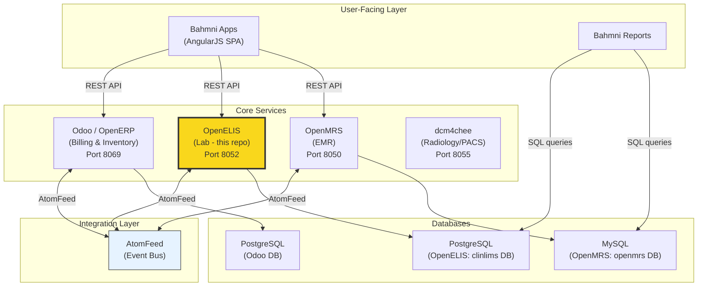
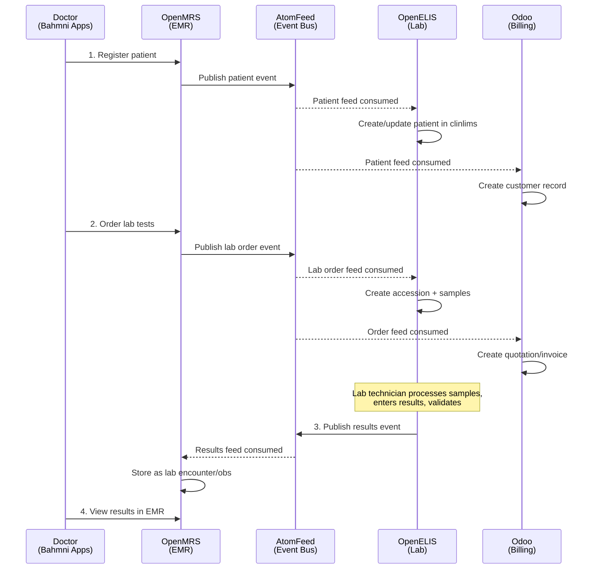
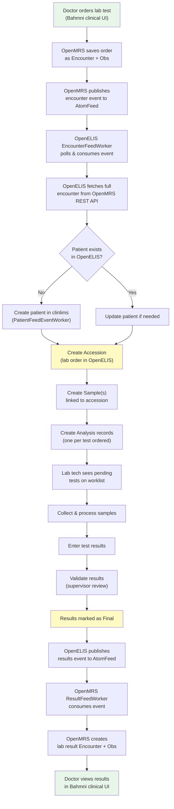
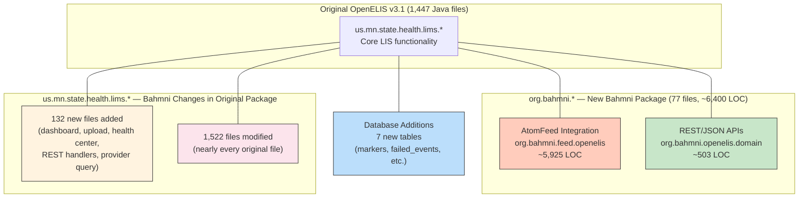
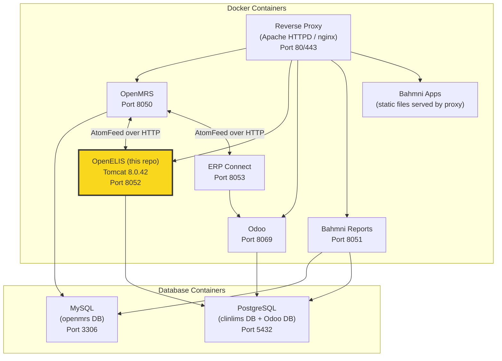
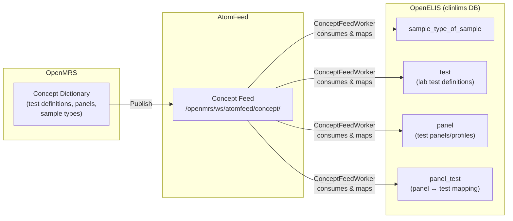
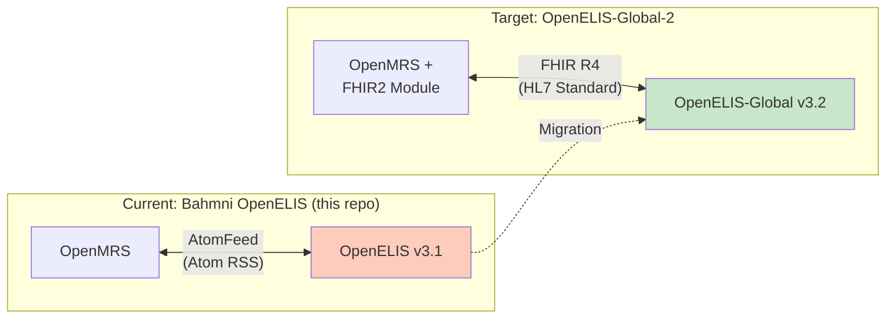

# Bahmni Ecosystem Context: OpenELIS (bahmni-lab)

This document explains how this OpenELIS repository fits within the broader Bahmni healthcare platform, including architecture diagrams, data flows, and integration details.

## What is Bahmni?

[Bahmni](https://www.bahmni.org/) is an open-source Hospital Information System (HIS) and Electronic Medical Record (EMR) designed for low-resource hospitals and clinics. It is deployed in **500+ hospitals across 50+ countries**. Bahmni is not a single monolithic application — it is an integration layer that ties together several best-of-breed open-source healthcare systems:

| Component | Role | Technology |
|-----------|------|------------|
| **OpenMRS** | EMR / Clinical data | Java, MySQL |
| **OpenELIS** (this repo) | Laboratory Information System | Java, PostgreSQL |
| **Odoo** (formerly OpenERP) | Billing, Inventory, Pharmacy | Python, PostgreSQL |
| **dcm4chee** | Radiology / PACS / DICOM imaging | Java |
| **Bahmni Apps** | Clinical UI (registration, consultation, lab) | AngularJS |
| **Bahmni Reports** | Reporting engine | Java, MySQL/PostgreSQL |

## High-Level Architecture

## AtomFeed Integration: The Backbone

All Bahmni services communicate via **AtomFeed** — a publish/subscribe mechanism based on the [Atom Syndication Format (RFC 4287)](https://tools.ietf.org/html/rfc4287). Each service publishes state changes as feed entries. Background worker threads in other services poll these feeds and process new events.

## Data Flow Table (AtomFeed)

This table shows exactly what data flows between services via AtomFeed:

| Source | Destination | Source Resource | Destination Resource | Direction |
|--------|-------------|-----------------|---------------------|-----------|
| OpenMRS | **OpenELIS** | Patient | Patient (in clinlims) | One-way |
| OpenMRS | **OpenELIS** | Lab Order (Encounter) | Draft Accession + Samples | One-way |
| OpenMRS | **OpenELIS** | Concept (test definitions) | Sample Types, Lab Tests, Panels | One-way |
| **OpenELIS** | OpenMRS | Accession, Samples & Results | Encounter (lab results as Obs) | One-way |
| OpenMRS | Odoo | Patient | Customer | One-way |
| OpenMRS | Odoo | Orders (drug/lab) | Quotation / Sale Order | One-way |
| OpenMRS | Odoo | Concept (drug definitions) | Drug / Product | One-way |

## Lab Order Lifecycle (Detailed)

This diagram shows the complete lifecycle of a lab order from the doctor's desk through the lab and back:

## OpenELIS Codebase Structure in Bahmni Context

This repo is a fork of **OpenELIS v3.1** (circa 2013, commit `8f8ab686`). The Bahmni team's changes span two areas:

> **Important:** The `org.bahmni` package is NOT the full picture of Bahmni's changes. The team also added 132 new files and modified 1,522 of the original 1,447 files directly in `us.mn.state.health.lims`. Key feature additions inside the original package include: dashboard views, CSV bulk upload, health center management, REST/JSON handlers, and provider autocomplete.

### AtomFeed Integration Classes

The largest Bahmni customization (~5,925 LOC) handles bidirectional sync with OpenMRS:

| Class / Package | Purpose |
|----------------|---------|
| `PatientFeedEventWorker` | Consumes patient events from OpenMRS, creates/updates patients in clinlims |
| `EncounterFeedWorker` | Consumes lab order events from OpenMRS, creates accessions/samples |
| `OpenElisPatientEventPublisher` | Publishes patient updates back to OpenMRS (if local edits) |
| `OpenElisAccessionEventPublisher` | Publishes accession results back to OpenMRS |
| `OpenMRSPatientMapper` | Maps OpenMRS patient JSON to OpenELIS patient model |
| `OpenMRSEncounterMapper` | Maps OpenMRS encounter (lab order) to OpenELIS accession |
| `ResultEventPublisher` | Publishes validated lab results to OpenMRS |
| `FeedReaderScheduler` (Quartz) | Background job polling AtomFeed every few seconds |
| `atomfeed.properties` | Configuration: OpenMRS feed URLs, polling intervals |

### REST/JSON API Classes

| Class | Purpose |
|-------|---------|
| `AccessionDetail` / `AccessionNote` | Value objects for lab accession API responses |
| `CompletePatientDetails` | Full patient data for API responses |
| `TestDetail` | Lab test data for API responses |
| `PatientHandler` | REST handler for patient queries |
| `AccessionHandler` | REST handler for accession/results queries |
| `WebServiceAction` | Base Struts action providing authentication for REST calls |

### Database Additions (13 tables in `BahmniConfig.xml`)

**AtomFeed infrastructure (7 tables):**

| Table | Purpose |
|-------|---------|
| `markers` | Tracks AtomFeed consumption position (last processed entry) |
| `failed_events` | Stores events that failed processing for retry |
| `failed_event_retry_log` | Retry attempt history for failed events |
| `chunking_history` | Tracks large feed chunking state |
| `event_records` | Locally published events (OpenELIS → OpenMRS) |
| `event_records_offset_marker` | Offset tracking for published events |
| `event_records_queue` | Event queue for async processing |

**Feature tables (6 tables):**

| Table | Purpose |
|-------|---------|
| `external_reference` | Maps OpenMRS UUIDs to internal OpenELIS IDs |
| `HEALTH_CENTER` | Health center / facility management |
| `sample_source` | Sample source dropdown values (e.g., ward, OPD) |
| `import_status` | CSV/bulk upload status tracking |
| `type_of_test_status` | Custom test status type definitions |
| `test_status` | Test-level status tracking |

## Deployment Architecture

### Docker Images for OpenELIS

| Image | Purpose |
|-------|---------|
| `bahmni/openelis` | Application image (Amazon Corretto 8 + embedded Tomcat 8.0.42) |
| `bahmni/openelis-db:fresh` | PostgreSQL with empty clinlims schema (for new installations) |
| `bahmni/openelis-db:demo` | PostgreSQL with demo data pre-loaded |

### Key Environment Variables

| Variable | Purpose | Default |
|----------|---------|---------|
| `OPENELIS_DB_SERVER` | PostgreSQL host | localhost |
| `OPENELIS_DB_PORT` | PostgreSQL port | 5432 |
| `OPENELIS_DB_NAME` | Database name | clinlims |
| `OPENELIS_DB_USERNAME` | Database user | clinlims |
| `OPENELIS_DB_PASSWORD` | Database password | clinlims |
| `OPENMRS_HOST` | OpenMRS server host | openmrs |
| `OPENMRS_PORT` | OpenMRS server port | 8080 |

## Technology Stack

| Layer | Technology | Version |
|-------|-----------|---------|
| Language | Java | 7 source / 8 runtime (Docker uses Amazon Corretto 8) |
| Build | Apache Ant | >= 1.9.1 |
| Web Framework | Struts 1.x + Tiles | 1.x |
| ORM | Hibernate | 3.x |
| Database | PostgreSQL | 9.x+ |
| Connection Pool | C3P0 | - |
| View | JSP | 2.x |
| CSS Preprocessor | SASS (via Ruby Compass) | Ruby 3.1 |
| DB Migrations | Liquibase | 1.9.5 |
| Scheduling | Quartz | 2.x |
| Server | Tomcat (embedded in Docker) | 8.0.42 |
| Source Encoding | ISO-8859-1 | - |

## Concept Sync: How Test Definitions Flow

Lab test definitions originate in OpenMRS and are synced to OpenELIS via AtomFeed:

## Migration Context: Why This Matters

This repository is being evaluated for migration to [OpenELIS-Global-2](https://github.com/DIGI-UW/OpenELIS-Global-2) (v3.2.x). The key architectural difference:

| Aspect | Current (this repo) | Target (OE-Global-2) |
|--------|-------------------|----------------------|
| Integration Protocol | AtomFeed (custom) | FHIR R4 (HL7 standard) |
| Java Version | 8 | 21 |
| Web Framework | Struts 1.x / JSP | Spring 6.2 / React |
| Build System | Ant | Maven |
| ORM | Hibernate 3.x | Hibernate 5.6 |
| Frontend | JSP + jQuery | React + Carbon Design |
| FHIR Support | None | HAPI FHIR 6.6.2 |

For the detailed migration analysis, see [migration-analysis-openelis-global-v3.md](./migration-analysis-openelis-global-v3.md).

## Quick Reference: Key File Locations

| What | Where |
|------|-------|
| Java source | `openelis/src/us/mn/state/health/lims/` |
| Bahmni AtomFeed code | `openelis/src/org/bahmni/feed/openelis/` |
| Bahmni REST/domain code | `openelis/src/org/bahmni/openelis/` |
| Hibernate config | `openelis/src/us/mn/state/health/lims/hibernate/hibernate.cfg.xml` |
| Struts config | `openelis/WebContent/WEB-INF/struts-config.xml` |
| Struts Bahmni extensions | `openelis/WebContent/WEB-INF/struts-globalOpenELIS.xml` |
| AtomFeed config | `openelis/WebContent/WEB-INF/classes/atomfeed.properties` |
| Liquibase migrations | `liquibase/` |
| Build file | `build.xml` |
| Docker resources | `package/docker/` |
| Helm chart | `package/helm/` |
| DB dumps | `db_backup/` |
