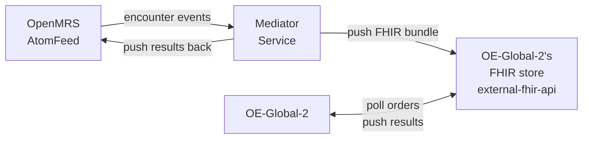

# Bahmni + OpenELIS-Global-2: Integration Plan

**Date:** 2026-02-17 (Updated: 2026-02-23)
**Status:** Draft
**Objective:** Replace Bahmni's OpenELIS fork with OpenELIS-Global-2 (OE-Global-2), integrated via FHIR.

**Detail pages:** [Current Flow](docs/current-flow-detail.md) | [Proposed Flow](docs/proposed-flow-detail.md) | [Architecture](docs/architecture-detail.md) | [Technical Reference](docs/technical-reference.md)

**Supporting pages:** [Decisions Log](docs/decisions-log.md) | [Fallback: Full OpenHIE](docs/fallback-option-a.md) | [Mediator Service Design](docs/mediator-service-design.md) | [Plan Maintenance Guide](docs/plan-maintenance-guide.md)

**Repository analysis:** [OpenELIS-Global-2](docs/repos/openelis-global-2.md) | [bahmni-core](docs/repos/bahmni-core.md) | [openmrs-module-fhir2](docs/repos/openmrs-module-fhir2.md) | [openmrs-module-labonfhir](docs/repos/openmrs-module-labonfhir.md) | [openmrs-module-atomfeed](docs/repos/openmrs-module-atomfeed.md) | [openmrs-module-bahmniapps](docs/repos/openmrs-module-bahmniapps.md) | [bahmni-frontend](docs/repos/bahmni-frontend.md) | [pacs-integration](docs/repos/pacs-integration.md) | [bahmni-reports](docs/repos/bahmni-reports.md) | [bahmni-metabase](docs/repos/bahmni-metabase.md) | [openmrs-distro-bahmni](docs/repos/openmrs-distro-bahmni.md) | [bahmni-mart](docs/repos/bahmni-mart.md)

---

## 1. Context

Bahmni ships a fork of OpenELIS (v3.1, circa 2013) integrated with OpenMRS via AtomFeed — a custom polling mechanism. OpenELIS-Global-2 is the actively maintained successor with native FHIR R4 support. We are adopting it **as-is** — no code porting, no forking.

**The work is integration:** making OE-Global-2 and Bahmni's OpenMRS exchange lab orders, results, and reference data via FHIR.

---

## 2. Current vs Proposed: At a Glance

| Aspect | Current (AtomFeed) | Proposed (FHIR) |
|---|---|---|
| **Order detection** | OpenELIS polls OpenMRS AtomFeed encounter feed | Mediator subscribes to same AtomFeed encounter feed |
| **Order push** | OpenELIS fetches order via REST | Mediator creates FHIR Task + ServiceRequest + Patient → pushes to OE-Global-2's FHIR store |
| **Order pickup by LIS** | OpenELIS polls AtomFeed (5s) | OE-Global-2 polls its FHIR store (2 min) |
| **Test matching** | Custom code mapping | LOINC code lookup |
| **Result return** | OpenELIS publishes to own AtomFeed | OE-Global-2 pushes DiagnosticReport to its FHIR store |
| **Result pickup** | OpenMRS polls OpenELIS AtomFeed | Mediator polls FHIR store → pushes results to OpenMRS |
| **Patient sync** | AtomFeed (immediate) | Mediator pushes Patient resource (immediate) |
| **Lab UI** | Struts/JSP (2013 vintage) | React |
| **Integration standard** | Atom RFC 4287 (custom) | HL7 FHIR R4 |
| **Key integration component** | `openmrs-module-atomfeed`, `bahmni-core` | Custom mediator service (standalone container) |
| **Master data** | OpenMRS (tests + ranges) | OpenMRS (test definitions), OEG2 (reference ranges) |
| **Containers** | 2 (app + db) | 7 (2 replaced + 5 new) |

**What stays the same:** Bahmni UI order entry, lab work in LIS, Bahmni UI result display.

Detail: [Current Flow](docs/current-flow-detail.md) | [Proposed Flow](docs/proposed-flow-detail.md) | [Architecture](docs/architecture-detail.md)

---

## 3. How It Works

See [Proposed Flow Detail](docs/proposed-flow-detail.md) for the full sequence diagram and [Mediator Service Design](docs/mediator-service-design.md) for the implementation design.

A **custom mediator service** bridges OpenMRS and OE-Global-2. It subscribes to OpenMRS's AtomFeed encounter feed, detects lab orders in new encounters, constructs FHIR bundles, and pushes them to OE-Global-2's FHIR store (`external-fhir-api`). Results flow back via a polling loop: the mediator polls `external-fhir-api` for completed Tasks and pushes results into OpenMRS via its FHIR API.

This is the same pattern used by the PACS integration and the old OpenELIS — a standalone Spring Boot service consuming the OpenMRS encounter feed. The mediator is modelled directly on `pacs-integration`.

**Backward compatibility:** The mediator only handles OEG2 integration. The existing AtomFeed-based OpenELIS integration continues to work independently. Both can coexist — deployments choose which LIS to use via a feature flag in the mediator.

---

## 4. Architecture

OE-Global-2 ships with a HAPI FHIR server (`external-fhir-api`) as a standard container. The mediator pushes FHIR bundles directly to this store — no intermediary infrastructure needed. OE-Global-2 polls the same store for new orders.

See [Architecture Detail](docs/architecture-detail.md) for the full container diagram, container list, and configuration.

**7 containers total** — 2 replace existing OpenELIS containers (webapp + database), 5 are net new (FHIR store, frontend, proxy, certs, mediator service).

*A [Full OpenHIE fallback](docs/fallback-option-a.md) exists if auth/audit requirements emerge — adds OpenHIM + SHR (6 extra containers). The path is additive.*

---

## 5. Open Questions

| # | Question | Blocks | Owner |
|---|---|---|---|
| 2 | How does the Bahmni data model map to OEG2's data model? Gaps to check: sample source (OPD/IPD), requester (ordering doctor), location in FHIR Task. | Phase 2 | Team |
| 4 | `Task.owner` / `remote.source.identifier` — format is `ResourceType/ResourceId` (e.g., `Organization/{uuid}`). Agree on the concrete value during Phase 1 PoC. See [Decision 13](docs/decisions-log.md). | Phase 1 | Team |
| 5 | Does `bahmni-core`'s `labOrderResults` populate `minNormal`/`maxNormal` from OpenMRS observations or from concept numeric limits? Determines whether OEG2 reference ranges appear in the Bahmni UI. Verify in Phase 1 PoC. | Phase 1 | Team |
| 6 | `bahmni-reports` `TestCount` and `ElisGeneric` reports query OpenELIS directly and will break. Rewrite against OEG2 schema or OpenMRS observations? See [bahmni-reports.md](docs/repos/bahmni-reports.md). | Phase 4 | Team |
| 9 | Does OEG2 support walk-in lab samples (accession without prior FHIR Task)? If so, mediator must back-create orders in OpenMRS for billing. See [Decision 11](docs/decisions-log.md) for current flow. | Phase 3 | Team |

---

## 6. Plan

### Phase 1: Proof of Concept (2-3 weeks)

**Goal:** Validate the FHIR integration end-to-end with OE-Global-2.

**Step 1a: Spin up OE-Global-2**
- [ ] Set up OE-Global-2 containers (webapp, database, external-fhir-api, frontend, proxy, certs)
- [ ] Configure OE-Global-2 to poll its `external-fhir-api` for orders
- [ ] Confirm `external-fhir-api` accepts writes from external clients

**Step 1b: Validate end-to-end FHIR flow**
- [ ] Push a FHIR Task + ServiceRequest + Patient bundle to `external-fhir-api` (manually or via script)
- [ ] Confirm OE-Global-2 picks up the order and creates a lab accession
- [ ] Enter and validate a result in OE-Global-2 → confirm DiagnosticReport is pushed back to `external-fhir-api`
- [ ] Observe the full Task lifecycle: REQUESTED → ACCEPTED → IN_PROGRESS → COMPLETED
- [ ] Agree on `Task.owner` / OEG2 `remote.source.identifier` value (open question 4)

**Step 1c: Confirm mediator service design**
- [ ] Review [Mediator Service Design](docs/mediator-service-design.md) — design is based on pacs-integration blueprint
- [ ] Confirm LOINC code mapping approach (config file vs DB table)
- [ ] Confirm patient sync approach (separate feed vs on-demand)

*If the FHIR integration fails validation, fall back to the [Full OpenHIE approach](docs/fallback-option-a.md).*

### Phase 2: Test Catalog + LOINC (2-3 weeks)

Bahmni's test catalog must be updated with LOINC codes — OEG2 requires them for test matching.

- [ ] Audit Bahmni test catalog for LOINC code coverage
- [ ] Add LOINC codes to tests that don't have them
- [ ] Create CSV configuration files for OE-Global-2
- [ ] Validate order matching end-to-end

### Phase 3: Build Mediator Service (2-3 weeks)

Standalone Spring Boot service modelled on `pacs-integration`. See [Mediator Service Design](docs/mediator-service-design.md).

- [ ] Subscribe to OpenMRS AtomFeed encounter feed; filter for lab order encounters
- [ ] Implement FHIR bundle construction: Task (status=REQUESTED) + ServiceRequest + Patient
- [ ] Implement push to `external-fhir-api` (HAPI FHIR Transaction Bundle)
- [ ] Implement result polling: poll `external-fhir-api` for Tasks with `status=COMPLETED`
- [ ] Implement result import: push DiagnosticReport/Observations to OpenMRS via `/ws/fhir2/`
- [ ] Implement patient sync
- [ ] Implement retry queue and cursor tracking (from pacs-integration pattern)
- [ ] Add feature flag for mediator activation
- [ ] Unit and integration tests

### Phase 4: Master Data + Deployment (2-3 weeks)

- [ ] Configure master data (result ranges, organizations, providers, users)
- [ ] Remove OpenELIS AtomFeed integration from `openmrs-distro-bahmni`. See [openmrs-distro-bahmni.md](docs/repos/openmrs-distro-bahmni.md)
- [ ] Add OEG2 containers to `Bahmni/bahmni-docker` and remove OpenELIS references from `odoo-connect` and `reports` services
- [ ] Configure networking, proxy, SSL, authentication
- [ ] Rewrite `TestCount` and `ElisGeneric` reports (open question 6). See [bahmni-reports.md](docs/repos/bahmni-reports.md)

### Phase 5: End-to-End Testing (2-3 weeks)

- [ ] Full lab workflow testing (order → sample → result → validation → report → display)
- [ ] Edge cases: rejected samples, amended results, cancelled orders
- [ ] User acceptance testing with lab technicians
- [ ] Verify Odoo billing integration end-to-end

### Phase 6: Go-Live (1 week)

- [ ] Deploy to production (fresh install, no data migration)
- [ ] Monitor for issues during initial operation period

**Total: 12-17 weeks**

### Data Migration

No full data migration is required.

- **Existing installations** continue using old OpenELIS — no forced migration.
- **New installations** use OEG2 from the start.
- **Patient migration** (when switching): replay patient creation events via a simple script.
- **Lab results:** Old results stay in old system — no result migration.

### Community Engagement

Once the high-level solution design is stable, present the plan to the Bahmni community:
- [ ] Create a Talk thread with the integration approach and architecture
- [ ] Solicit feedback from community members and implementers
- [ ] Consider a community call to walk through the design

---

## 7. Repository Analysis

| Repo | Changes Required | Analysis |
|---|---|---|
| **OpenELIS-Global-2** | None — configuration only | [openelis-global-2.md](docs/repos/openelis-global-2.md) |
| **openmrs-module-fhir2** | None | [openmrs-module-fhir2.md](docs/repos/openmrs-module-fhir2.md) |
| **openmrs-module-atomfeed** | None | [openmrs-module-atomfeed.md](docs/repos/openmrs-module-atomfeed.md) |
| **bahmni-core** | None | [bahmni-core.md](docs/repos/bahmni-core.md) |
| **openmrs-module-bahmniapps** | None | [openmrs-module-bahmniapps.md](docs/repos/openmrs-module-bahmniapps.md) |
| **bahmni-frontend** | None | [bahmni-frontend.md](docs/repos/bahmni-frontend.md) |
| **openmrs-module-labonfhir** | None — reference only | [openmrs-module-labonfhir.md](docs/repos/openmrs-module-labonfhir.md) |
| **pacs-integration** | None — blueprint for mediator | [pacs-integration.md](docs/repos/pacs-integration.md) |
| **bahmni-reports** | Rewrite `TestCount` and `ElisGeneric` (open question 6) | [bahmni-reports.md](docs/repos/bahmni-reports.md) |
| **bahmni-metabase** | None | [bahmni-metabase.md](docs/repos/bahmni-metabase.md) |
| **bahmni-mart** | None | [bahmni-mart.md](docs/repos/bahmni-mart.md) |
| **openmrs-distro-bahmni** | Remove OpenELIS OMOD, properties, startup script, Helm env vars | [openmrs-distro-bahmni.md](docs/repos/openmrs-distro-bahmni.md) |
| **bahmni-docker** | Add OEG2 containers; remove OpenELIS references from 5 services | — |
| **openerp-atomfeed-service** | Remove dormant OpenELIS feed path and credentials | — |

---

## 8. References

| Source | Link | Relevance |
|---|---|---|
| **Reference implementation** | [github.com/DIGI-UW/openelis-openmrs-hie](https://github.com/DIGI-UW/openelis-openmrs-hie) | Working Docker Compose stack (OpenMRS 3 + OE-Global-2 + OpenHIM + SHR). Reference for OEG2 container setup and FHIR configuration. |
| **FHIR integration discussion** | [talk.openelis-global.org/t/1702](https://talk.openelis-global.org/t/integration-with-openmrs-over-fhir/1702) | Community discussion (Angshuman + Moses Mutesasira). Confirmed purely FHIR exchange, active bridge required. |
| **Test method selection** | [talk.openelis-global.org/t/1691](https://talk.openelis-global.org/t/openelis-global-capability-for-selecting-a-specific-method-for-a-given-order/1691) | Method selection at execution time; LOINC mapping is test-level, not method-level. |
| **Lab on FHIR module** | [github.com/openmrs/openmrs-module-labonfhir](https://github.com/openmrs/openmrs-module-labonfhir) | Reference for FHIR Task + ServiceRequest bundle construction. |

---

*Detail pages: [Current Flow](docs/current-flow-detail.md) | [Proposed Flow](docs/proposed-flow-detail.md) | [Architecture](docs/architecture-detail.md) | [Technical Reference](docs/technical-reference.md)*

*Supporting pages: [Decisions Log](docs/decisions-log.md) | [Fallback: Full OpenHIE](docs/fallback-option-a.md)*

*Archived analysis documents with detailed code inventory available in [archive/](archive/) for reference.*
