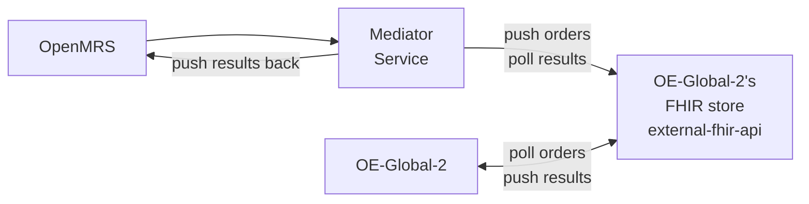

# Bahmni + OpenELIS-Global-2: Integration Plan

**Date:** 2026-02-17 (Updated: 2026-02-19)
**Status:** Draft (SME-reviewed 2026-02-18)
**Objective:** Replace Bahmni's OpenELIS fork with OpenELIS-Global-2 (OE-Global-2), integrated via FHIR.

**Detail pages:** [Current Flow](docs/current-flow-detail.md) | [Proposed Flow](docs/proposed-flow-detail.md) | [Architecture](docs/architecture-detail.md) | [Technical Reference](docs/technical-reference.md)

**Supporting pages:** [Decisions Log](docs/decisions-log.md) | [Fallback: Full OpenHIE](docs/fallback-option-a.md)

---

## 1. Context

Bahmni ships a fork of OpenELIS (v3.1, circa 2013) integrated with OpenMRS via AtomFeed — a custom polling mechanism. OpenELIS-Global-2 is the actively maintained successor with native FHIR R4 support. We are adopting it **as-is** — no code porting, no forking.

**The work is integration:** making OE-Global-2 and Bahmni's OpenMRS exchange lab orders, results, and reference data via FHIR.

---

## 2. Current vs Proposed: At a Glance

| Aspect | Current (AtomFeed) | Proposed (FHIR) |
|---|---|---|
| **Order creation** | AtomFeed event → REST fetch | Mediator service creates FHIR Task → pushes to OE-Global-2's FHIR store |
| **Order pickup** | OpenELIS polls AtomFeed (5s) | OE-Global-2 polls its FHIR store (20s-2min) |
| **Test matching** | Custom code mapping | LOINC code lookup |
| **Result return** | AtomFeed event → REST fetch | DiagnosticReport pushed to OE-Global-2's FHIR store |
| **Result pickup** | OpenMRS polls AtomFeed (15s) | Mediator service polls FHIR store → pushes results to OpenMRS |
| **Patient sync** | AtomFeed (immediate) | Mediator service pushes Patient resource (immediate) |
| **Routing/auth** | Direct HTTP | Docker network isolation |
| **Lab UI** | Struts/JSP (2013 vintage) | React |
| **Integration standard** | Atom RFC 4287 (custom) | HL7 FHIR R4 |
| **Key integration component** | `openmrs-module-atomfeed`, `bahmni-core` | Custom mediator service (standalone container) |
| **Master data** | OpenMRS (tests + ranges) | OpenMRS (test definitions), OEG2 (reference ranges) |
| **Containers** | 2 (app + db) | 7 (2 replaced + 5 new) |

**What stays the same:** Bahmni UI order entry, lab work in LIS, Bahmni UI result display, Odoo billing.

Detail: [Current Flow](docs/current-flow-detail.md) | [Proposed Flow](docs/proposed-flow-detail.md) | [Architecture](docs/architecture-detail.md)

---

## 3. How It Works

See [Proposed Flow Detail](docs/proposed-flow-detail.md) for the full sequence diagram, component roles, and configuration.

A **custom mediator service** bridges OpenMRS and OE-Global-2 — detecting lab order events in OpenMRS, transforming them into FHIR bundles, and pushing them to OE-Global-2's FHIR store (`external-fhir-api`). Results flow back the same way: the mediator polls the FHIR store for completed Tasks and pushes results into OpenMRS.

This follows Bahmni's existing integration pattern used for ERP (Odoo) and PACS — a standalone microservice that listens to events and orchestrates communication, kept separate from the core EMR.

**Backward compatibility:** The mediator service only handles OEG2 integration. The existing AtomFeed-based OpenELIS integration continues to work independently. Both can coexist — deployments choose which LIS to use. A feature flag in the mediator controls whether it is active.

---

## 4. Architecture

OE-Global-2 ships with a HAPI FHIR server (`external-fhir-api`) as a standard container. The mediator service pushes FHIR bundles directly to this store — no intermediary infrastructure needed. OE-Global-2 polls the same store for new orders.

See [Architecture Detail](docs/architecture-detail.md) for the full container diagram, container list, and configuration.

**7 containers total** — 2 replace existing OpenELIS containers (webapp + database), 5 are net new (FHIR store, frontend, proxy, certs, mediator service).

*A [Full OpenHIE fallback](docs/fallback-option-a.md) exists if auth/audit requirements emerge — adds OpenHIM + SHR (6 extra containers). The path is additive.*

---

## 5. Open Questions

| # | Question | Blocks | Owner |
|---|---|---|---|
| 1 | What is the detailed design for the custom mediator service? Event detection mechanism (AtomFeed, JMS, or FHIR subscription), FHIR bundle construction, error handling, retry logic. | **Critical — blocks implementation** | Team |
| 2 | How does the Bahmni data model map to OEG2's data model? Specific gaps: sample source (OPD/IPD — custom to Bahmni), requester (ordering doctor), location info in FHIR Task. | Phase 2 | Team |
| 3 | What are ALL current AtomFeed interactions to/from Bahmni OpenELIS? (Beyond the main lab order flow — patient sync, metadata, etc.) Needed to understand full scope of what the mediator must replicate. | Phase 1 | Angshuman Sarkar (requested) |

---

## 6. Plan

### Phase 1: Proof of Concept (2-3 weeks)

**Goal:** Validate the simplified FHIR integration end-to-end with OE-Global-2.

**Step 1a: Spin up OE-Global-2 with simplified architecture**
- [ ] Set up OE-Global-2 containers (webapp, database, external-fhir-api, frontend, proxy, certs)
- [ ] Configure OE-Global-2 to poll its own `external-fhir-api` for orders
- [ ] Confirm `external-fhir-api` accepts writes from external clients (mediator pushing FHIR bundles)

**Step 1b: Validate end-to-end FHIR flow**
- [ ] Push a FHIR Task + ServiceRequest + Patient bundle to `external-fhir-api` (manually or via script)
- [ ] Confirm OE-Global-2 picks up the order and creates a lab accession
- [ ] Enter and validate a result in OE-Global-2 → confirm DiagnosticReport is pushed back to `external-fhir-api`
- [ ] Observe the full Task lifecycle: REQUESTED → ACCEPTED → IN_PROGRESS → COMPLETED

**Step 1c: Catalog all AtomFeed interactions (open question 3)**
- [ ] Get full list of AtomFeed interactions to/from Bahmni OpenELIS from **Angshuman Sarkar**
- [ ] Identify which interactions the mediator service must replicate (beyond lab order flow)
- [ ] Identify which interactions can remain on AtomFeed (if old OpenELIS coexists)

**Step 1d: Design custom mediator service**
- [ ] Define event detection mechanism (AtomFeed, JMS, or FHIR subscription)
- [ ] Define FHIR bundle construction (Task + ServiceRequest + Patient)
- [ ] Define result polling and import flow
- [ ] Assess whether feature flag is needed for mediator activation

*If the simplified architecture fails validation, fall back to the [Full OpenHIE approach](docs/fallback-option-a.md).*

### Phase 2: Test Catalog + LOINC (2-3 weeks)

Bahmni's test catalog will be updated with LOINC codes (OEG2 requires them for test matching).

- [ ] Audit Bahmni test catalog for LOINC code coverage
- [ ] Add LOINC codes to tests that don't have them
- [ ] Create CSV configuration files for OE-Global-2
- [ ] Validate order matching end-to-end

### Phase 3: Build Mediator Service (2-3 weeks)

- [ ] Implement event detection (order creation, patient creation)
- [ ] Implement FHIR bundle construction (Task + ServiceRequest + Patient)
- [ ] Implement result polling and import flow
- [ ] Implement patient sync (immediate on creation)
- [ ] Add feature flag for mediator activation
- [ ] Unit and integration tests

### Phase 4: Master Data + Deployment (2-3 weeks)

- [ ] Configure master data (result ranges, organizations, providers, users)
- [ ] Integrate OE-Global-2 containers into Bahmni Docker Compose stack
- [ ] Configure networking, proxy, SSL, authentication

### Phase 5: End-to-End Testing (2-3 weeks)

- [ ] Full lab workflow testing (order → sample → result → validation → report → display)
- [ ] Edge cases: rejected samples, amended results, cancelled orders
- [ ] User acceptance testing with lab technicians
- [ ] Verify Odoo billing integration is unaffected

### Phase 6: Go-Live (1 week)

- [ ] Deploy to production (fresh install, no data migration)
- [ ] Monitor for issues during initial operation period

**Total: 12-17 weeks** *(pending resolution of open questions)*

### Data Migration

No full data migration is required.

- **Existing installations** continue using old OpenELIS — no forced migration.
- **New installations** use OEG2 from the start.
- **Patient migration** (when switching): replay patient creation events via a simple script to populate OEG2 with existing patients.
- **Lab results:** Old results stay in old system — no result migration.

### Community Engagement

Once the high-level solution design is stable, present the plan to the Bahmni community:
- [ ] Create a Talk thread with the integration approach and architecture
- [ ] Solicit feedback from community members and implementers
- [ ] Consider a community call to walk through the design

---

## 7. References

| Source | Link | Relevance |
|---|---|---|
| **Reference implementation** | [github.com/DIGI-UW/openelis-openmrs-hie](https://github.com/DIGI-UW/openelis-openmrs-hie) | Working Docker Compose stack (OpenMRS 3 + OE-Global-2 + OpenHIM + SHR). Useful as reference for OEG2 container setup and FHIR configuration. |
| **FHIR integration discussion** | [talk.openelis-global.org/t/1702](https://talk.openelis-global.org/t/integration-with-openmrs-over-fhir/1702) | Community discussion (Angshuman + Moses Mutesasira). Confirmed purely FHIR exchange, active bridge required. |
| **Test method selection** | [talk.openelis-global.org/t/1691](https://talk.openelis-global.org/t/openelis-global-capability-for-selecting-a-specific-method-for-a-given-order/1691) | Method selection at execution time; LOINC mapping is test-level, not method-level. |
| **Lab on FHIR module** | [github.com/openmrs/openmrs-module-labonfhir](https://github.com/openmrs/openmrs-module-labonfhir) | Reference for FHIR Task + ServiceRequest creation. Our mediator service will replicate this role. |

---

*Detail pages: [Current Flow](docs/current-flow-detail.md) | [Proposed Flow](docs/proposed-flow-detail.md) | [Architecture](docs/architecture-detail.md) | [Technical Reference](docs/technical-reference.md)*

*Supporting pages: [Decisions Log](docs/decisions-log.md) | [Fallback: Full OpenHIE](docs/fallback-option-a.md)*

*Archived analysis documents with detailed code inventory available in [archive/](archive/) for reference.*
