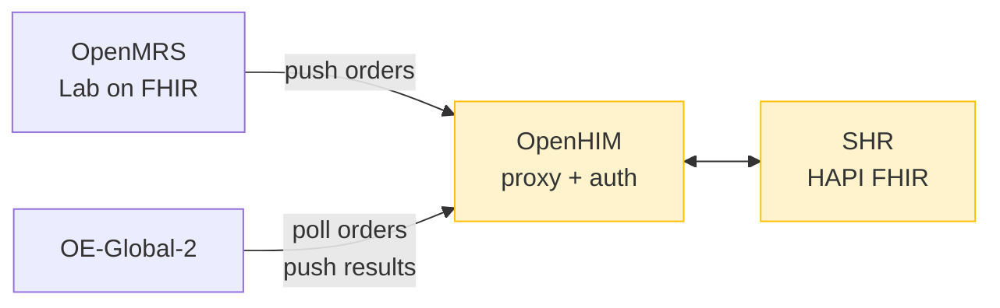
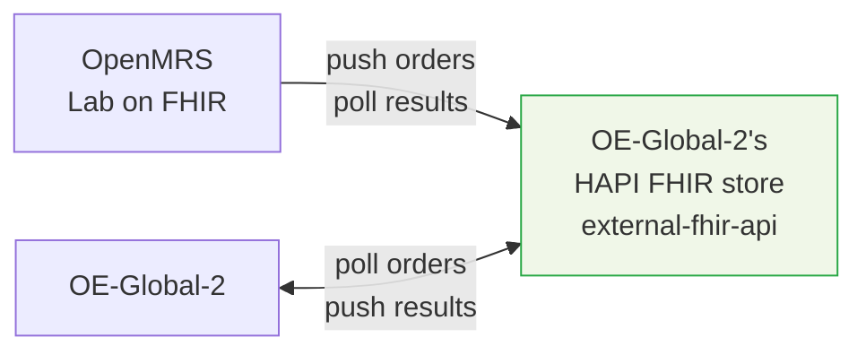

# Bahmni + OpenELIS-Global-2: Integration Plan

**Date:** 2026-02-17 (Updated: 2026-02-18)
**Status:** Draft
**Objective:** Replace Bahmni's OpenELIS fork with OpenELIS-Global-2 (OE-Global-2), integrated via FHIR.

**Key references:**
- [Reference implementation: `DIGI-UW/openelis-openmrs-hie`](https://github.com/DIGI-UW/openelis-openmrs-hie) — working Docker Compose stack
- [OE-Global-2 + OpenMRS FHIR integration discussion](https://talk.openelis-global.org/t/integration-with-openmrs-over-fhir/1702) (Angshuman + Moses Mutesasira)
- [OE-Global-2 test method selection](https://talk.openelis-global.org/t/openelis-global-capability-for-selecting-a-specific-method-for-a-given-order/1691)
- [`openmrs-module-labonfhir`](https://github.com/openmrs/openmrs-module-labonfhir) — the critical OpenMRS module that creates FHIR Tasks

**Detail pages:** [Current Flow](docs/current-flow-detail.md) | [Proposed Flow](docs/proposed-flow-detail.md) | [Architecture](docs/architecture-detail.md) | [Q&A](docs/integration-qa-detail.md)

---

## 1. Context

Bahmni ships a fork of OpenELIS (v3.1, circa 2013) integrated with OpenMRS via AtomFeed — a custom polling mechanism. OpenELIS-Global-2 is the actively maintained successor with native FHIR R4 support. We are adopting it **as-is** — no code porting, no forking.

**The work is integration:** making OE-Global-2 and Bahmni's OpenMRS exchange lab orders, results, and reference data via FHIR.

---

## 2. Current vs Proposed: At a Glance

| Aspect | Current (AtomFeed) | Proposed Option B: Simplified | Proposed Option A: Full OpenHIE |
|---|---|---|---|
| **Order creation** | AtomFeed event → REST fetch | Lab on FHIR pushes FHIR Task to OE-Global-2's FHIR store | Lab on FHIR pushes FHIR Task to SHR via OpenHIM |
| **Order pickup** | OpenELIS polls AtomFeed (5s) | OE-Global-2 polls its own FHIR store (20s-2min) | OE-Global-2 polls SHR via OpenHIM (20s-2min) |
| **Test matching** | Custom code mapping | LOINC code lookup | LOINC code lookup |
| **Result return** | AtomFeed event → REST fetch | DiagnosticReport pushed to OE-Global-2's FHIR store | DiagnosticReport pushed to SHR via OpenHIM |
| **Result pickup** | OpenMRS polls AtomFeed (15s) | Lab on FHIR polls OE-Global-2's FHIR store | Lab on FHIR polls SHR via OpenHIM |
| **Routing/auth** | Direct HTTP | Docker network isolation | OpenHIM proxy (basic auth + audit) |
| **Lab UI** | Struts/JSP (2013 vintage) | React | React |
| **Integration standard** | Atom RFC 4287 (custom) | HL7 FHIR R4 | HL7 FHIR R4 |
| **Key OpenMRS modules** | `openmrs-module-atomfeed`, `bahmni-core` | `openmrs-module-labonfhir`, `openmrs-module-fhir2` | `openmrs-module-labonfhir`, `openmrs-module-fhir2` |
| **New containers** | — | 6 | 12 |

**What stays the same:** Bahmni UI order entry, lab work in LIS, Bahmni UI result display, Odoo billing.

Detail: [Current Flow](docs/current-flow-detail.md) | [Proposed Flow](docs/proposed-flow-detail.md) | [Architecture](docs/architecture-detail.md)

---

## 3. How It Works

See [Proposed Flow Detail](docs/proposed-flow-detail.md) for the full sequence diagram, module roles, and configuration.

The critical module is **`openmrs-module-labonfhir`** — it's the active bridge between OpenMRS and the lab. The FHIR2 module is a passive API layer; Lab on FHIR is the one that **reacts** to new orders and **pushes** them out.

**Lab on FHIR is NOT currently in Bahmni's OpenMRS distribution.** Adding it is the first thing to validate.

---

## 4. Key Findings

| Finding | Source | Impact |
|---|---|---|
| FHIR2 alone doesn't create Tasks — **Lab on FHIR module is required** | [Community discussion](https://talk.openelis-global.org/t/integration-with-openmrs-over-fhir/1702) | Must add `openmrs-module-labonfhir` to Bahmni |
| Reference architecture uses **OpenHIM + SHR** as intermediaries (not direct connection) | [Reference impl](https://github.com/DIGI-UW/openelis-openmrs-hie) | Simplified option proposed — see [Section 5](#5-architecture-decision-full-openhie-vs-simplified) |
| Exchange is **purely FHIR** — no HL7v2 | [Moses Mutesasira](https://talk.openelis-global.org/t/integration-with-openmrs-over-fhir/1702/2) | Clean integration path |
| OE-Global-2 matches tests by **LOINC codes only** | Code analysis | Bahmni test catalog needs LOINC codes |
| Test methods (PCR, culture, etc.) selected at **execution time** by lab tech, not at order time | [Community discussion](https://talk.openelis-global.org/t/openelis-global-capability-for-selecting-a-specific-method-for-a-given-order/1691) | LOINC mapping is test-level, not method-level |
| A **working reference implementation** exists with Docker Compose | [DIGI-UW/openelis-openmrs-hie](https://github.com/DIGI-UW/openelis-openmrs-hie) | Phase 1 starts from this, not from scratch |
| Lab on FHIR detects orders via **JMS events** (instant), returns results via **polling** | Code analysis | Event-driven outbound, poll-based inbound |

Detail: [Full Q&A with technical depth](docs/integration-qa-detail.md)

---

## 5. Architecture Decision: Full OpenHIE vs Simplified

The reference implementation uses 6 extra containers (OpenHIM + SHR) as intermediaries. **We believe this can be simplified for Bahmni.**

**Background — what is `external-fhir-api`?** A HAPI FHIR server is essentially a database that stores and retrieves healthcare data in FHIR format via REST API (e.g., `POST /fhir/Task` to create, `GET /fhir/Task?status=requested` to search). OE-Global-2 **already ships with its own** HAPI FHIR server as a standard container called `external-fhir-api`. The reference implementation then adds a **second** HAPI FHIR server (`shr-hapi-fhir`) as the Shared Health Record — the "noticeboard" that both OpenMRS and OE-Global-2 read from and write to, with OpenHIM as a gatekeeper in front.

**The key insight:** Why have two FHIR servers when one will do? Both Lab on FHIR and OE-Global-2 just need *a FHIR store* to read from and write to. We can use OE-Global-2's existing `external-fhir-api` as that shared store instead of deploying a separate SHR + OpenHIM.

### Option A: Full OpenHIE Stack (Reference Implementation)



**12 new containers** = 6 OE-Global-2 + 6 HIE (OpenHIM core/console/config/MongoDB + SHR HAPI FHIR/PostgreSQL)

### Option B: Simplified — OE-Global-2's FHIR Store as Shared Store



**6 new containers** = OE-Global-2 only (webapp, database, external-fhir-api, frontend, proxy, certs). No HIE layer.

**Config-only change** — no code changes to either system:
```properties
# OpenMRS Lab on FHIR — point to OE-Global-2's FHIR store instead of SHR
labonfhir.lisUrl=http://external-fhir-api:8080/fhir/

# OE-Global-2 — poll its own FHIR store instead of SHR
org.openelisglobal.remote.source.uri=http://external-fhir-api:8080/fhir/
org.openelisglobal.fhir.subscriber=http://external-fhir-api:8080/fhir/
```

### Comparison

| Aspect | Option A: Full OpenHIE | Option B: Simplified |
|---|---|---|
| **New containers** | 12 | 6 |
| **Proven/tested** | Yes (reference impl) | Needs PoC validation |
| **Code changes** | None (config only) | None (config only) |
| **Standards compliance** | OpenHIE-compliant | Not OpenHIE-compliant |
| **Auth/audit** | OpenHIM provides auth + audit trail | No auth layer — rely on Docker network isolation |
| **Maintenance burden** | High — 6 extra services to monitor | Low — just OE-Global-2 stack |
| **Debugging** | Harder — more network hops, OpenHIM logs | Easier — fewer moving parts |
| **Resilience** | SHR buffers orders if one side is down | If OE-Global-2 is down, FHIR store is also down |
| **Extensibility** | Other systems can connect to SHR | Additional systems would need to access OE-Global-2's store |
| **Path to Option A** | N/A | Can add OpenHIM + SHR later if needed (additive) |

### Recommendation

**Start Phase 1 PoC with Option B (simplified).** Rationale:
1. Config-only change — no risk of code changes going wrong
2. Halves the container count (6 vs 12)
3. The path from B → A is additive (add OpenHIM + SHR later if auth/audit needs emerge)
4. The path from A → B requires removing infrastructure (harder to justify after setup)
5. For Bahmni deployments on internal networks, OpenHIM's auth layer adds complexity without clear benefit

**Risk to validate in PoC:** Confirm that OE-Global-2's `external-fhir-api` accepts writes from external clients (Lab on FHIR pushing Task+ServiceRequest bundles). It's a standard HAPI FHIR server, so this should work.

Detail: [Architecture Detail](docs/architecture-detail.md)

---

## 6. Open Questions

| # | Question | Blocks | Owner |
|---|---|---|---|
| 1 | Can `openmrs-module-labonfhir` (v1.5.3) be added to Bahmni's OpenMRS distribution? Any module conflicts or version incompatibilities? | **Critical — blocks everything** | Angshuman Sarkar |
| 2 | Does the current Bahmni test catalog have LOINC codes? How many tests need mapping? | Phase 2 | SME |
| 3 | Where should the test catalog be mastered — OpenMRS or OE-Global-2? | Phase 2 | Team decision |
| 4 | Is standalone patient sync needed, or is patient-on-demand (via Task context) sufficient? | Phase 1 | SME |

---

## 7. Plan

### Phase 1: Proof of Concept (2-3 weeks)

**Goal:** Validate the FHIR integration end-to-end, then assess Bahmni-specific gaps.

**Step 1a: Run the reference implementation as-is (validate the flow)**
- [ ] Spin up [`DIGI-UW/openelis-openmrs-hie`](https://github.com/DIGI-UW/openelis-openmrs-hie) (`docker-compose up -d`)
- [ ] Place a lab order in OpenMRS 3 → confirm it appears in OE-Global-2
- [ ] Enter and validate a result in OE-Global-2 → confirm DiagnosticReport reaches OpenMRS
- [ ] Observe the full Task lifecycle: REQUESTED → ACCEPTED → IN_PROGRESS → COMPLETED

**Step 1b: Test simplified architecture (Option B from [Section 5](#5-architecture-decision-full-openhie-vs-simplified))**
- [ ] Reconfigure Lab on FHIR to push to OE-Global-2's `external-fhir-api` instead of SHR
- [ ] Reconfigure OE-Global-2 to poll its own FHIR store instead of SHR
- [ ] Stop OpenHIM + SHR containers, verify order→result flow still works
- [ ] Confirm `external-fhir-api` accepts writes from Lab on FHIR (external client)

**Step 1c: Assess Bahmni-specific gaps (answers open question 1)**
- [ ] Determine if `openmrs-module-labonfhir` can be added to Bahmni's OpenMRS without conflicts
- [ ] Involve **Angshuman Sarkar** for OpenMRS-side assessment

### Phase 2: Test Catalog + LOINC (2-3 weeks)

*(Contingent on open questions 2 and 3.)*

- [ ] Audit Bahmni test catalog for LOINC code coverage
- [ ] Map tests without LOINC codes to LOINC
- [ ] Create CSV configuration files for OE-Global-2
- [ ] Validate order matching end-to-end

### Phase 3: Master Data + Deployment (2-3 weeks)

- [ ] Configure master data (result ranges, organizations, providers, users)
- [ ] Integrate OE-Global-2 containers into Bahmni Docker Compose stack
- [ ] Configure networking, proxy, SSL, authentication

### Phase 4: End-to-End Testing (2-3 weeks)

- [ ] Full lab workflow testing (order → sample → result → validation → report → display)
- [ ] Edge cases: rejected samples, amended results, cancelled orders
- [ ] User acceptance testing with lab technicians
- [ ] Verify Odoo billing integration is unaffected

### Phase 5: Go-Live (1 week)

- [ ] Deploy to production (fresh install, no data migration)
- [ ] Monitor for issues during initial operation period

**Total: 10-14 weeks** *(pending resolution of open questions)*

### Future: Data Migration Tooling

Existing Bahmni installations will need a data migration path when OE-Global-2 becomes the standard. Can be planned independently.

---

## 8. Community References

| Source | Link | Key Insight |
|---|---|---|
| **FHIR integration discussion** | [talk.openelis-global.org/t/1702](https://talk.openelis-global.org/t/integration-with-openmrs-over-fhir/1702) | Lab on FHIR + FHIR2 needed; purely FHIR; OpenHIM for auth |
| **Test method selection** | [talk.openelis-global.org/t/1691](https://talk.openelis-global.org/t/openelis-global-capability-for-selecting-a-specific-method-for-a-given-order/1691) | Method selection at execution time; parent/child test pattern |
| **Reference implementation** | [github.com/DIGI-UW/openelis-openmrs-hie](https://github.com/DIGI-UW/openelis-openmrs-hie) | Working Docker Compose with OpenMRS 3 + OE-Global-2 + OpenHIM + SHR |
| **Lab on FHIR module** | [github.com/openmrs/openmrs-module-labonfhir](https://github.com/openmrs/openmrs-module-labonfhir) | Creates FHIR Task + ServiceRequest; pushes to LIS |

---

*Detail pages: [Current Flow](docs/current-flow-detail.md) | [Proposed Flow](docs/proposed-flow-detail.md) | [Architecture](docs/architecture-detail.md) | [Q&A](docs/integration-qa-detail.md)*

*Archived analysis documents with detailed code inventory available in [archive/](archive/) for reference.*
