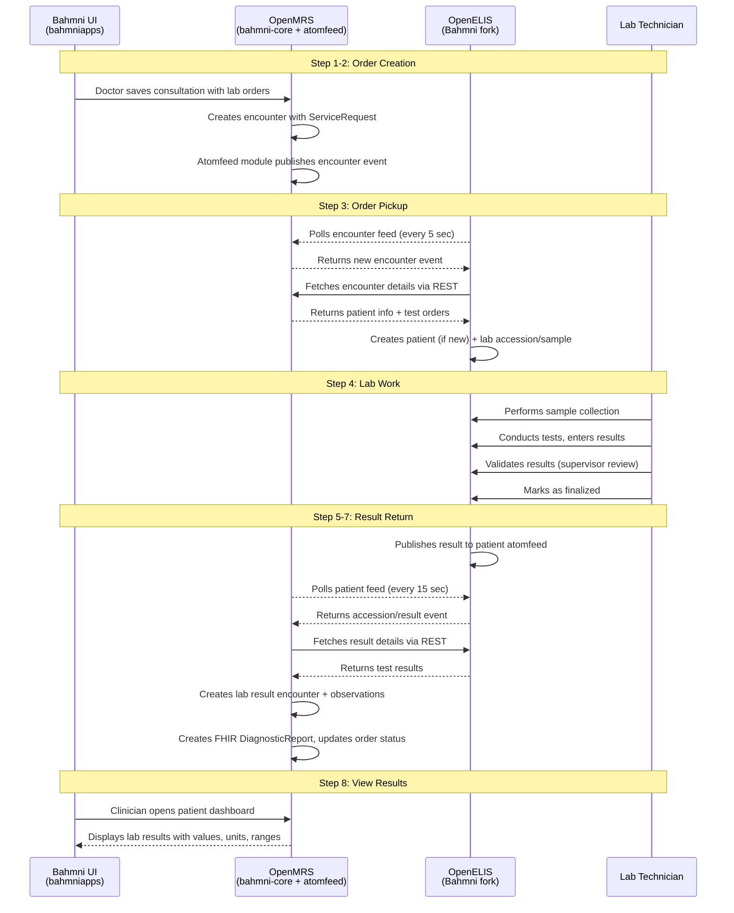
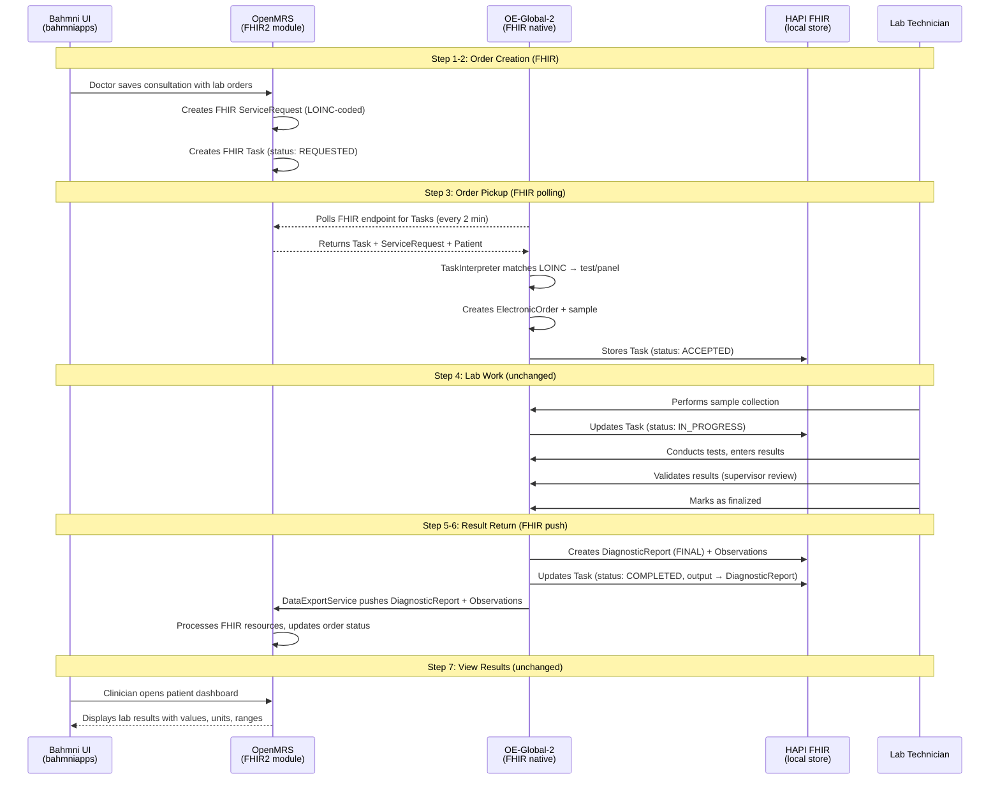
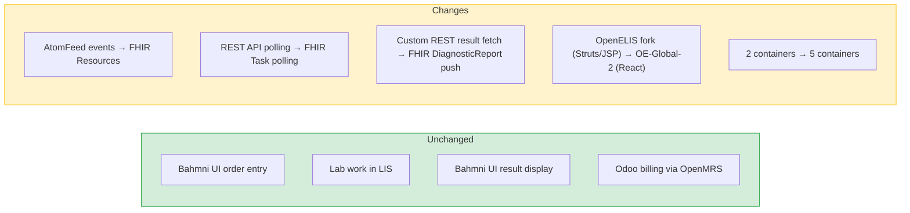
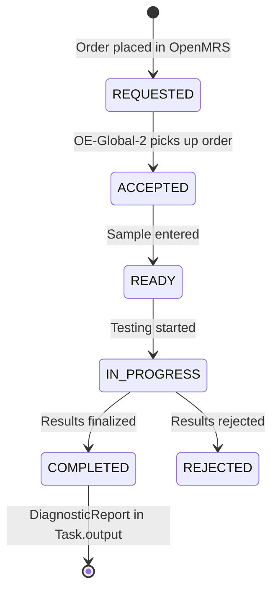
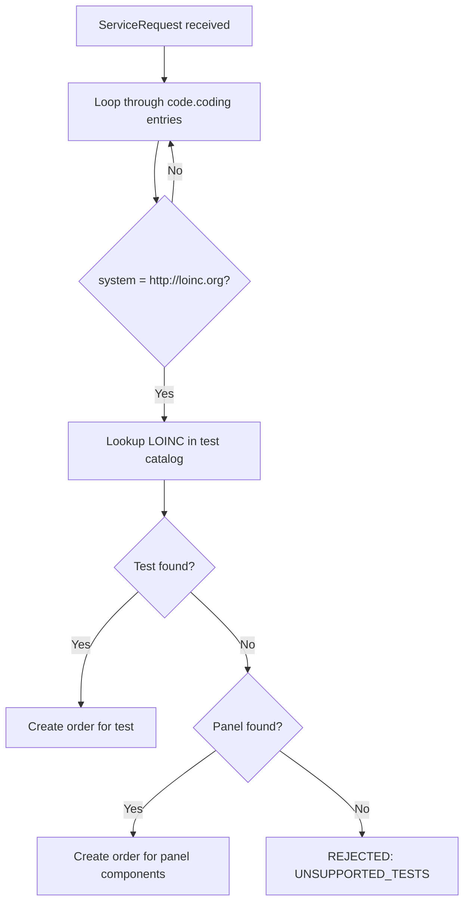
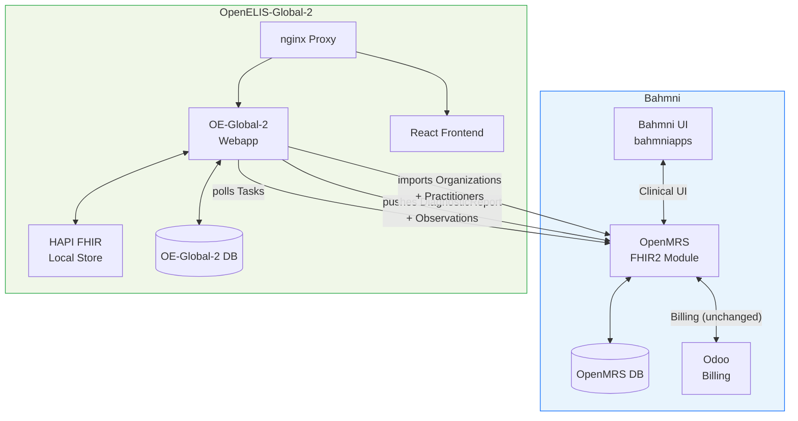

# Bahmni + OpenELIS-Global-2: Integration Plan

**Date:** 2026-02-17
**Status:** Draft
**Objective:** Replace Bahmni's OpenELIS fork with OpenELIS-Global-2 (OE-Global-2), integrated via FHIR.

---

## 1. Context

Bahmni currently ships a fork of OpenELIS (v3.1, circa 2013) integrated with OpenMRS via AtomFeed — a custom, polling-based event mechanism. OpenELIS-Global-2 is the actively maintained successor with native FHIR R4 support. We are adopting it as-is — no code porting, no forking.

**The work is integration:** making OE-Global-2 and Bahmni's OpenMRS exchange lab orders, results, and reference data via FHIR.

---

## 2. Current Flow (AtomFeed-based)

This is how the lab order lifecycle works today in Bahmni, step by step.

### 2.1 Current Flow Diagram



### 2.2 Current Step-by-Step Detail

| Step | System | What Happens | Repository |
|---|---|---|---|
| **1. Create order** | Bahmni UI | Doctor opens consultation → Orders tab → selects lab tests → saves | `openmrs-module-bahmniapps` |
| **2. Publish event** | OpenMRS | Creates encounter with orders; atomfeed publishes encounter event | `openmrs/openmrs-module-atomfeed`, `bahmni-core` |
| **3. Poll & fetch** | OpenELIS | Polls encounter feed (5s interval); fetches encounter via REST; creates patient + accession | `Bahmni/OpenElis` |
| **4. Lab work** | OpenELIS | Sample collection → testing → result entry → validation → finalization | `Bahmni/OpenElis` |
| **5. Publish results** | OpenELIS | Publishes atomfeed event with accession UUID | `Bahmni/OpenElis` |
| **6. Poll & fetch** | OpenMRS | Polls OpenELIS patient feed (15s interval); fetches result details via REST | `bahmni-core (openmrs-elis-atomfeed-client-omod)` |
| **7. Process results** | OpenMRS | Creates lab result encounter, observations, FHIR DiagnosticReport; updates order status | `elis-fhir-result-support`, `bahmni-module-fhir2-addl-extension` |
| **8. View results** | Bahmni UI | Clinician sees results on patient dashboard with values, units, reference ranges | `openmrs-module-bahmniapps` |

### 2.3 Current Integration Feeds

| Feed | Direction | URL | Poll Interval |
|---|---|---|---|
| Encounter feed | OpenMRS → OpenELIS | `http://openmrs:8080/openmrs/ws/atomfeed/encounter/recent` | 5 seconds |
| Patient result feed | OpenELIS → OpenMRS | `http://openelis:8052/openelis/ws/feed/patient/recent` | 15 seconds |

---

## 3. Proposed Flow (FHIR-based with OE-Global-2)

### 3.1 Proposed Flow Diagram



### 3.2 What Changes, What Stays the Same



### 3.3 Side-by-Side Comparison

| Aspect | Current (AtomFeed) | Proposed (FHIR) |
|---|---|---|
| **Order signal** | AtomFeed encounter event → REST fetch | FHIR Task + ServiceRequest |
| **Order pickup** | OpenELIS polls AtomFeed (5s) | OE-Global-2 polls FHIR Tasks (2 min, configurable) |
| **Test matching** | Custom code mapping | LOINC code lookup in ServiceRequest.code |
| **Patient sync** | Separate patient AtomFeed | Part of FHIR Task context (Patient reference) |
| **Result return** | AtomFeed event → REST fetch | FHIR DiagnosticReport + Observation (push) |
| **Result pickup** | OpenMRS polls AtomFeed (15s) | OE-Global-2 pushes to OpenMRS FHIR endpoint |
| **Lab UI** | OpenELIS (Struts/JSP) | OE-Global-2 (React) |
| **Integration standard** | Custom (Atom RFC 4287) | HL7 FHIR R4 |

---

## 4. Key Integration Questions — Answered

### Q1: How do I send a lab order to OE-Global-2?

**Answer:** OE-Global-2 polls a FHIR endpoint for `Task` resources. It can poll OpenMRS's FHIR2 module directly.

OE-Global-2 has a scheduled poller (`FhirApiWorkFlowServiceImpl`) that queries a remote FHIR endpoint for new Tasks with status `REQUESTED`, fetches the linked ServiceRequest and Patient, and creates an electronic order.

Configuration:
```properties
# OE-Global-2 polls THIS endpoint for lab order Tasks
org.openelisglobal.remote.source.uri=http://openmrs:8080/openmrs/ws/fhir2/R4

# Poll frequency (default: 120 seconds)
org.openelisglobal.remote.poll.frequency=120000

# Practitioner ID that "owns" the tasks (filters which tasks to pick up)
org.openelisglobal.remote.source.identifier=<practitioner-id>
```

**Can I skip the separate HAPI FHIR server?**

Not entirely. OE-Global-2 uses two FHIR endpoints:

| Endpoint | Purpose | Can it be OpenMRS? |
|---|---|---|
| **Remote source** (`remote.source.uri`) | Poll for incoming Tasks/orders | **Yes** — points directly at OpenMRS FHIR2 |
| **Local FHIR store** (`fhirstore.uri`) | Store OE-Global-2's own FHIR resources (DiagnosticReport, Observation, Task status) | **No** — needs a dedicated HAPI FHIR server |

**Verdict:** The HAPI FHIR container is needed, but it can be lightweight. OE-Global-2 reads from OpenMRS directly, writes to its own HAPI FHIR store.

**What Bahmni/OpenMRS must do:** When a clinician places a lab order, OpenMRS must create a FHIR `ServiceRequest` (with LOINC code) and a FHIR `Task` (referencing ServiceRequest + Patient, status `REQUESTED`). The Bahmni FHIR2 module needs to produce these. **This is the key OpenMRS-side work — needs Angshuman Sarkar's assessment.**

---

### Q2: How does the EMR know results are ready?

**Answer:** OE-Global-2 pushes results. When results are validated, it creates FHIR DiagnosticReport + Observations, updates the Task to `COMPLETED`, and a built-in data export service pushes these to OpenMRS.

**Task status lifecycle:**



**Three options for getting results to OpenMRS:**

| Option | Mechanism | Configuration |
|---|---|---|
| **A. Data Export (recommended)** | OE-Global-2 pushes DiagnosticReport + Observations to OpenMRS FHIR endpoint | `org.openelisglobal.fhir.subscriber=http://openmrs:8080/openmrs/ws/fhir2/R4` |
| **B. Task status update** | OE-Global-2 updates original Task on OpenMRS to COMPLETED with result refs | `org.openelisglobal.remote.source.updateStatus=true` |
| **C. OpenMRS polls** | OpenMRS polls OE-Global-2's HAPI FHIR for completed DiagnosticReports | OpenMRS-side configuration |

All three are built into OE-Global-2. **Needs PoC validation** to confirm which works best with the Bahmni FHIR2 module.

**Open:** Can the OpenMRS FHIR2 module accept pushed DiagnosticReports (write), or only serve them (read)?

---

### Q3: How does OE-Global-2 know what test to run?

**Answer:** LOINC codes only. No fallback to custom codes in the FHIR path.

When OE-Global-2 receives a FHIR ServiceRequest, the `TaskInterpreter` does:



**Test entity fields:**

| Field | Used for FHIR matching? | Notes |
|---|---|---|
| `loinc` (240 chars) | **Yes — the only field used** | Required for FHIR orders |
| `local_code` (10 chars) | No | Optional, internal use only |
| `description` (60 chars) | No | Human-readable name |

**Panels** are composed via `PanelItem` entities — a CBC panel can have whatever component tests you need. Both the panel and each component test need LOINC codes.

**Implication for Bahmni:**
- Every test and panel ordered from Bahmni **must have a LOINC code**
- The same LOINC code must exist in both OpenMRS and OE-Global-2
- If Bahmni currently uses only custom codes, **LOINC mapping is a prerequisite**

---

### Q4: How do I set up master data?

**Answer:** OE-Global-2 has an admin UI, CSV bulk import on startup, and FHIR-based import for organizations and providers.

| Master Data | Recommended Setup Method | Details |
|---|---|---|
| **Tests + panels** | CSV files on startup | Drop CSV in `/var/lib/openelis-global/configuration/backend/tests/`. Format: `testName,testSection,sampleType,loinc,isActive,...` Auto-loaded, checksum-tracked. |
| **Sample types** | CSV files on startup | `configuration/sampleTypes/*.csv` |
| **Dictionaries** | CSV files on startup | `configuration/dictionaries/*.csv` |
| **Result ranges** | Admin UI or REST API | No CSV import — must be configured per test via UI |
| **Organizations/centers** | FHIR import from OpenMRS | Config: `org.openelisglobal.facilitylist.fhirstore=http://openmrs:8080/openmrs/ws/fhir2/R4`. Runs on schedule. |
| **Users/providers** | FHIR import + local creation | Practitioners auto-imported from OpenMRS FHIR. Lab-specific accounts created locally via admin UI. |
| **Roles** | CSV files on startup | `configuration/roles/*.csv` |

**Recommended approach for Bahmni:** Create a "Bahmni default" CSV configuration set (tests, panels, sample types, dictionaries) checked into version control. Mount as a Docker volume. Organizations and providers auto-sync from OpenMRS via FHIR.

---

## 5. Integration Architecture



**Deployment change:**

| Current | Target |
|---|---|
| `bahmni/openelis` (WAR, port 8052) | `openelisglobal-webapp` (Java backend) |
| `bahmni/openelis-db` (PostgreSQL) | `openelisglobal-database` (PostgreSQL) |
| | `external-fhir-api` (HAPI FHIR server) — **new** |
| | `openelisglobal-frontend` (React SPA) — **new** |
| | `openelisglobal-proxy` (nginx) — **new** |

Net change: 2 containers removed, 5 added (+3).

---

## 6. Additional Integration Concerns

### 6.1 LOINC Code Prerequisite

OE-Global-2 requires LOINC codes for FHIR order matching. If Bahmni's current test catalog uses only custom codes, LOINC mapping must be done before integration can work. This could be significant depending on catalog size.

**Action:** Audit the current Bahmni test catalog for LOINC coverage.

### 6.2 Reference Data Sync (Who Owns the Test Catalog?)

Tests and panels are currently mastered in OpenMRS. OE-Global-2 manages its catalog locally.

| Option | Description | Effort |
|---|---|---|
| **A. OE-Global-2 owns** | Configure in OE-Global-2 (CSV/admin UI); sync to OpenMRS for order dropdowns | Low — but changes current workflow |
| **B. Shared CSV config** | Single CSV set configures both systems; checked into version control | Low — operational process |
| **C. FHIR sync from OpenMRS** | Build inbound sync to OE-Global-2 | High — FHIR test catalog representation is not well-established |

**Recommendation:** Option A or B. The LIS should own its test catalog.

### 6.3 Patient Sync

Patient data flows as part of the FHIR Task context — when a lab order arrives, the Patient resource is included. OE-Global-2 creates/updates the patient automatically.

**Open:** Is standalone patient sync needed, or is patient-on-demand sufficient?

### 6.4 Authentication Between Systems

OE-Global-2 supports basic auth and token-based auth for FHIR connections:
```properties
org.openelisglobal.fhirstore.username=<username>
org.openelisglobal.fhirstore.password=<password>
```

OpenMRS FHIR2 endpoint authentication needs to be compatible.

---

## 7. Plan

### Phase 1: Proof of Concept (3-4 weeks)

**Goal:** Validate that the FHIR integration works end-to-end. Answer: can a lab order placed in Bahmni reach OE-Global-2, and can a result come back?

- [ ] Deploy OE-Global-2 standalone (Docker Compose)
- [ ] Point `remote.source.uri` at a test OpenMRS FHIR2 endpoint
- [ ] Verify OE-Global-2 picks up FHIR Tasks from OpenMRS
- [ ] Place a lab order in Bahmni → confirm it appears in OE-Global-2
- [ ] Enter and validate a result in OE-Global-2 → confirm DiagnosticReport reaches OpenMRS
- [ ] Determine which result-return mechanism works (DataExport push vs Task status update vs OpenMRS poll)
- [ ] Involve **Angshuman Sarkar** to assess Bahmni FHIR2 module capabilities and gaps

**Answers Q1 + Q2. Blockers:** Does Bahmni FHIR2 module create Task resources? Can OpenMRS accept pushed DiagnosticReports?

### Phase 2: Test Catalog + LOINC (2-3 weeks)

**Goal:** Ensure OE-Global-2 can interpret every lab test Bahmni orders. Establish the "Bahmni default" test catalog.

- [ ] Audit Bahmni test catalog for LOINC code coverage
- [ ] Map tests without LOINC codes to LOINC (or decide on custom code support — may need OE-Global-2 community discussion)
- [ ] Create CSV configuration files for OE-Global-2 (tests, panels, sample types, dictionaries)
- [ ] Validate order matching: place orders for every test → confirm OE-Global-2 matches correctly
- [ ] Decide on test catalog mastering model (OE-Global-2 vs shared CSV vs sync)

**Answers Q3.**

### Phase 3: Master Data + Deployment (2-3 weeks)

**Goal:** Full working Bahmni + OE-Global-2 stack with all master data configured.

- [ ] Configure result ranges via admin UI or REST API
- [ ] Set up FHIR-based organization import from OpenMRS
- [ ] Set up FHIR-based provider import from OpenMRS
- [ ] Create lab-specific user accounts in OE-Global-2
- [ ] Integrate OE-Global-2 containers into Bahmni Docker Compose stack
- [ ] Configure networking, proxy, SSL, environment variables
- [ ] Configure authentication between OpenMRS and OE-Global-2

**Answers Q4.**

### Phase 4: End-to-End Testing (2-3 weeks)

**Goal:** Production readiness validated with real workflows.

- [ ] Full lab workflow testing: order → sample → result → validation → report → display in Bahmni
- [ ] Test all configured tests and panels
- [ ] Test edge cases: rejected samples, amended results, cancelled orders
- [ ] User acceptance testing with lab technicians on OE-Global-2's React UI
- [ ] Performance testing (5-container stack)
- [ ] Verify Odoo billing integration is unaffected

### Phase 5: Go-Live (1 week)

**Goal:** Production deployment for current client (fresh install, no data migration).

- [ ] Deploy to production environment
- [ ] Verify end-to-end flow with production configuration
- [ ] Monitor for issues during initial operation period

**Total: 10-14 weeks**

### Future: Data Migration Tooling

When OE-Global-2 becomes part of the standard Bahmni release, existing installations will need a data migration path. This should be built as a productized tool (not a one-off script) covering patients, samples, results, and test catalog. Can be planned independently from the current integration work.

---

## 8. Open Questions

| # | Question | Blocks | Owner |
|---|---|---|---|
| 1 | Does the Bahmni FHIR2 module create `Task` resources on lab order, or only `ServiceRequest`? | Phase 1 | Angshuman Sarkar |
| 2 | Can OpenMRS FHIR2 module accept pushed DiagnosticReports (write), or only serve them (read)? | Phase 1 | Angshuman Sarkar |
| 3 | Does the current Bahmni test catalog have LOINC codes? How many tests need mapping? | Phase 2 | SME |
| 4 | Where should the test catalog be mastered — OpenMRS or OE-Global-2? | Phase 2 | Team decision |
| 5 | Is standalone patient sync needed, or is patient-on-demand sufficient? | Phase 1 | SME |

---

*Archived analysis documents with detailed code inventory available in [archive/](archive/) for reference.*
