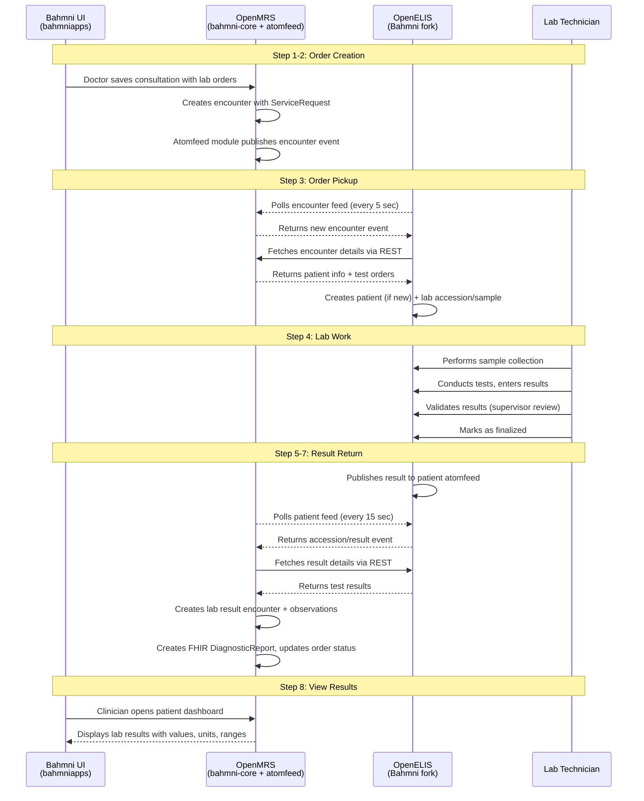
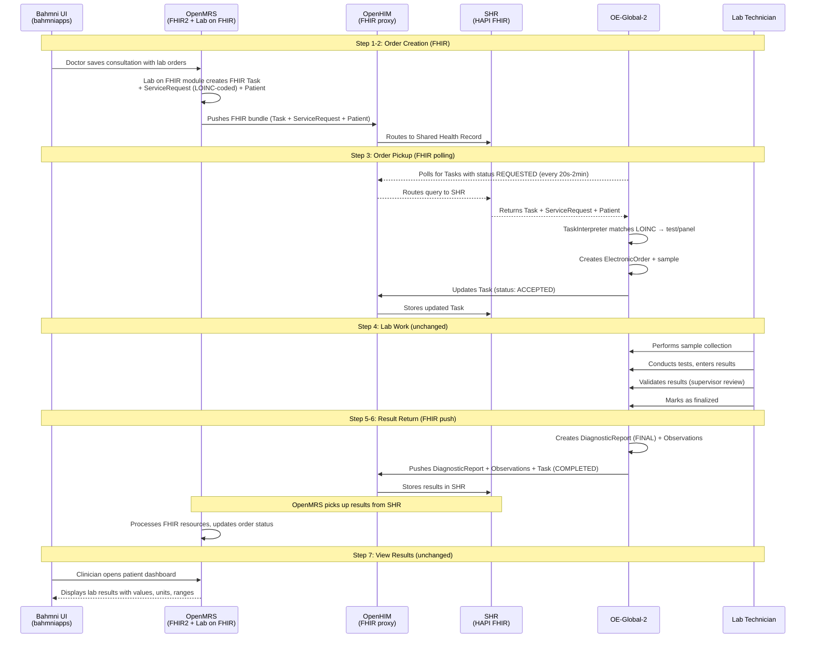
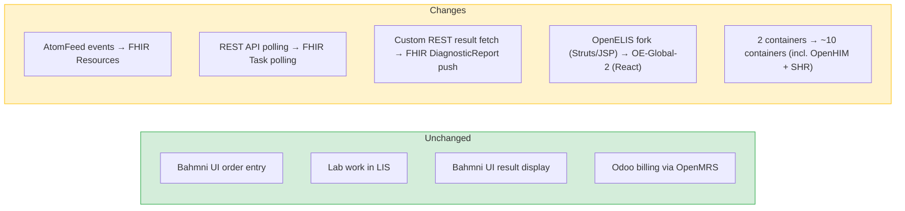
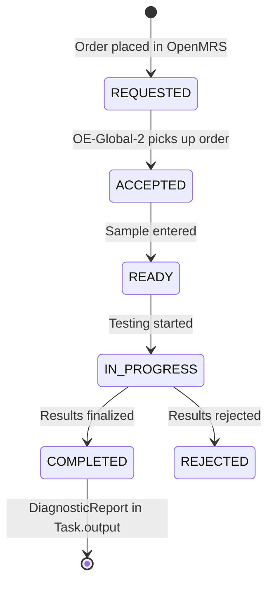
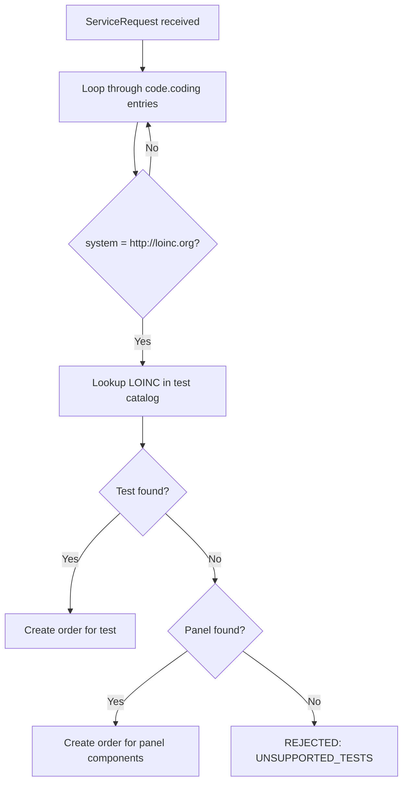
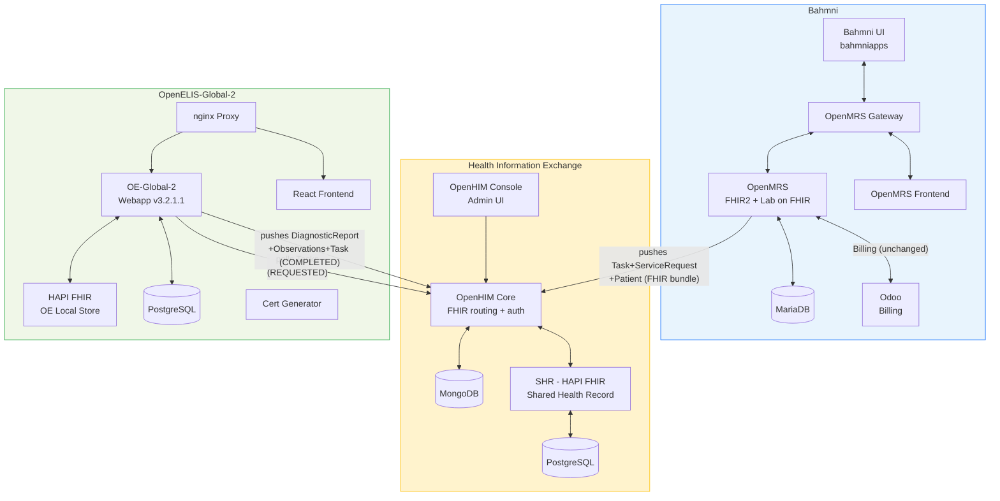

# Bahmni + OpenELIS-Global-2: Integration Plan

**Date:** 2026-02-17 (Updated: 2026-02-18)
**Status:** Draft
**Objective:** Replace Bahmni's OpenELIS fork with OpenELIS-Global-2 (OE-Global-2), integrated via FHIR.

**Key references:**
- [OE-Global-2 + OpenMRS FHIR integration discussion](https://talk.openelis-global.org/t/integration-with-openmrs-over-fhir/1702) (Angshuman + Moses Mutesasira)
- [OE-Global-2 test method selection capability](https://talk.openelis-global.org/t/openelis-global-capability-for-selecting-a-specific-method-for-a-given-order/1691)
- [Reference implementation: `DIGI-UW/openelis-openmrs-hie`](https://github.com/DIGI-UW/openelis-openmrs-hie) — working Docker Compose stack with OpenMRS 3 + OE-Global-2 + OpenHIM

---

## 1. Context

Bahmni currently ships a fork of OpenELIS (v3.1, circa 2013) integrated with OpenMRS via AtomFeed — a custom, polling-based event mechanism. OpenELIS-Global-2 is the actively maintained successor with native FHIR R4 support. We are adopting it as-is — no code porting, no forking.

**The work is integration:** making OE-Global-2 and Bahmni's OpenMRS exchange lab orders, results, and reference data via FHIR.

---

## 2. Current Flow (AtomFeed-based)

This is how the lab order lifecycle works today in Bahmni, step by step.

### 2.1 Current Flow Diagram



### 2.2 Current Step-by-Step Detail

| Step | System | What Happens | Repository |
|---|---|---|---|
| **1. Create order** | Bahmni UI | Doctor opens consultation → Orders tab → selects lab tests → saves | `openmrs-module-bahmniapps` |
| **2. Publish event** | OpenMRS | Creates encounter with orders; atomfeed publishes encounter event | `openmrs/openmrs-module-atomfeed`, `bahmni-core` |
| **3. Poll & fetch** | OpenELIS | Polls encounter feed (5s interval); fetches encounter via REST; creates patient + accession | `Bahmni/OpenElis` |
| **4. Lab work** | OpenELIS | Sample collection → testing → result entry → validation → finalization | `Bahmni/OpenElis` |
| **5. Publish results** | OpenELIS | Publishes atomfeed event with accession UUID | `Bahmni/OpenElis` |
| **6. Poll & fetch** | OpenMRS | Polls OpenELIS patient feed (15s interval); fetches result details via REST | `bahmni-core (openmrs-elis-atomfeed-client-omod)` |
| **7. Process results** | OpenMRS | Creates lab result encounter, observations, FHIR DiagnosticReport; updates order status | `elis-fhir-result-support`, `bahmni-module-fhir2-addl-extension` |
| **8. View results** | Bahmni UI | Clinician sees results on patient dashboard with values, units, reference ranges | `openmrs-module-bahmniapps` |

### 2.3 Current Integration Feeds

| Feed | Direction | URL | Poll Interval |
|---|---|---|---|
| Encounter feed | OpenMRS → OpenELIS | `http://openmrs:8080/openmrs/ws/atomfeed/encounter/recent` | 5 seconds |
| Patient result feed | OpenELIS → OpenMRS | `http://openelis:8052/openelis/ws/feed/patient/recent` | 15 seconds |

---

## 3. Proposed Flow (FHIR-based with OE-Global-2)

### 3.1 Proposed Flow Diagram

Based on the [reference implementation](https://github.com/DIGI-UW/openelis-openmrs-hie) and [community discussion](https://talk.openelis-global.org/t/integration-with-openmrs-over-fhir/1702), the exchange is **purely FHIR-based**. The key insight: both systems communicate through a **Shared Health Record (SHR)** via **OpenHIM** as a routing/auth proxy — they do not talk directly to each other.



> **Note:** The reference implementation uses OpenHIM + SHR as intermediaries. A simplified architecture where OE-Global-2 talks directly to OpenMRS FHIR2 is theoretically possible (see [Section 9: Open Questions](#9-open-questions)) but has not been validated.

### 3.2 What Changes, What Stays the Same



### 3.3 Side-by-Side Comparison

| Aspect | Current (AtomFeed) | Proposed (FHIR) |
|---|---|---|
| **Order creation** | AtomFeed encounter event → REST fetch | Lab on FHIR module creates FHIR Task + ServiceRequest, pushes to SHR |
| **Order pickup** | OpenELIS polls AtomFeed (5s) | OE-Global-2 polls SHR for FHIR Tasks (configurable, 20s-2min) |
| **Test matching** | Custom code mapping | LOINC code lookup in ServiceRequest.code |
| **Patient sync** | Separate patient AtomFeed | Part of FHIR Task context (Patient reference) |
| **Result return** | AtomFeed event → REST fetch | FHIR DiagnosticReport + Observation pushed to SHR |
| **Result pickup** | OpenMRS polls AtomFeed (15s) | OpenMRS reads results from SHR |
| **Routing/auth** | Direct HTTP between services | OpenHIM proxy (basic auth, routing, audit trail) |
| **Lab UI** | OpenELIS (Struts/JSP) | OE-Global-2 (React) |
| **Integration standard** | Custom (Atom RFC 4287) | HL7 FHIR R4 |
| **Key OpenMRS modules** | `openmrs-module-atomfeed`, `bahmni-core` | `openmrs-module-labonfhir` (v1.5.3+), `openmrs-module-fhir2` |

---

## 4. Key Integration Questions — Answered

### Q1: How do I send a lab order to OE-Global-2?

**Answer:** The [`openmrs-module-labonfhir`](https://github.com/openmrs/openmrs-module-labonfhir) module (not the FHIR2 module alone) creates FHIR Task + ServiceRequest bundles and pushes them to a shared FHIR store. OE-Global-2 polls that store for new Tasks.

This was confirmed by [Moses Mutesasira from the OE-Global-2 team](https://talk.openelis-global.org/t/integration-with-openmrs-over-fhir/1702/2): the exchange is "purely FHIR based" using "Lab On FHIR module and FHIR2 module" together. The Lab Integration module (IsantePlus-specific) is **not** for general OE-Global-2 integration.

**How it works in the reference implementation:**

1. **OpenMRS side:** Lab on FHIR module detects a new lab order, creates a FHIR transaction bundle (Task + ServiceRequest + Patient), and pushes it to the SHR via OpenHIM
2. **OE-Global-2 side:** Poller (`FhirApiWorkFlowServiceImpl`) queries the SHR (via OpenHIM) for Tasks with status `REQUESTED`

**OE-Global-2 configuration** (from [`common.properties`](https://github.com/DIGI-UW/openelis-openmrs-hie/blob/main/configs/openelis/properties/common.properties)):
```properties
# Polls SHR (via OpenHIM) for lab order Tasks
org.openelisglobal.remote.source.uri=http://openhim-core:5001/fhir/

# Poll frequency (20 seconds in demo; default 120 seconds)
org.openelisglobal.remote.poll.frequency=20000

# Accept tasks for any practitioner
org.openelisglobal.remote.source.identifier=Practitioner/*

# Update task status back on remote
org.openelisglobal.remote.source.updateStatus=true

# Use ServiceRequest from Task.basedOn
org.openelisglobal.task.useBasedOn=true
```

**OpenMRS side configuration** (from [`openelis-openmrs.xml`](https://github.com/DIGI-UW/openelis-openmrs-hie/blob/main/configs/openmrs/distro/configuration/globalproperties/openelis-openmrs.xml)):
```properties
labonfhir.lisUrl=http://openhim-core:5001/fhir/   # Push Tasks to SHR via OpenHIM
labonfhir.activateFhirPush=true                     # Push mode (not poll)
labonfhir.authType=BASIC                            # Auth via OpenHIM
labonfhir.labUpdateTriggerObject=Order              # Trigger on Order creation
```

**What about the HAPI FHIR server?**

The reference implementation uses **three** FHIR endpoints:

| Endpoint | Service | Purpose |
|---|---|---|
| **SHR** (`shr-hapi-fhir`) | Shared Health Record | Central FHIR store where OpenMRS pushes orders and OE-Global-2 pushes results |
| **OE local FHIR** (`fhir.openelis.org`) | OE-Global-2's own HAPI FHIR | OE-Global-2's internal FHIR store (shares DB with OE-Global-2) |
| **OpenMRS FHIR2** | OpenMRS | OpenMRS's own FHIR API (provider/organization sync) |

**Verdict:** The SHR (HAPI FHIR) + OpenHIM containers are needed in the reference architecture. Whether they can be simplified for Bahmni is an open question (see [Section 9](#9-open-questions)).

**What Bahmni/OpenMRS must do:**
- Install `openmrs-module-labonfhir` (v1.5.3+) — **this is not currently part of Bahmni's OpenMRS distribution**
- Configure it to push FHIR bundles to the SHR
- Ensure lab orders carry LOINC codes in the ServiceRequest

---

### Q2: How does the EMR know results are ready?

**Answer:** OE-Global-2 pushes results to the **Shared Health Record (SHR)** via OpenHIM. The Task resource tracks status throughout the lifecycle. OpenMRS picks up completed results from the SHR.

Per the [community discussion](https://talk.openelis-global.org/t/integration-with-openmrs-over-fhir/1702/2): the Task serves as "a container Resource to track the status of the Order" and the exchange returns FHIR DiagnosticReport + Observation (not HL7v2).

**Task status lifecycle:**



**How results flow in the reference implementation:**

OE-Global-2 is configured to push results to the SHR (via OpenHIM) using the `fhir.subscriber` setting:

```properties
# OE-Global-2 pushes these FHIR resources to SHR via OpenHIM
org.openelisglobal.fhir.subscriber=http://openhim-core:5001/fhir/
org.openelisglobal.fhir.subscriber.resources=Task,Patient,ServiceRequest,DiagnosticReport,Observation,Specimen,Practitioner,Encounter

# Also updates Task status on the remote source
org.openelisglobal.remote.source.updateStatus=true
```

This means **both** mechanisms are active in the reference impl:
- **Data export:** DiagnosticReport + Observations pushed to SHR
- **Task status update:** Task updated to COMPLETED with result references

**Open:** How does OpenMRS/Lab on FHIR module pick up the completed results from the SHR? Does it poll, or does it rely on the Task status update? **This needs PoC validation.**

---

### Q3: How does OE-Global-2 know what test to run?

**Answer:** LOINC codes only. No fallback to custom codes in the FHIR path.

When OE-Global-2 receives a FHIR ServiceRequest, the `TaskInterpreter` does:



**Test entity fields:**

| Field | Used for FHIR matching? | Notes |
|---|---|---|
| `loinc` (240 chars) | **Yes — the only field used** | Required for FHIR orders |
| `local_code` (10 chars) | No | Optional, internal use only |
| `description` (60 chars) | No | Human-readable name |

**Panels** are composed via `PanelItem` entities — a CBC panel can have whatever component tests you need. Both the panel and each component test need LOINC codes.

**Method selection at lab execution time:**

Per the [community discussion on test methods](https://talk.openelis-global.org/t/openelis-global-capability-for-selecting-a-specific-method-for-a-given-order/1691), OE-Global-2 supports selecting the specific method (EIA, PCR, STAIN, CULTURE, etc.) at the time of test execution — not at order time. This means:

- A clinician can order a high-level test (e.g., "TB Test") with a single LOINC code
- The lab technician selects which specific method to use during accession
- OE-Global-2 records both the ordered test and the method employed
- **You don't need separate LOINC codes per method at order time**

The recommended pattern is parent/child test configuration:
- **Parent test:** Generic "TB Test" — used for ordering, has the LOINC code the EMR sends
- **Child tests:** Specific variants like "TB Test – Culture", "TB Test – PCR" — configured within OE-Global-2

**Implication for Bahmni:**
- Every test and panel ordered from Bahmni **must have a LOINC code**
- The same LOINC code must exist in both OpenMRS and OE-Global-2
- If Bahmni currently uses only custom codes, **LOINC mapping is a prerequisite**
- LOINC mapping can be at the **test level** (not method level) — method-specific granularity is handled inside OE-Global-2

---

### Q4: How do I set up master data?

**Answer:** OE-Global-2 has an admin UI, CSV bulk import on startup, and FHIR-based import for organizations and providers.

| Master Data | Recommended Setup Method | Details |
|---|---|---|
| **Tests + panels** | CSV files on startup | Drop CSV in `/var/lib/openelis-global/configuration/backend/tests/`. Format: `testName,testSection,sampleType,loinc,isActive,...` Auto-loaded, checksum-tracked. |
| **Sample types** | CSV files on startup | `configuration/sampleTypes/*.csv` |
| **Dictionaries** | CSV files on startup | `configuration/dictionaries/*.csv` |
| **Result ranges** | Admin UI or REST API | No CSV import — must be configured per test via UI |
| **Organizations/centers** | FHIR import from OpenMRS | Config: `org.openelisglobal.facilitylist.fhirstore=http://openmrs:8080/openmrs/ws/fhir2/R4`. Runs on schedule. |
| **Users/providers** | FHIR import + local creation | Practitioners auto-imported from OpenMRS FHIR. Lab-specific accounts created locally via admin UI. |
| **Roles** | CSV files on startup | `configuration/roles/*.csv` |

**Recommended approach for Bahmni:** Create a "Bahmni default" CSV configuration set (tests, panels, sample types, dictionaries) checked into version control. Mount as a Docker volume. Organizations and providers auto-sync from OpenMRS via FHIR.

---

## 5. Integration Architecture

Based on the [reference implementation](https://github.com/DIGI-UW/openelis-openmrs-hie) (`docker-compose.yml`):



**Deployment change:**

| Current (Bahmni OpenELIS) | Target (Reference Implementation) | Container Name |
|---|---|---|
| `bahmni/openelis` (WAR, port 8052) | OE-Global-2 webapp | `openelisglobal-webapp` |
| `bahmni/openelis-db` (PostgreSQL) | OE-Global-2 database | `openelisglobal-database` |
| | OE-Global-2 HAPI FHIR (local store) | `external-fhir-api` |
| | OE-Global-2 React frontend | `openelisglobal-front-end` |
| | OE-Global-2 nginx proxy | `openelisglobal-proxy` |
| | OE-Global-2 cert generator | `oe-certs` |
| | OpenHIM core (FHIR proxy) | `openhim-core` |
| | OpenHIM console (admin UI) | `openhim-console` |
| | OpenHIM config loader | `openhim-config` |
| | MongoDB (OpenHIM state) | `openhim-mongo` |
| | SHR - HAPI FHIR (shared health record) | `shr-hapi-fhir` |
| | SHR database (PostgreSQL) | `hapi-fhir-db` |

Net change: 2 containers removed, 12 added. The reference implementation also includes OpenMRS 3 containers (gateway, frontend, backend, MariaDB) but Bahmni already has these.

> **Can this be simplified?** The reference implementation follows the OpenHIE architecture pattern. For Bahmni deployments on an internal network, it may be possible to skip OpenHIM and the SHR and have OE-Global-2 talk directly to OpenMRS FHIR2. This is an open question (see [Section 9](#9-open-questions)).

---

## 6. Additional Integration Concerns

### 6.1 LOINC Code Prerequisite

OE-Global-2 requires LOINC codes for FHIR order matching. If Bahmni's current test catalog uses only custom codes, LOINC mapping must be done before integration can work. This could be significant depending on catalog size.

However, per the [test method discussion](https://talk.openelis-global.org/t/openelis-global-capability-for-selecting-a-specific-method-for-a-given-order/1691), LOINC mapping only needs to be at the **test level**, not the method level. Method-specific codes (e.g., PCR vs culture for TB) are handled inside OE-Global-2 at execution time.

**Action:** Audit the current Bahmni test catalog for LOINC coverage.

### 6.2 Reference Data Sync (Who Owns the Test Catalog?)

Tests and panels are currently mastered in OpenMRS. OE-Global-2 manages its catalog locally.

| Option | Description | Effort |
|---|---|---|
| **A. OE-Global-2 owns** | Configure in OE-Global-2 (CSV/admin UI); sync to OpenMRS for order dropdowns | Low — but changes current workflow |
| **B. Shared CSV config** | Single CSV set configures both systems; checked into version control | Low — operational process |
| **C. FHIR sync from OpenMRS** | Build inbound sync to OE-Global-2 | High — FHIR test catalog representation is not well-established |

**Recommendation:** Option A or B. The LIS should own its test catalog.

### 6.3 Patient Sync

Patient data flows as part of the FHIR Task context — when a lab order arrives, the Patient resource is included. OE-Global-2 creates/updates the patient automatically.

**Open:** Is standalone patient sync needed, or is patient-on-demand sufficient?

### 6.4 Authentication Between Systems

Per the [community discussion](https://talk.openelis-global.org/t/integration-with-openmrs-over-fhir/1702/2), authentication options are:

| Option | Description | When to use |
|---|---|---|
| **No auth** | Services on internal network, not exposed externally | PoC / development |
| **Basic auth via OpenHIM** | OpenHIM proxies FHIR endpoints, handles authentication | Reference implementation (recommended for production) |
| **HTTPS certificates** | Mutual TLS between services | High-security deployments |

The reference implementation uses OpenHIM with pre-configured clients:
- **Client `OpenELIS`** — OE-Global-2 authenticates to OpenHIM
- **Client `OpenMRS`** — OpenMRS authenticates to OpenHIM
- OpenHIM routes all `/fhir/*` requests to the SHR (HAPI FHIR)

OpenMRS Lab on FHIR module configuration:
```properties
labonfhir.authType=BASIC
labonfhir.username=OpenMRS
labonfhir.password=admin
```

OE-Global-2 configuration:
```properties
org.openelisglobal.fhirstore.username=OpenELIS
org.openelisglobal.fhirstore.password=admin
```

---

## 7. Community References

| Source | Link | Key Insight |
|---|---|---|
| **FHIR integration discussion** | [talk.openelis-global.org/t/1702](https://talk.openelis-global.org/t/integration-with-openmrs-over-fhir/1702) | Lab on FHIR + FHIR2 modules needed; exchange is purely FHIR; OpenHIM for auth |
| **Test method selection** | [talk.openelis-global.org/t/1691](https://talk.openelis-global.org/t/openelis-global-capability-for-selecting-a-specific-method-for-a-given-order/1691) | OE-Global-2 supports method selection at execution time; parent/child test pattern |
| **Reference implementation** | [github.com/DIGI-UW/openelis-openmrs-hie](https://github.com/DIGI-UW/openelis-openmrs-hie) | Working Docker Compose with OpenMRS 3 + OE-Global-2 + OpenHIM + SHR |
| **Lab on FHIR module** | [github.com/openmrs/openmrs-module-labonfhir](https://github.com/openmrs/openmrs-module-labonfhir) | Creates FHIR Task + ServiceRequest bundles; pushes to LIS |

---

## 8. Open Questions

| # | Question | Blocks | Owner |
|---|---|---|---|
| 1 | Can `openmrs-module-labonfhir` (v1.5.3) be added to Bahmni's OpenMRS distribution? Any module conflicts or version incompatibilities? | **Critical — blocks everything** | Angshuman Sarkar |
| 2 | Can the architecture be simplified for Bahmni? Can OE-Global-2 poll OpenMRS FHIR2 directly and push results back directly, skipping OpenHIM + SHR? The reference impl adds ~6 containers for this layer. | Phase 1 | Angshuman Sarkar + team |
| 3 | How does OpenMRS/Lab on FHIR pick up completed results from the SHR? Does it poll, or rely on Task status updates? | Phase 1 | PoC validation |
| 4 | Does the current Bahmni test catalog have LOINC codes? How many tests need mapping? | Phase 2 | SME |
| 5 | Where should the test catalog be mastered — OpenMRS or OE-Global-2? | Phase 2 | Team decision |
| 6 | Is standalone patient sync needed, or is patient-on-demand (via Task context) sufficient? | Phase 1 | SME |

---

## 9. Plan

### Phase 1: Proof of Concept (2-3 weeks)

**Goal:** Validate the FHIR integration end-to-end using the reference implementation, then assess Bahmni-specific gaps.

**Step 1a: Run the reference implementation as-is**
- [ ] Spin up [`DIGI-UW/openelis-openmrs-hie`](https://github.com/DIGI-UW/openelis-openmrs-hie) (`docker-compose up -d`)
- [ ] Place a lab order in OpenMRS 3 → confirm it appears in OE-Global-2
- [ ] Enter and validate a result in OE-Global-2 → confirm DiagnosticReport reaches OpenMRS
- [ ] Observe the full Task lifecycle: REQUESTED → ACCEPTED → IN_PROGRESS → COMPLETED
- [ ] Understand how OpenHIM routes FHIR traffic (OpenHIM console at `http://localhost:9000`)

**Step 1b: Assess Bahmni-specific gaps (answers open questions 1-3)**
- [ ] Determine if `openmrs-module-labonfhir` (v1.5.3) can be added to Bahmni's OpenMRS without conflicts
- [ ] Assess whether Bahmni's OpenMRS version supports the FHIR2 module features Lab on FHIR requires
- [ ] Evaluate if OpenHIM + SHR are required, or if a simplified direct connection works for Bahmni
- [ ] Involve **Angshuman Sarkar** for OpenMRS-side assessment

### Phase 2: Test Catalog + LOINC (2-3 weeks)

**Goal:** Ensure OE-Global-2 can interpret every lab test Bahmni orders. Establish the "Bahmni default" test catalog. *(Contingent on open questions 4 and 5.)*

- [ ] Audit Bahmni test catalog for LOINC code coverage
- [ ] Map tests without LOINC codes to LOINC
- [ ] Create CSV configuration files for OE-Global-2 (tests, panels, sample types, dictionaries)
- [ ] Validate order matching: place orders for every test → confirm OE-Global-2 matches correctly
- [ ] Decide on test catalog mastering model (OE-Global-2 vs shared CSV vs sync)

### Phase 3: Master Data + Deployment (2-3 weeks)

**Goal:** Full working Bahmni + OE-Global-2 stack with all master data configured.

- [ ] Configure result ranges via admin UI or REST API
- [ ] Set up FHIR-based organization import from OpenMRS
- [ ] Set up FHIR-based provider import from OpenMRS
- [ ] Create lab-specific user accounts in OE-Global-2
- [ ] Integrate OE-Global-2 containers into Bahmni Docker Compose stack
- [ ] Configure networking, proxy, SSL, environment variables
- [ ] Configure authentication between OpenMRS and OE-Global-2

### Phase 4: End-to-End Testing (2-3 weeks)

**Goal:** Production readiness validated with real workflows.

- [ ] Full lab workflow testing: order → sample → result → validation → report → display in Bahmni
- [ ] Test all configured tests and panels
- [ ] Test edge cases: rejected samples, amended results, cancelled orders
- [ ] User acceptance testing with lab technicians on OE-Global-2's React UI
- [ ] Performance testing (full container stack)
- [ ] Verify Odoo billing integration is unaffected

### Phase 5: Go-Live (1 week)

**Goal:** Production deployment for current client (fresh install, no data migration).

- [ ] Deploy to production environment
- [ ] Verify end-to-end flow with production configuration
- [ ] Monitor for issues during initial operation period

**Total: 10-14 weeks** *(pending resolution of open questions)*

### Future: Data Migration Tooling

When OE-Global-2 becomes part of the standard Bahmni release, existing installations will need a data migration path. This should be built as a productized tool (not a one-off script) covering patients, samples, results, and test catalog. Can be planned independently from the current integration work.

---

*Archived analysis documents with detailed code inventory available in [archive/](archive/) for reference.*
