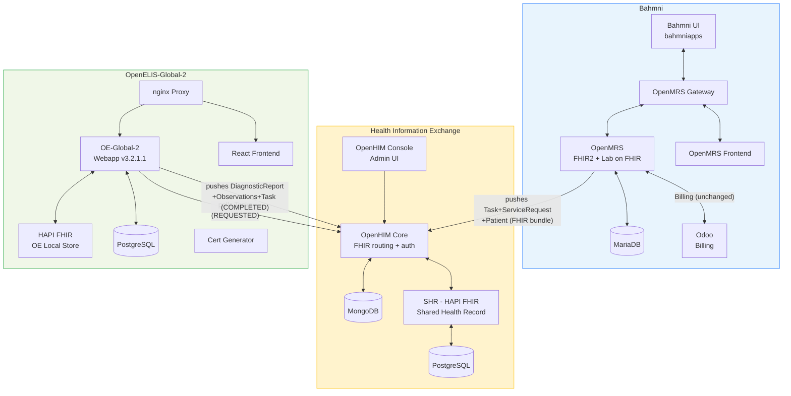

# Architecture Detail: Container Inventory and Deployment

*Back to [Integration Plan](../bahmni-openelis-global2-integration-plan.md)*

---

## Architecture Diagram

Based on the [reference implementation](https://github.com/DIGI-UW/openelis-openmrs-hie) (`docker-compose.yml`):



## Container Inventory

### Current (Bahmni OpenELIS — being replaced)

| Container | Image | Purpose |
|---|---|---|
| `bahmni/openelis` | WAR on Tomcat, port 8052 | OpenELIS Bahmni fork |
| `bahmni/openelis-db` | PostgreSQL | OpenELIS database |

### Target: OE-Global-2 Containers (new)

| Container Name | Purpose | Notes |
|---|---|---|
| `openelisglobal-webapp` | OE-Global-2 Java backend (v3.2.1.1) | Replaces `bahmni/openelis` |
| `openelisglobal-database` | OE-Global-2 PostgreSQL database | Replaces `bahmni/openelis-db` |
| `external-fhir-api` | OE-Global-2's internal HAPI FHIR store | New — shares DB with OEG |
| `openelisglobal-front-end` | React SPA frontend | New |
| `openelisglobal-proxy` | nginx reverse proxy | New |
| `oe-certs` | SSL certificate generator | New — init container |

### Target: Health Information Exchange Containers (new)

| Container Name | Purpose | Notes |
|---|---|---|
| `openhim-core` | FHIR routing proxy + auth | New — API gateway |
| `openhim-console` | OpenHIM admin UI | New — port 9000 |
| `openhim-config` | Auto-configures OpenHIM channels/clients | New — init container |
| `openhim-mongo` | MongoDB for OpenHIM state | New |
| `shr-hapi-fhir` | Shared Health Record (HAPI FHIR server) | New — central FHIR store |
| `hapi-fhir-db` | PostgreSQL for SHR | New |

**Net change:** 2 containers removed, 12 added. Bahmni already has its own OpenMRS containers.

> **Can this be simplified?** The reference implementation follows the OpenHIE architecture pattern. For Bahmni deployments on an internal network, it may be possible to skip OpenHIM and the SHR and have OE-Global-2 talk directly to OpenMRS FHIR2. This is an open question.

## Authentication

Per the [community discussion](https://talk.openelis-global.org/t/integration-with-openmrs-over-fhir/1702/2):

| Option | Description | When to use |
|---|---|---|
| **No auth** | Services on internal network, not exposed externally | PoC / development |
| **Basic auth via OpenHIM** | OpenHIM proxies FHIR endpoints, handles authentication | Reference implementation (recommended) |
| **HTTPS certificates** | Mutual TLS between services | High-security deployments |

The reference implementation pre-configures two OpenHIM clients:
- **`OpenELIS`** — OE-Global-2 authenticates to OpenHIM
- **`OpenMRS`** — OpenMRS authenticates to OpenHIM
- OpenHIM routes all `/fhir/*` requests to the SHR

Auth configuration:
```properties
# OpenMRS Lab on FHIR
labonfhir.authType=BASIC
labonfhir.username=OpenMRS
labonfhir.password=admin

# OE-Global-2
org.openelisglobal.fhirstore.username=OpenELIS
org.openelisglobal.fhirstore.password=admin
```

## Master Data Setup

| Master Data | Recommended Setup Method | Details |
|---|---|---|
| **Tests + panels** | CSV files on startup | Drop CSV in `/var/lib/openelis-global/configuration/backend/tests/`. Format: `testName,testSection,sampleType,loinc,isActive,...` |
| **Sample types** | CSV files on startup | `configuration/sampleTypes/*.csv` |
| **Dictionaries** | CSV files on startup | `configuration/dictionaries/*.csv` |
| **Result ranges** | Admin UI or REST API | No CSV import — must be configured per test via UI |
| **Organizations/centers** | FHIR import from OpenMRS | `org.openelisglobal.facilitylist.fhirstore=http://openmrs:8080/openmrs/ws/fhir2/R4` |
| **Users/providers** | FHIR import + local creation | Practitioners auto-imported from OpenMRS FHIR |
| **Roles** | CSV files on startup | `configuration/roles/*.csv` |

**Recommended approach for Bahmni:** Create a "Bahmni default" CSV configuration set checked into version control. Mount as a Docker volume.
