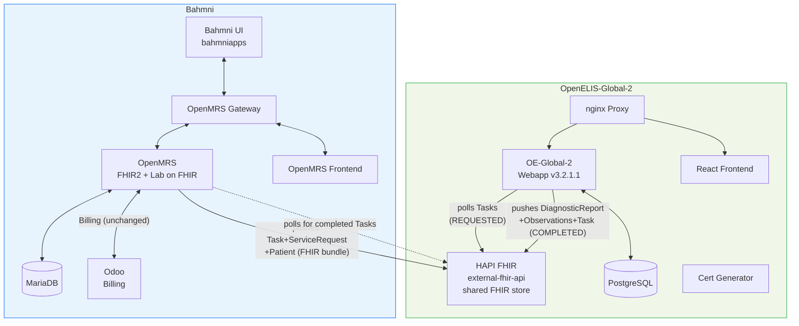
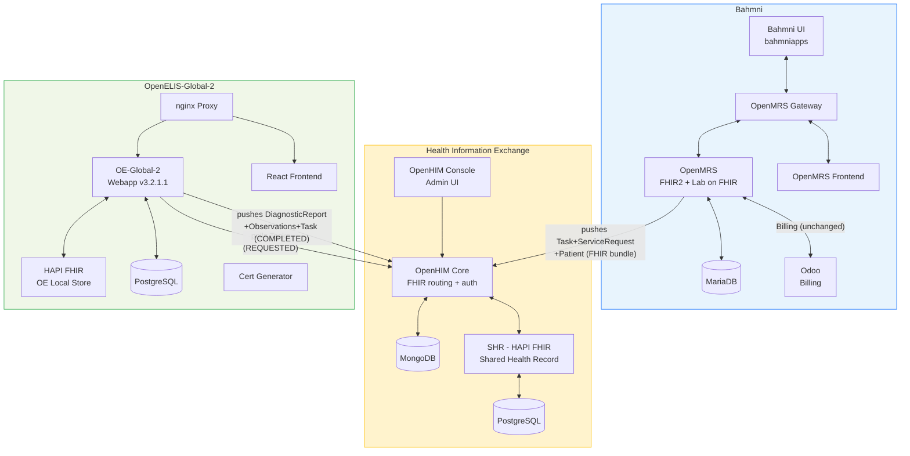

# Architecture Detail: Containers, Config, and Deployment

*Back to [Integration Plan](../bahmni-openelis-global2-integration-plan.md)*

---

Two architecture options are proposed. See [Architecture Decision](../bahmni-openelis-global2-integration-plan.md#5-architecture-decision-full-openhie-vs-simplified) for the comparison table and recommendation.

## Option B: Simplified (recommended)



### Containers (6 new)

| Container Name | Purpose | Notes |
|---|---|---|
| `openelisglobal-webapp` | OE-Global-2 Java backend (v3.2.1.1) | Replaces `bahmni/openelis` |
| `openelisglobal-database` | OE-Global-2 PostgreSQL database | Replaces `bahmni/openelis-db` |
| `external-fhir-api` | OE-Global-2's HAPI FHIR store — **also serves as the shared FHIR store** | Receives writes from Lab on FHIR |
| `openelisglobal-front-end` | React SPA frontend | New |
| `openelisglobal-proxy` | nginx reverse proxy | New |
| `oe-certs` | SSL certificate generator | Init container |

### Config

```properties
# OpenMRS Lab on FHIR — push directly to OE-Global-2's FHIR store
labonfhir.lisUrl=http://external-fhir-api:8080/fhir/
labonfhir.activateFhirPush=true
labonfhir.authType=NONE
labonfhir.labUpdateTriggerObject=Order

# OE-Global-2 — poll its own FHIR store
org.openelisglobal.remote.source.uri=http://external-fhir-api:8080/fhir/
org.openelisglobal.remote.poll.frequency=20000
org.openelisglobal.remote.source.identifier=Practitioner/*
org.openelisglobal.remote.source.updateStatus=true
org.openelisglobal.task.useBasedOn=true
org.openelisglobal.fhir.subscriber=http://external-fhir-api:8080/fhir/
org.openelisglobal.fhir.subscriber.resources=Task,Patient,ServiceRequest,DiagnosticReport,Observation,Specimen,Practitioner,Encounter
```

### Auth

Docker network isolation — services communicate on an internal Docker network not exposed externally. No auth overhead for PoC/internal deployments.

---

## Option A: Full OpenHIE Stack (reference implementation)



### Containers (12 new)

**OE-Global-2 (6):**

| Container Name | Purpose |
|---|---|
| `openelisglobal-webapp` | OE-Global-2 Java backend (v3.2.1.1) |
| `openelisglobal-database` | OE-Global-2 PostgreSQL database |
| `external-fhir-api` | OE-Global-2's internal HAPI FHIR store |
| `openelisglobal-front-end` | React SPA frontend |
| `openelisglobal-proxy` | nginx reverse proxy |
| `oe-certs` | SSL certificate generator (init container) |

**Health Information Exchange (6):**

| Container Name | Purpose |
|---|---|
| `openhim-core` | FHIR routing proxy + auth (API gateway) |
| `openhim-console` | OpenHIM admin UI (port 9000) |
| `openhim-config` | Auto-configures OpenHIM channels/clients (init container) |
| `openhim-mongo` | MongoDB for OpenHIM state |
| `shr-hapi-fhir` | Shared Health Record (HAPI FHIR server) |
| `hapi-fhir-db` | PostgreSQL for SHR |

### Config

From the [reference implementation](https://github.com/DIGI-UW/openelis-openmrs-hie):

```properties
# OpenMRS Lab on FHIR — push to SHR via OpenHIM
labonfhir.lisUrl=http://openhim-core:5001/fhir/
labonfhir.activateFhirPush=true
labonfhir.authType=BASIC
labonfhir.username=OpenMRS
labonfhir.password=admin
labonfhir.labUpdateTriggerObject=Order

# OE-Global-2 — poll SHR via OpenHIM
org.openelisglobal.remote.source.uri=http://openhim-core:5001/fhir/
org.openelisglobal.remote.poll.frequency=20000
org.openelisglobal.remote.source.identifier=Practitioner/*
org.openelisglobal.remote.source.updateStatus=true
org.openelisglobal.task.useBasedOn=true
org.openelisglobal.fhir.subscriber=http://openhim-core:5001/fhir/
org.openelisglobal.fhir.subscriber.resources=Task,Patient,ServiceRequest,DiagnosticReport,Observation,Specimen,Practitioner,Encounter
```

### Auth

OpenHIM provides basic auth + audit trail. Pre-configured clients:
- **`OpenMRS`** — OpenMRS authenticates to OpenHIM
- **`OpenELIS`** — OE-Global-2 authenticates to OpenHIM
- OpenHIM routes all `/fhir/*` requests to the SHR

```properties
# OpenMRS credentials
labonfhir.authType=BASIC
labonfhir.username=OpenMRS
labonfhir.password=admin

# OE-Global-2 credentials
org.openelisglobal.fhirstore.username=OpenELIS
org.openelisglobal.fhirstore.password=admin
```

---

## Current Containers (being replaced)

| Container | Image | Purpose |
|---|---|---|
| `bahmni/openelis` | WAR on Tomcat, port 8052 | OpenELIS Bahmni fork |
| `bahmni/openelis-db` | PostgreSQL | OpenELIS database |

**Net change:** 2 containers removed, **6 added (Option B)** or **12 added (Option A)**.
