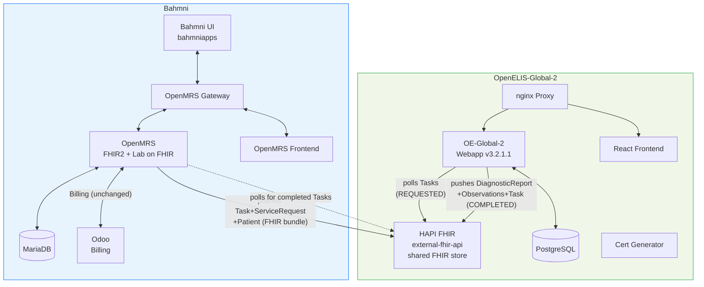
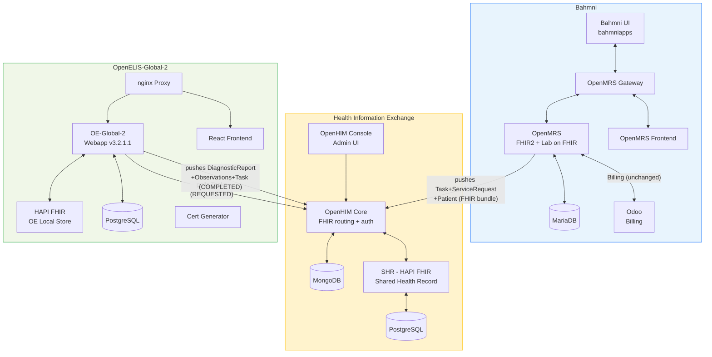

# Architecture Detail: Container Inventory and Deployment

*Back to [Integration Plan](../bahmni-openelis-global2-integration-plan.md)*

---

Two architecture options are under consideration. See [Architecture Decision](../bahmni-openelis-global2-integration-plan.md#5-architecture-decision-full-openhie-vs-simplified) in the main plan for the comparison table and recommendation.

## Option B: Simplified (recommended)



**6 new containers.** OE-Global-2's `external-fhir-api` doubles as the shared FHIR store. No HIE layer.

## Option A: Full OpenHIE Stack (reference implementation)



**12 new containers.** Adds a separate SHR and OpenHIM proxy layer between OpenMRS and OE-Global-2.

## Container Inventory

### Current (Bahmni OpenELIS — being replaced)

| Container | Image | Purpose |
|---|---|---|
| `bahmni/openelis` | WAR on Tomcat, port 8052 | OpenELIS Bahmni fork |
| `bahmni/openelis-db` | PostgreSQL | OpenELIS database |

### OE-Global-2 Containers (both options)

| Container Name | Purpose | Notes |
|---|---|---|
| `openelisglobal-webapp` | OE-Global-2 Java backend (v3.2.1.1) | Replaces `bahmni/openelis` |
| `openelisglobal-database` | OE-Global-2 PostgreSQL database | Replaces `bahmni/openelis-db` |
| `external-fhir-api` | OE-Global-2's HAPI FHIR store | In Option B, also serves as the shared FHIR store |
| `openelisglobal-front-end` | React SPA frontend | New |
| `openelisglobal-proxy` | nginx reverse proxy | New |
| `oe-certs` | SSL certificate generator | New — init container |

### HIE Containers (Option A only)

| Container Name | Purpose | Notes |
|---|---|---|
| `openhim-core` | FHIR routing proxy + auth | API gateway |
| `openhim-console` | OpenHIM admin UI | Port 9000 |
| `openhim-config` | Auto-configures OpenHIM channels/clients | Init container |
| `openhim-mongo` | MongoDB for OpenHIM state | |
| `shr-hapi-fhir` | Shared Health Record (HAPI FHIR server) | Central FHIR store |
| `hapi-fhir-db` | PostgreSQL for SHR | |

**Net change:** 2 containers removed, **6 added (Option B)** or **12 added (Option A)**.

## Authentication

| Option | Auth approach | Details |
|---|---|---|
| **Option B (simplified)** | Docker network isolation | Services communicate on an internal Docker network not exposed externally. No auth overhead for PoC. |
| **Option A (full OpenHIE)** | Basic auth via OpenHIM | OpenHIM proxies FHIR endpoints; pre-configured clients: `OpenELIS` and `OpenMRS`. See config below. |
| **Either (production)** | HTTPS certificates | Mutual TLS between services for high-security deployments. Can be added later. |

### Option A auth configuration

```properties
# OpenMRS Lab on FHIR
labonfhir.authType=BASIC
labonfhir.username=OpenMRS
labonfhir.password=admin

# OE-Global-2
org.openelisglobal.fhirstore.username=OpenELIS
org.openelisglobal.fhirstore.password=admin
```

OpenHIM routes all `/fhir/*` requests to the SHR.

## Master Data Setup

| Master Data | Recommended Setup Method | Details |
|---|---|---|
| **Tests + panels** | CSV files on startup | Drop CSV in `/var/lib/openelis-global/configuration/backend/tests/`. Format: `testName,testSection,sampleType,loinc,isActive,...` |
| **Sample types** | CSV files on startup | `configuration/sampleTypes/*.csv` |
| **Dictionaries** | CSV files on startup | `configuration/dictionaries/*.csv` |
| **Result ranges** | Admin UI or REST API | No CSV import — must be configured per test via UI |
| **Organizations/centers** | FHIR import from OpenMRS | `org.openelisglobal.facilitylist.fhirstore=http://openmrs:8080/openmrs/ws/fhir2/R4` |
| **Users/providers** | FHIR import + local creation | Practitioners auto-imported from OpenMRS FHIR |
| **Roles** | CSV files on startup | `configuration/roles/*.csv` |

**Recommended approach for Bahmni:** Create a "Bahmni default" CSV configuration set checked into version control. Mount as a Docker volume.
