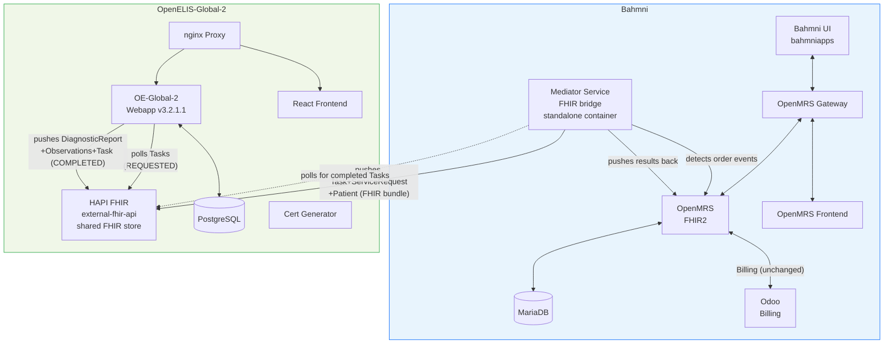

# Architecture Detail: Containers, Config, and Deployment

*Back to [Integration Plan](../bahmni-openelis-global2-integration-plan.md)*

---

## Container Diagram



## Containers

| Container Name | Purpose | Change |
|---|---|---|
| `openelisglobal-webapp` | OE-Global-2 Java backend (v3.2.1.1) | Replaces `bahmni/openelis` |
| `openelisglobal-database` | OE-Global-2 PostgreSQL database | Replaces `bahmni/openelis-db` |
| `external-fhir-api` | OE-Global-2's HAPI FHIR store — **also serves as the shared FHIR store** | New |
| `openelisglobal-front-end` | React SPA frontend | New |
| `openelisglobal-proxy` | nginx reverse proxy | New |
| `oe-certs` | SSL certificate generator (init container) | New |
| **`bahmni-lab-mediator`** | Custom mediator service — bridges OpenMRS ↔ OEG2 via FHIR | **New (to be built)** |

**Net change:** 2 existing containers replaced, 5 new containers added (+5 net).

## Config

```properties
# Custom mediator service — push to OE-Global-2's FHIR store
mediator.fhirStoreUrl=http://external-fhir-api:8080/fhir/
mediator.openmrsUrl=http://openmrs:8080/openmrs/
mediator.enabled=true

# OE-Global-2 — poll its own FHIR store
org.openelisglobal.remote.source.uri=http://external-fhir-api:8080/fhir/
org.openelisglobal.remote.poll.frequency=20000
org.openelisglobal.remote.source.identifier=Practitioner/*
org.openelisglobal.remote.source.updateStatus=true
org.openelisglobal.task.useBasedOn=true
org.openelisglobal.fhir.subscriber=http://external-fhir-api:8080/fhir/
org.openelisglobal.fhir.subscriber.resources=Task,Patient,ServiceRequest,DiagnosticReport,Observation,Specimen,Practitioner,Encounter
```

## Auth

Docker network isolation — services communicate on an internal Docker network not exposed externally. No auth overhead for PoC/internal deployments.

*Fallback architecture (Full OpenHIE with OpenHIM + SHR, adding auth/audit) is documented in [fallback-option-a.md](fallback-option-a.md).*
