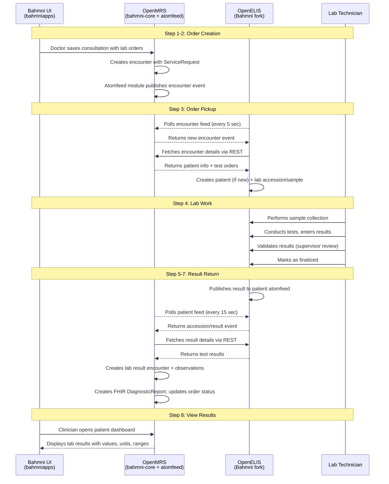

# Current Flow Detail: AtomFeed-based Integration

*Back to [Integration Plan](../bahmni-openelis-global2-integration-plan.md)*

---

## Sequence Diagram

## Step-by-Step Detail

| Step | System | What Happens | Repository |
|---|---|---|---|
| **1. Create order** | Bahmni UI | Doctor opens consultation → Orders tab → selects lab tests → saves | `openmrs-module-bahmniapps` |
| **2. Publish event** | OpenMRS | Creates encounter with orders; atomfeed publishes encounter event | `openmrs/openmrs-module-atomfeed`, `bahmni-core` |
| **3. Poll & fetch** | OpenELIS | Polls encounter feed (5s interval); fetches encounter via REST; creates patient + accession | `Bahmni/OpenElis` |
| **4. Lab work** | OpenELIS | Sample collection → testing → result entry → validation → finalization | `Bahmni/OpenElis` |
| **5. Publish results** | OpenELIS | Publishes atomfeed event with accession UUID | `Bahmni/OpenElis` |
| **6. Poll & fetch** | OpenMRS | Polls OpenELIS patient feed (15s interval); fetches result details via REST | `bahmni-core (openmrs-elis-atomfeed-client-omod)` |
| **7. Process results** | OpenMRS | Creates lab result encounter, observations, FHIR DiagnosticReport; updates order status | `elis-fhir-result-support`, `bahmni-module-fhir2-addl-extension` |
| **8. View results** | Bahmni UI | Clinician sees results on patient dashboard with values, units, reference ranges | `openmrs-module-bahmniapps` |

## Integration Feeds

| Feed | Direction | URL | Poll Interval |
|---|---|---|---|
| Encounter feed | OpenMRS → OpenELIS | `http://openmrs:8080/openmrs/ws/atomfeed/encounter/recent` | 5 seconds |
| Patient result feed | OpenELIS → OpenMRS | `http://openelis:8052/openelis/ws/feed/patient/recent` | 15 seconds |
