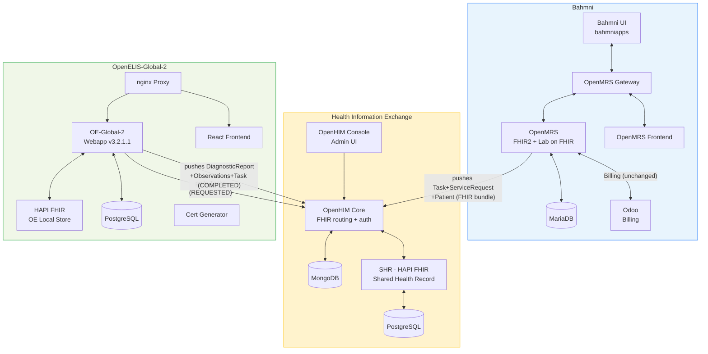
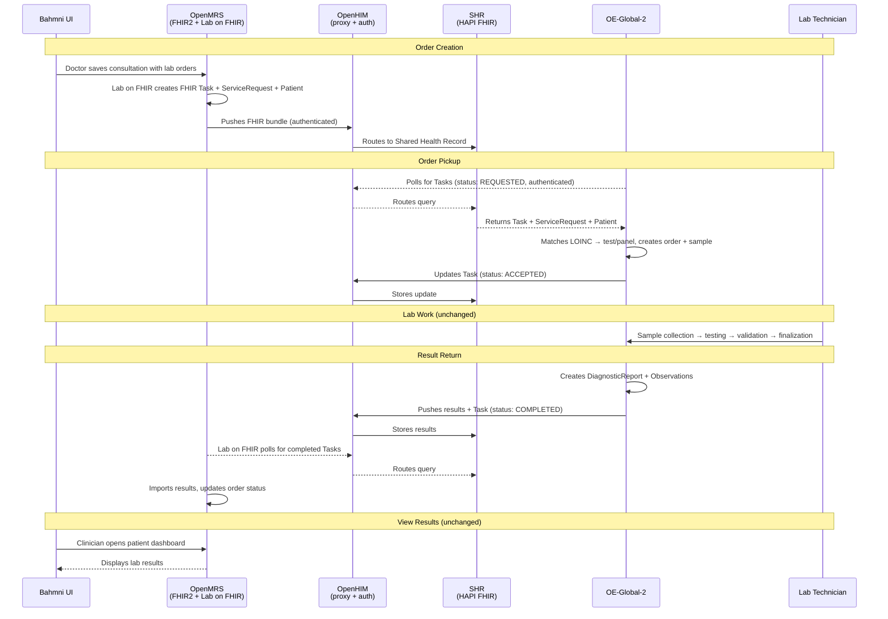

# Fallback: Full OpenHIE Architecture (Option A)

*Back to [Integration Plan](../bahmni-openelis-global2-integration-plan.md)*

---

This documents the Full OpenHIE architecture as a fallback option. The decided approach is the [simplified architecture](architecture-detail.md). This option can be adopted later if auth/audit requirements emerge — the path from simplified → OpenHIE is additive.

## When to Consider This Option

- Multiple external systems need to connect to the FHIR store (SHR acts as a shared hub)
- Regulatory requirements mandate audit trails on all FHIR transactions
- Multi-format translation is needed (HL7v2, CDA profiles) — OpenHIM handles this
- Resilience requirement: SHR buffers orders/results if one side is temporarily down

## Comparison with Simplified Approach

| Aspect | Full OpenHIE (this page) | Simplified (decided) |
|---|---|---|
| **New containers** | 12 | 7 |
| **Proven/tested** | Yes (reference impl) | Needs PoC validation |
| **Code changes** | None (config only) | None (config only) |
| **Standards compliance** | OpenHIE-compliant | Not OpenHIE-compliant |
| **Auth/audit** | OpenHIM provides auth + audit trail | No auth layer — Docker network isolation |
| **Maintenance burden** | High — 6 extra services to monitor | Low — just OE-Global-2 stack |
| **Debugging** | Harder — more network hops, OpenHIM logs | Easier — fewer moving parts |
| **Resilience** | SHR buffers orders if one side is down | If OE-Global-2 is down, FHIR store is also down |
| **Extensibility** | Other systems can connect to SHR | Additional systems would need to access OE-Global-2's store |

## Architecture Diagram



## Sequence Diagram



## Containers (12 new)

**OE-Global-2 (6):**

| Container Name | Purpose |
|---|---|
| `openelisglobal-webapp` | OE-Global-2 Java backend (v3.2.1.1) |
| `openelisglobal-database` | OE-Global-2 PostgreSQL database |
| `external-fhir-api` | OE-Global-2's internal HAPI FHIR store |
| `openelisglobal-front-end` | React SPA frontend |
| `openelisglobal-proxy` | nginx reverse proxy |
| `oe-certs` | SSL certificate generator (init container) |

**Health Information Exchange (6):**

| Container Name | Purpose |
|---|---|
| `openhim-core` | FHIR routing proxy + auth (API gateway) |
| `openhim-console` | OpenHIM admin UI (port 9000) |
| `openhim-config` | Auto-configures OpenHIM channels/clients (init container) |
| `openhim-mongo` | MongoDB for OpenHIM state |
| `shr-hapi-fhir` | Shared Health Record (HAPI FHIR server) |
| `hapi-fhir-db` | PostgreSQL for SHR |

## Config

From the [reference implementation](https://github.com/DIGI-UW/openelis-openmrs-hie):

```properties
# OpenMRS Lab on FHIR — push to SHR via OpenHIM
labonfhir.lisUrl=http://openhim-core:5001/fhir/
labonfhir.activateFhirPush=true
labonfhir.authType=BASIC
labonfhir.username=OpenMRS
labonfhir.password=admin
labonfhir.labUpdateTriggerObject=Order

# OE-Global-2 — poll SHR via OpenHIM
org.openelisglobal.remote.source.uri=http://openhim-core:5001/fhir/
org.openelisglobal.remote.poll.frequency=20000
org.openelisglobal.remote.source.identifier=Practitioner/*
org.openelisglobal.remote.source.updateStatus=true
org.openelisglobal.task.useBasedOn=true
org.openelisglobal.fhir.subscriber=http://openhim-core:5001/fhir/
org.openelisglobal.fhir.subscriber.resources=Task,Patient,ServiceRequest,DiagnosticReport,Observation,Specimen,Practitioner,Encounter
```

## Auth

OpenHIM provides basic auth + audit trail. Pre-configured clients:
- **`OpenMRS`** — OpenMRS authenticates to OpenHIM
- **`OpenELIS`** — OE-Global-2 authenticates to OpenHIM
- OpenHIM routes all `/fhir/*` requests to the SHR

```properties
# OpenMRS credentials
labonfhir.authType=BASIC
labonfhir.username=OpenMRS
labonfhir.password=admin

# OE-Global-2 credentials
org.openelisglobal.fhirstore.username=OpenELIS
org.openelisglobal.fhirstore.password=admin
```

## Key Components (different from simplified approach)

| Component | Role |
|---|---|
| [`openmrs-module-labonfhir`](https://github.com/openmrs/openmrs-module-labonfhir) | Active orchestrator (OpenMRS module) — detects lab orders via JMS, pushes FHIR bundles, polls for results |
| `shr-hapi-fhir` | Separate Shared Health Record (HAPI FHIR) — the "noticeboard" both systems read from/write to |
| OpenHIM (`openhim-core`) | API gateway — routes `/fhir/*` requests, handles auth + audit |

Note: This option uses `openmrs-module-labonfhir` (an OpenMRS module) instead of the custom mediator service used in the simplified approach.
