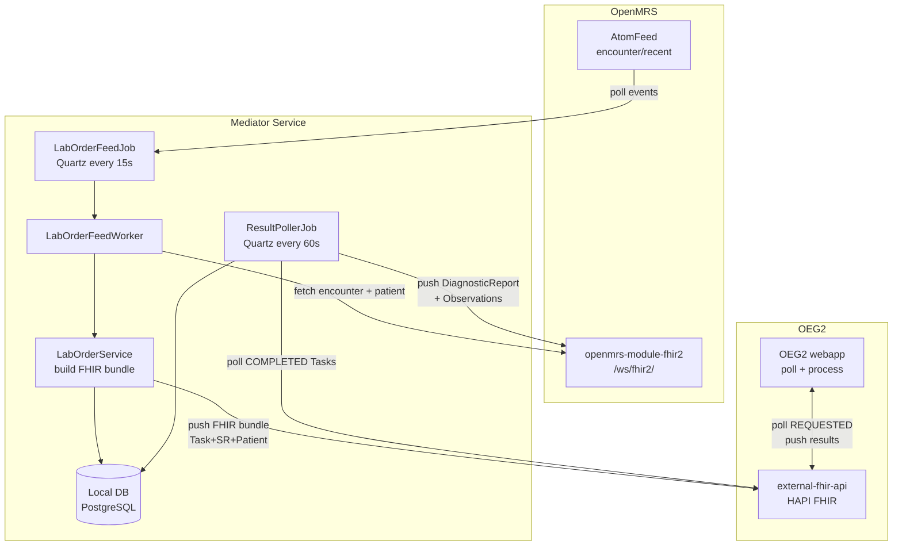

# Mediator Service Design

*Back to [Integration Plan](../bahmni-openelis-global2-integration-plan.md)*

**Status:** Draft — 2026-02-19
**Derived from:** [pacs-integration blueprint](repos/pacs-integration.md) + [labonfhir FHIR patterns](repos/openmrs-module-labonfhir.md)

---

## Overview

The lab order mediator is a **standalone Java/Spring Boot service** that bridges OpenMRS and OpenELIS-Global-2 over FHIR. It follows the same architectural pattern as `pacs-integration` — subscribing to OpenMRS AtomFeed, processing events, and communicating with the downstream system.

**Structure borrowed from `pacs-integration`:** AtomFeed client, retry queue, cursor tracking, Quartz scheduling, Docker/config templating.

**FHIR bundle patterns borrowed from `openmrs-module-labonfhir`:** Task + ServiceRequest + Patient bundle construction, result polling, Task status → Order status mapping.

### Pattern note (from SME input, 2026-02-20)

Although Bahmni historically calls these services "mediators" (and `pacs-integration`, `odoo-connect-service` follow this naming), the EIP (Enterprise Integration Patterns) term that more precisely describes this component is **Process Manager** — a stateful orchestrator that routes messages based on the results of prior steps. The lab order lifecycle (REQUESTED → ACCEPTED → IN_PROGRESS → COMPLETED) is a multi-step stateful workflow, and the mediator's `lab_order` table is the state store. The name "mediator" is retained for consistency with existing Bahmni services.

**Three event types this component handles** (generalised architecture per SME):
- **Reference data** — test definitions/orderables. For OEG2: handled as a one-time LOINC CSV setup (Phase 2), not a live feed, because OEG2 does not consume AtomFeed.
- **Patient** — sync patient demographics to OEG2 immediately on creation.
- **Orders (ServiceRequests)** — the core lab order flow.

**Future direction (not in current scope):** The SME envisions evolving from AtomFeed polling to a topic/message-broker model (e.g. Kafka), where downstream systems subscribe rather than poll. The mediator's component separation (feed worker, patient sync, result poller) is designed to accommodate this. CDS Hooks integration is also on the horizon. Phase 3 implementation should keep event-type processing cleanly separated.

---

## Architecture



---

## Order Detection: AtomFeed Encounter Feed

The mediator subscribes to the OpenMRS encounter feed:
```
http://openmrs:8080/openmrs/ws/atomfeed/encounter/recent
```

This is the same feed the old OpenELIS and pacs-integration consume. It is event-driven, uses the proven `org.ict4h.atomfeed.client` library from pacs-integration, and requires no changes to OpenMRS. See Decision 7 in [Decisions Log](../docs/decisions-log.md).

When an encounter event arrives:
1. Extract encounter URI from event content
2. Fetch full encounter from OpenMRS: `GET /ws/fhir2/Encounter/{id}?_include=Encounter:patient`
3. Filter: only process encounters containing lab orders (`orderType = Lab Order`)
4. For each new lab order: construct and push FHIR bundle

---

## Technology Stack

| Aspect | Choice | Rationale |
|---|---|---|
| Language | Java | Consistent with pacs-integration, bahmni-core |
| Framework | Spring Boot (latest 2.x or 3.x) | pacs-integration uses 1.2.4 — upgrade to modern version |
| Build | Maven | Consistent with pacs-integration |
| AtomFeed client | `org.ict4h.atomfeed.client` | Same library as pacs-integration |
| Scheduling | Quartz | Same as pacs-integration |
| FHIR client | HAPI FHIR client (same as labonfhir) | Standard library for FHIR R4 |
| Database | PostgreSQL | Same as pacs-integration |
| Migrations | Liquibase | Same as pacs-integration |
| Packaging | Docker (Amazon Corretto) | Consistent with Bahmni stack |

---

## Component Design

### 1. Order Feed Processing (adapted from pacs-integration)

**`LabOrderFeedJob`** (adapted from `EncounterFeedJob`):
```java
@DisallowConcurrentExecution
public class LabOrderFeedJob implements FeedJob {
    public void process() {
        atomFeedClient.processEvents();
    }
}
```

**`LabOrderFeedWorker`** (adapted from `EncounterFeedWorker`):
```java
public class LabOrderFeedWorker implements EventWorker {
    public void process(Event event) {
        String encounterUri = event.getContent();
        OpenMRSEncounter encounter = openMRSService.getEncounter(encounterUri);
        if (!encounter.hasLabOrders()) return;
        labOrderService.processEncounter(encounter);
    }
}
```

**`LabOrderService.processEncounter()`** (replaces `PacsIntegrationService`):
```java
public void processEncounter(OpenMRSEncounter encounter) {
    List<OpenMRSOrder> labOrders = encounter.getLabOrders();
    for (OpenMRSOrder order : labOrders) {
        if (labOrderRepository.existsByOrderUuid(order.getUuid())) continue; // dedup
        OpenMRSPatient patient = openMRSService.getPatient(encounter.getPatientUuid());
        Bundle bundle = fhirBundleBuilder.buildLabOrderBundle(order, patient, encounter);
        fhirClient.transaction().withBundle(bundle).execute();
        labOrderRepository.save(new LabOrder(order, encounter, TaskStatus.REQUESTED));
    }
}
```

### 2. FHIR Bundle Construction (adapted from labonfhir's LabCreationListener)

```
Transaction Bundle (PUT)
├── Task
│   ├── status: REQUESTED
│   ├── intent: ORDER
│   ├── basedOn: ServiceRequest/{order.uuid}
│   ├── for: Patient/{patient.uuid}
│   ├── owner: Organization/{oeg2-facility-id}   ← matches OEG2 remote.source.identifier
│   ├── encounter: Encounter/{encounter.uuid}
│   └── requester: Practitioner/{orderer.uuid}
├── ServiceRequest/{order.uuid}
│   ├── status: active
│   ├── subject: Patient/{patient.uuid}
│   └── code: CodeableConcept (LOINC code from concept mapping)
└── Patient/{patient.uuid}
    ├── identifier: [{system, value}]  ← Bahmni patient ID
    ├── name: [{family, given}]
    ├── birthDate: required (OEG2 validates)
    └── gender: required (OEG2 validates)
```

### 3. Result Polling (new — not in pacs-integration)

**`ResultPollerJob`** (new, runs every 60s):
```java
public class ResultPollerJob {
    public void process() {
        // Query external-fhir-api for Tasks with status=COMPLETED
        // that were created by this mediator (owner matches)
        Bundle completedTasks = fhirClient.search()
            .forResource(Task.class)
            .where(Task.STATUS.exactly().code("completed"))
            .where(Task.OWNER.hasAnyOfIds(config.getOeg2FacilityId()))
            .lastUpdated(new DateRangeParam().setLowerBound(lastPollTime))
            .returnBundle(Bundle.class).execute();

        for (Task task : completedTasks) {
            resultImporter.importResult(task);
        }
    }
}
```

**`ResultImporter.importResult()`:**
1. Fetch `DiagnosticReport` from `Task.output`
2. Fetch `Observation` resources from `DiagnosticReport.result`
3. Push each `Observation` to OpenMRS: `POST /ws/fhir2/Observation`
4. Update `Order.fulfillerStatus` = COMPLETED: `PATCH /ws/rest/v1/order/{uuid}`
5. Update local `LabOrder` record status

**Critical: result field mapping for Bahmni UI.** The `bahmnicore/labOrderResults` endpoint (consumed by the Angular UI) returns these fields per test result: `minNormal`, `maxNormal`, `testUnitOfMeasurement`, `abnormal`, `referredOut`, `uploadedFileName`. These must land correctly in OpenMRS observations for the Bahmni UI to display them.

The FHIR `Observation` resource carries reference ranges in `referenceRange[].low.value` and `referenceRange[].high.value`. Whether bahmni-core reads these from the observation or from the OpenMRS concept numeric limits must be confirmed in Phase 1 PoC (Open Question 6). If bahmni-core reads from concept limits, the mediator may need to additionally update OpenMRS concept numeric limits when writing results — or the reference ranges will come from OpenMRS concept definitions rather than OEG2's lab-configured ranges. See [Open Question 6](../bahmni-openelis-global2-integration-plan.md#5-open-questions).

### 4. Patient Sync

On patient creation events (separate AtomFeed feed or detected via encounter processing):
- Push `Patient` resource to `external-fhir-api` immediately
- Ensures OEG2 has patient demographics before the first order arrives

### 5. Walk-in Lab Back-Creation (Phase 3+ — not in initial scope)

**Context (code-verified 2026-02-23):** The current system supports walk-in lab samples — a patient arrives at the lab without a prior doctor's order. OpenELIS creates an accession and publishes it via AtomFeed. bahmni-core's `OpenElisAccessionEventWorker` detects no matching encounter and calls `AccessionHelper.createOrders()` to back-create an encounter + lab orders in OpenMRS. This triggers billing via odoo-connect (which picks up the encounter from the OpenMRS feed).

**For OEG2:** If OEG2 supports walk-in lab samples (accession created directly in OEG2 without a prior FHIR Task), the mediator would need a reverse flow:
1. Poll OEG2's FHIR store for accessions/Tasks that were NOT created by the mediator
2. For each: create an encounter + lab orders in OpenMRS via FHIR API
3. This ensures billing (odoo-connect picks up the encounter) and result tracking

**Status:** Deferred — needs investigation during Phase 1 PoC to determine if OEG2 supports this workflow natively. See [Open Question 9](../bahmni-openelis-global2-integration-plan.md#5-open-questions).

---

## Database Schema

```sql
-- Inherited from pacs-integration (unchanged):
-- markers            (atomfeed-client manages)
-- failed_events      (atomfeed-client manages)
-- quartz_cron_scheduler

-- New tables for lab mediator:
CREATE TABLE lab_order (
    id               SERIAL PRIMARY KEY,
    order_uuid       VARCHAR(38) UNIQUE NOT NULL,
    encounter_uuid   VARCHAR(38) NOT NULL,
    patient_uuid     VARCHAR(38) NOT NULL,
    task_uuid        VARCHAR(38),           -- FHIR Task ID in external-fhir-api
    task_status      VARCHAR(20),           -- REQUESTED, ACCEPTED, COMPLETED, etc.
    date_created     TIMESTAMP DEFAULT NOW(),
    date_updated     TIMESTAMP
);

CREATE TABLE lab_order_result (
    id               SERIAL PRIMARY KEY,
    lab_order_id     INTEGER REFERENCES lab_order(id),
    diagnostic_report_uuid VARCHAR(38),
    observation_uuid  VARCHAR(38),
    openmrs_obs_uuid  VARCHAR(38),          -- UUID after writing back to OpenMRS
    date_imported    TIMESTAMP DEFAULT NOW()
);

CREATE TABLE result_poll_cursor (
    id               SERIAL PRIMARY KEY,
    last_poll_time   TIMESTAMP NOT NULL     -- Used as _lastUpdated lower bound
);
```

---

## Configuration

**`atomfeed.properties`** (templated):
```properties
openmrs.encounter.feed.uri=http://${OPENMRS_HOST}:${OPENMRS_PORT}/openmrs/ws/atomfeed/encounter/recent
openmrs.auth.uri=http://${OPENMRS_HOST}:${OPENMRS_PORT}/openmrs/ws/rest/v1/session
openmrs.user=${OPENMRS_ATOMFEED_USER}
openmrs.password=${OPENMRS_ATOMFEED_PASSWORD}
feed.maxFailedEvents=10000
feed.failedEventMaxRetry=10
```

**`application.properties`** (templated):
```properties
# Database
spring.datasource.url=jdbc:postgresql://${DB_HOST}:${DB_PORT}/${DB_NAME}
spring.datasource.username=${DB_USERNAME}
spring.datasource.password=${DB_PASSWORD}

# OEG2 FHIR store
oeg2.fhir.url=http://${OEG2_FHIR_HOST}:${OEG2_FHIR_PORT}/fhir/
oeg2.fhir.facility.identifier=${OEG2_FACILITY_IDENTIFIER}

# OpenMRS FHIR API
openmrs.fhir.url=http://${OPENMRS_HOST}:${OPENMRS_PORT}/openmrs/ws/fhir2/

# Scheduling
enable.scheduling=true
result.poll.interval.ms=60000

# Feature flag
mediator.active=true
```

---

## Quartz Job Schedule

```sql
INSERT INTO quartz_cron_scheduler VALUES
  (1, 'labOrderFeedJob',       true, '0/15 * * * * ?', 0),  -- every 15s
  (2, 'labOrderFailedFeedJob', true, '0/15 * * * * ?', 0),  -- every 15s
  (3, 'resultPollerJob',       true, '0/60 * * * * ?', 0);  -- every 60s
```

---

## Docker Container

```dockerfile
FROM amazoncorretto:17   # upgrade from Corretto 8

COPY target/lab-order-mediator.war /etc/lab-order-mediator/
# ... (same pattern as pacs-integration)

ENV DB_HOST=localhost
ENV DB_PORT=5432
ENV DB_NAME=bahmni_lab_mediator
ENV OPENMRS_HOST=openmrs
ENV OPENMRS_PORT=8080
ENV OEG2_FHIR_HOST=fhir.openelis.org
ENV OEG2_FHIR_PORT=8080
ENV OEG2_FACILITY_IDENTIFIER=Organization/oeg2
```

---

## Open Questions

| # | Question |
|---|---|
| 1 | ~~`org.openelisglobal.remote.source.identifier` identifier scheme~~ **PARTIALLY RESOLVED** (2026-02-23): Code-verified format is `ResourceType/ResourceId` (e.g., `Organization/{uuid}`). OEG2 filters Tasks via `Task.OWNER.hasAnyOfIds(...)`. For Bahmni single-clinic, use `Organization/{bahmni-org-uuid}`. **Remaining:** agree on the concrete UUID value during Phase 1 PoC. |
| 2 | Does the OpenMRS encounter AtomFeed distinguish between "new order" and "updated encounter"? Need to handle deduplication correctly when the same encounter fires multiple events. |
| 3 | LOINC code mapping: the mediator maps OpenMRS concept UUIDs → LOINC codes for `ServiceRequest.code`. Where is this mapping stored? Config file or DB table? |
| 4 | Patient sync: separate AtomFeed feed for patient events, or detect via encounter processing (patient not yet in OEG2 = sync first)? |
| 5 | `Order.fulfillerStatus` update: does the mediator PATCH this when results arrive, or does the fhir2 module handle it automatically when an Observation is posted? |
| 6 | Walk-in lab back-creation: does OEG2 support creating accessions without a prior FHIR Task? If so, the mediator needs a reverse flow to back-create orders in OpenMRS. See section 5 above. |
