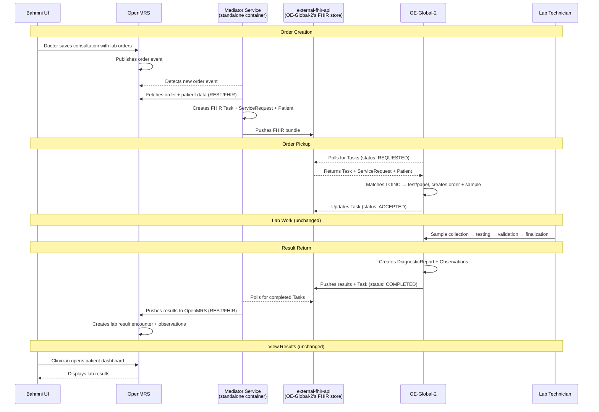

# Proposed Flow Detail

*Back to [Integration Plan](../bahmni-openelis-global2-integration-plan.md)*

---

A custom **mediator service** (standalone microservice) detects lab order events in OpenMRS, creates FHIR bundles, and pushes them to OE-Global-2's FHIR store (`external-fhir-api`). OE-Global-2 polls that same store. Results flow back through the mediator.

## Sequence Diagram

## Components

| Component | Role |
|---|---|
| **Custom mediator service** (new, standalone container) | Active orchestrator — detects lab order events in OpenMRS, creates FHIR bundles, pushes to FHIR store, polls for results, pushes results back to OpenMRS |
| [`openmrs-module-fhir2`](https://github.com/openmrs/openmrs-module-fhir2) | Passive API layer — translates OpenMRS data to/from FHIR format |
| [OpenELIS-Global-2](https://github.com/DIGI-UW/OpenELIS-Global-2) | Lab system — polls for orders, processes them, pushes results back |
| `external-fhir-api` | OE-Global-2's HAPI FHIR store — doubles as the shared FHIR store |

| Direction | Mechanism | Latency |
|---|---|---|
| Orders out (OpenMRS → FHIR Store) | Mediator detects event → pushes FHIR bundle | Seconds |
| Results back (FHIR Store → OpenMRS) | Mediator polls for completed Tasks | Configurable (seconds-minutes) |
| Patient sync (OpenMRS → FHIR Store) | Mediator detects patient creation → pushes Patient resource | Seconds |

For deeper technical details on LOINC matching, Task lifecycle, and mediator service responsibilities, see [Technical Reference](technical-reference.md).

*Fallback architecture (Full OpenHIE with OpenHIM + SHR) is documented in [fallback-option-a.md](fallback-option-a.md).*
