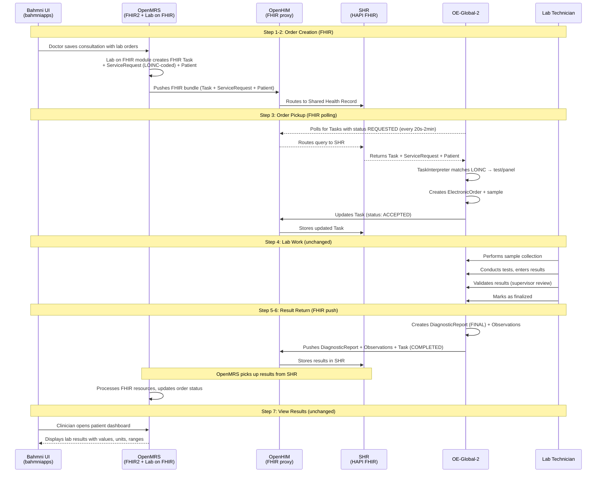
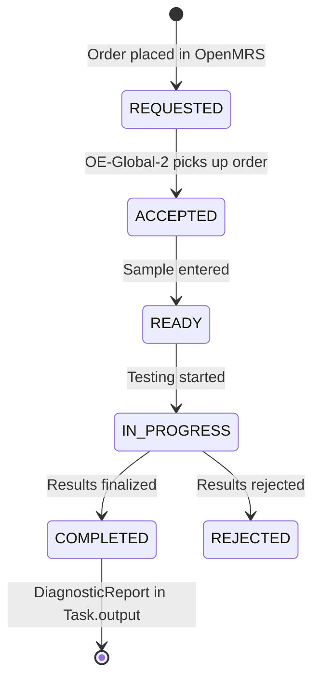
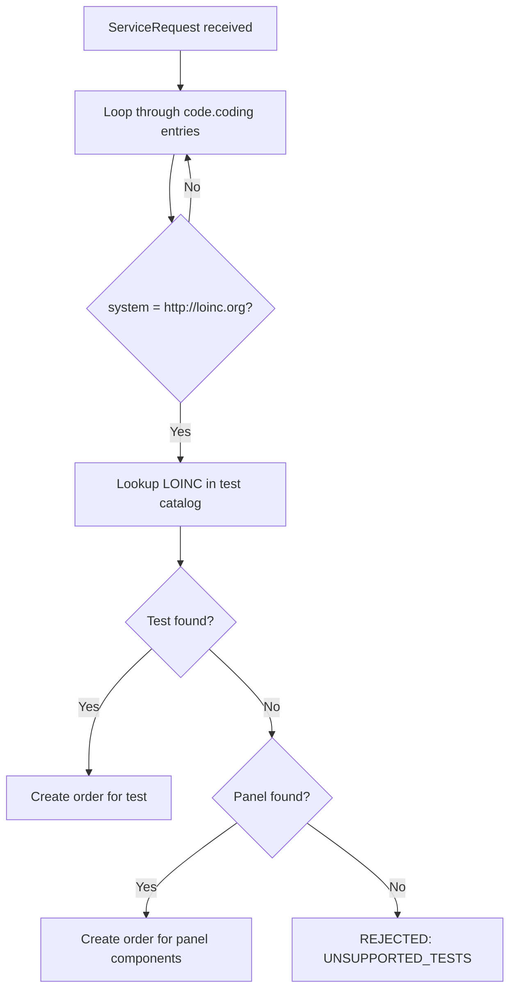

# Proposed Flow Detail: FHIR-based Integration with OE-Global-2

*Back to [Integration Plan](../bahmni-openelis-global2-integration-plan.md)*

---

Based on the [reference implementation](https://github.com/DIGI-UW/openelis-openmrs-hie) and [community discussion](https://talk.openelis-global.org/t/integration-with-openmrs-over-fhir/1702), the exchange is **purely FHIR-based**. Both systems communicate through a **Shared Health Record (SHR)** via **OpenHIM** as a routing/auth proxy — they do not talk directly to each other.

## Sequence Diagram



> **Note:** A simplified architecture where OE-Global-2 talks directly to OpenMRS FHIR2 is theoretically possible but has not been validated.

## Which Module Does What

| Module (GitHub Repo) | Role | Analogy |
|---|---|---|
| [`openmrs-module-fhir2`](https://github.com/openmrs/openmrs-module-fhir2) | Passive API layer — translates OpenMRS data to/from FHIR format | REST controller — responds when called |
| [`openmrs-module-labonfhir`](https://github.com/openmrs/openmrs-module-labonfhir) | Active orchestrator — watches for lab orders (via JMS event), builds FHIR bundles, pushes them to SHR. Also polls SHR for completed results. | Event listener + HTTP client |
| OpenHIM (`openhim-core`) | Routes all `/fhir/*` requests, handles auth, audit trail | API gateway (nginx/Kong) |
| SHR (`shr-hapi-fhir`) | Shared FHIR database — both sides read from and write to it | Shared message queue / S3 bucket |
| [OpenELIS-Global-2](https://github.com/DIGI-UW/OpenELIS-Global-2) | Lab system — polls SHR for orders, processes them, pushes results back to SHR | Independent microservice |

### How Lab on FHIR detects new orders (technical detail)

OpenMRS has a built-in JMS event system (`openmrs-module-event`). When Hibernate saves an `Order` entity, a JMS message is published. Lab on FHIR subscribes at startup:

```java
Event.subscribe(Order.class, Event.Action.CREATED.toString(), orderListener);
```

The listener checks if it's a `TestOrder`, builds a FHIR Task + ServiceRequest bundle, and pushes it to the SHR. This is **event-driven** (instant), not polling.

For the **return path**, Lab on FHIR uses a **scheduled polling task** (`FetchTaskUpdates`) that periodically checks the SHR for Tasks that changed from REQUESTED to COMPLETED, then imports the DiagnosticReport + Observations.

| Direction | Mechanism | Latency |
|---|---|---|
| Orders out (OpenMRS → SHR) | JMS event → instant push | Seconds |
| Results back (SHR → OpenMRS) | Scheduled polling task | Configurable (seconds-minutes) |

## Task Status Lifecycle



## LOINC Code Matching

When OE-Global-2 receives a FHIR ServiceRequest, the `TaskInterpreter` does:



**Method selection at execution time:** Per the [community discussion](https://talk.openelis-global.org/t/openelis-global-capability-for-selecting-a-specific-method-for-a-given-order/1691), OE-Global-2 supports selecting the specific method (EIA, PCR, STAIN, CULTURE, etc.) at the time of test execution — not at order time. You don't need separate LOINC codes per method at order time. The recommended pattern is parent/child test configuration.

## Configuration Reference

### OE-Global-2 (`common.properties`)

From the [reference implementation](https://github.com/DIGI-UW/openelis-openmrs-hie/blob/main/configs/openelis/properties/common.properties):

```properties
# Polls SHR (via OpenHIM) for lab order Tasks
org.openelisglobal.remote.source.uri=http://openhim-core:5001/fhir/
org.openelisglobal.remote.poll.frequency=20000
org.openelisglobal.remote.source.identifier=Practitioner/*
org.openelisglobal.remote.source.updateStatus=true
org.openelisglobal.task.useBasedOn=true

# Pushes results to SHR via OpenHIM
org.openelisglobal.fhir.subscriber=http://openhim-core:5001/fhir/
org.openelisglobal.fhir.subscriber.resources=Task,Patient,ServiceRequest,DiagnosticReport,Observation,Specimen,Practitioner,Encounter
```

### OpenMRS Lab on FHIR (`openelis-openmrs.xml`)

From the [reference implementation](https://github.com/DIGI-UW/openelis-openmrs-hie/blob/main/configs/openmrs/distro/configuration/globalproperties/openelis-openmrs.xml):

```properties
labonfhir.lisUrl=http://openhim-core:5001/fhir/
labonfhir.activateFhirPush=true
labonfhir.authType=BASIC
labonfhir.labUpdateTriggerObject=Order
```

### FHIR Endpoints in the Reference Implementation

| Endpoint | Service | Purpose |
|---|---|---|
| **SHR** (`shr-hapi-fhir`) | Shared Health Record | Central FHIR store — OpenMRS pushes orders, OE-Global-2 pushes results |
| **OE local FHIR** (`fhir.openelis.org`) | OE-Global-2's own HAPI FHIR | Internal FHIR store (shares DB with OE-Global-2) |
| **OpenMRS FHIR2** | OpenMRS | OpenMRS's own FHIR API (provider/organization sync) |
