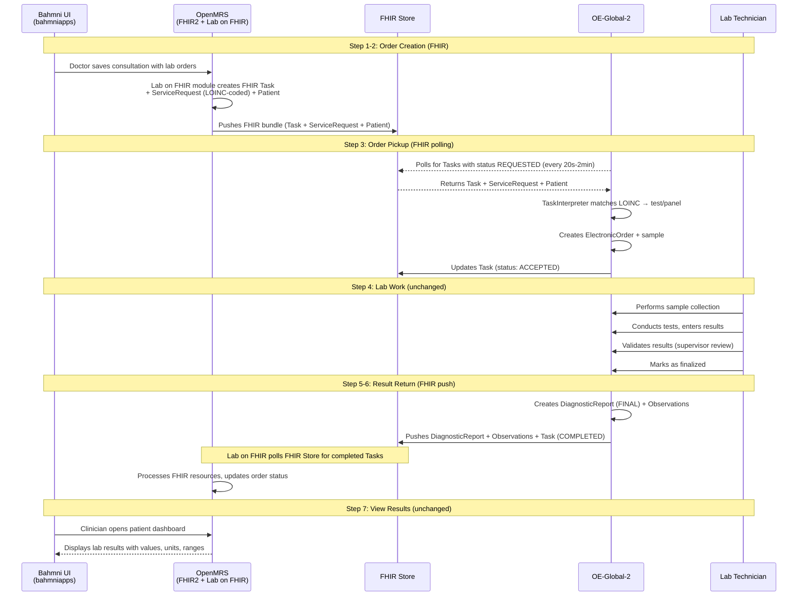
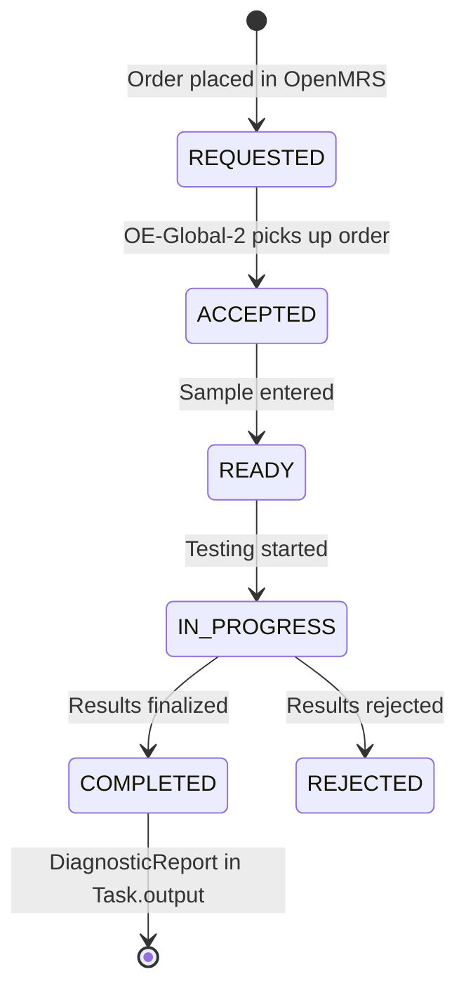
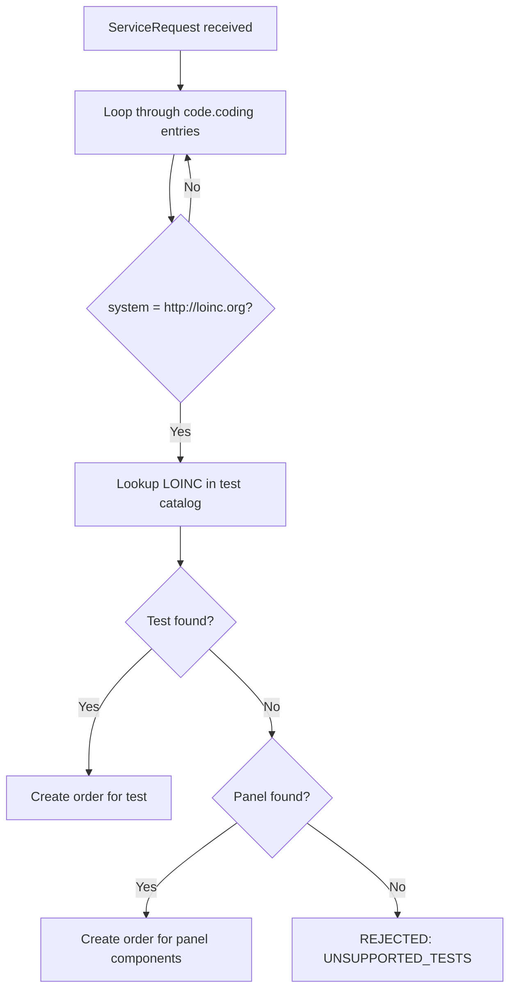

# Proposed Flow Detail: FHIR-based Integration with OE-Global-2

*Back to [Integration Plan](../bahmni-openelis-global2-integration-plan.md)*

---

The exchange is **purely FHIR-based**. Both OpenMRS and OE-Global-2 read from and write to a shared **FHIR Store**. The logical flow is the same regardless of which architecture option is chosen — the only difference is what serves as that FHIR Store.

| | Option A: Full OpenHIE | Option B: Simplified (recommended) |
|---|---|---|
| **FHIR Store** | Separate SHR (`shr-hapi-fhir`), accessed via OpenHIM proxy | OE-Global-2's own HAPI FHIR (`external-fhir-api`) |
| **Detail** | [Architecture Decision](../bahmni-openelis-global2-integration-plan.md#5-architecture-decision-full-openhie-vs-simplified) | [Architecture Decision](../bahmni-openelis-global2-integration-plan.md#5-architecture-decision-full-openhie-vs-simplified) |

## Sequence Diagram



> **"FHIR Store" =** `external-fhir-api` in Option B (simplified) or `shr-hapi-fhir` via OpenHIM in Option A (full OpenHIE). See [Architecture Decision](../bahmni-openelis-global2-integration-plan.md#5-architecture-decision-full-openhie-vs-simplified).

## Which Module Does What

| Module (GitHub Repo) | Role | Analogy |
|---|---|---|
| [`openmrs-module-fhir2`](https://github.com/openmrs/openmrs-module-fhir2) | Passive API layer — translates OpenMRS data to/from FHIR format | REST controller — responds when called |
| [`openmrs-module-labonfhir`](https://github.com/openmrs/openmrs-module-labonfhir) | Active orchestrator — watches for lab orders (via JMS event), builds FHIR bundles, pushes them to FHIR Store. Also polls FHIR Store for completed results. | Event listener + HTTP client |
| FHIR Store | Shared FHIR database — both sides read from and write to it | Shared message queue / S3 bucket |
| [OpenELIS-Global-2](https://github.com/DIGI-UW/OpenELIS-Global-2) | Lab system — polls FHIR Store for orders, processes them, pushes results back | Independent microservice |
| OpenHIM (`openhim-core`) | *(Option A only)* Routes all `/fhir/*` requests, handles auth, audit trail | API gateway (nginx/Kong) |

### How Lab on FHIR detects new orders (technical detail)

OpenMRS has a built-in JMS event system (`openmrs-module-event`). When Hibernate saves an `Order` entity, a JMS message is published. Lab on FHIR subscribes at startup:

```java
Event.subscribe(Order.class, Event.Action.CREATED.toString(), orderListener);
```

The listener checks if it's a `TestOrder`, builds a FHIR Task + ServiceRequest bundle, and pushes it to the configured FHIR Store URL. This is **event-driven** (instant), not polling.

For the **return path**, Lab on FHIR uses a **scheduled polling task** (`FetchTaskUpdates`) that periodically checks the FHIR Store for Tasks that changed from REQUESTED to COMPLETED, then imports the DiagnosticReport + Observations.

| Direction | Mechanism | Latency |
|---|---|---|
| Orders out (OpenMRS → FHIR Store) | JMS event → instant push | Seconds |
| Results back (FHIR Store → OpenMRS) | Scheduled polling task | Configurable (seconds-minutes) |

## Task Status Lifecycle



## LOINC Code Matching

When OE-Global-2 receives a FHIR ServiceRequest, the `TaskInterpreter` does:



**Method selection at execution time:** Per the [community discussion](https://talk.openelis-global.org/t/openelis-global-capability-for-selecting-a-specific-method-for-a-given-order/1691), OE-Global-2 supports selecting the specific method (EIA, PCR, STAIN, CULTURE, etc.) at the time of test execution — not at order time. You don't need separate LOINC codes per method at order time. The recommended pattern is parent/child test configuration.

## Configuration Reference

### Option B: Simplified (recommended)

```properties
# OpenMRS Lab on FHIR — push directly to OE-Global-2's FHIR store
labonfhir.lisUrl=http://external-fhir-api:8080/fhir/
labonfhir.activateFhirPush=true
labonfhir.authType=NONE
labonfhir.labUpdateTriggerObject=Order

# OE-Global-2 — poll its own FHIR store
org.openelisglobal.remote.source.uri=http://external-fhir-api:8080/fhir/
org.openelisglobal.remote.poll.frequency=20000
org.openelisglobal.remote.source.identifier=Practitioner/*
org.openelisglobal.remote.source.updateStatus=true
org.openelisglobal.task.useBasedOn=true
org.openelisglobal.fhir.subscriber=http://external-fhir-api:8080/fhir/
org.openelisglobal.fhir.subscriber.resources=Task,Patient,ServiceRequest,DiagnosticReport,Observation,Specimen,Practitioner,Encounter
```

### Option A: Full OpenHIE (reference implementation)

From the [reference implementation](https://github.com/DIGI-UW/openelis-openmrs-hie):

```properties
# OpenMRS Lab on FHIR — push to SHR via OpenHIM
labonfhir.lisUrl=http://openhim-core:5001/fhir/
labonfhir.activateFhirPush=true
labonfhir.authType=BASIC
labonfhir.username=OpenMRS
labonfhir.password=admin
labonfhir.labUpdateTriggerObject=Order

# OE-Global-2 — poll SHR via OpenHIM
org.openelisglobal.remote.source.uri=http://openhim-core:5001/fhir/
org.openelisglobal.remote.poll.frequency=20000
org.openelisglobal.remote.source.identifier=Practitioner/*
org.openelisglobal.remote.source.updateStatus=true
org.openelisglobal.task.useBasedOn=true
org.openelisglobal.fhir.subscriber=http://openhim-core:5001/fhir/
org.openelisglobal.fhir.subscriber.resources=Task,Patient,ServiceRequest,DiagnosticReport,Observation,Specimen,Practitioner,Encounter
```

### FHIR Endpoints

| Endpoint | Present in | Purpose |
|---|---|---|
| **`external-fhir-api`** | Both options | OE-Global-2's HAPI FHIR store. In Option B, also serves as the shared store. |
| **`shr-hapi-fhir`** | Option A only | Separate Shared Health Record (HAPI FHIR server) |
| **OpenHIM** (`openhim-core:5001`) | Option A only | Routes `/fhir/*` requests to SHR, handles auth |
| **OpenMRS FHIR2** | Both options | OpenMRS's own FHIR API (provider/organization sync) |
