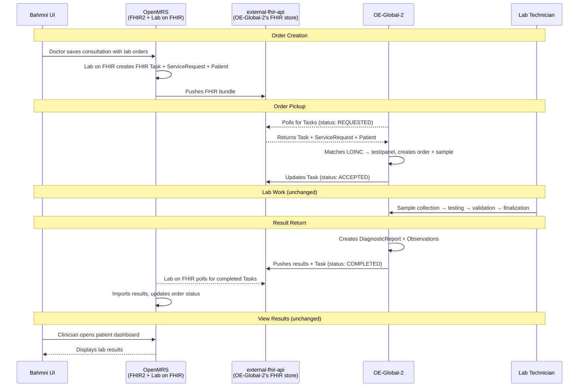
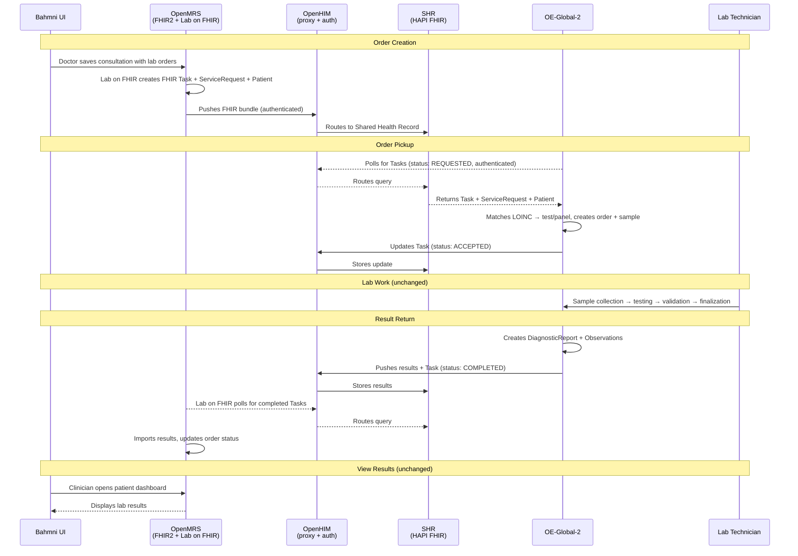

# Proposed Flow Detail

*Back to [Integration Plan](../bahmni-openelis-global2-integration-plan.md)*

---

Two architecture options are proposed. The data flow is similar — the difference is what sits between OpenMRS and OE-Global-2. See [Architecture Decision](../bahmni-openelis-global2-integration-plan.md#5-architecture-decision-full-openhie-vs-simplified) for the comparison and recommendation.

## Option B: Simplified Flow (recommended)

OpenMRS pushes orders directly to OE-Global-2's own FHIR store (`external-fhir-api`). OE-Global-2 polls that same store. Results flow back through the same store.

## Option A: Full OpenHIE Flow (reference implementation)

OpenMRS and OE-Global-2 communicate through a separate Shared Health Record (SHR), with OpenHIM as an API gateway handling routing and auth.

## Which Module Does What

| Module | Role | Present in |
|---|---|---|
| [`openmrs-module-fhir2`](https://github.com/openmrs/openmrs-module-fhir2) | Passive API layer — translates OpenMRS data to/from FHIR format | Both options |
| [`openmrs-module-labonfhir`](https://github.com/openmrs/openmrs-module-labonfhir) | Active orchestrator — detects lab orders (via JMS), pushes FHIR bundles, polls for results | Both options |
| [OpenELIS-Global-2](https://github.com/DIGI-UW/OpenELIS-Global-2) | Lab system — polls for orders, processes them, pushes results back | Both options |
| `external-fhir-api` | OE-Global-2's HAPI FHIR store — in Option B, doubles as the shared store | Both options (shared store in B) |
| `shr-hapi-fhir` | Separate Shared Health Record (HAPI FHIR) | Option A only |
| OpenHIM (`openhim-core`) | API gateway — routes `/fhir/*` requests, handles auth + audit | Option A only |

| Direction | Mechanism | Latency |
|---|---|---|
| Orders out (OpenMRS → FHIR Store) | JMS event → instant push | Seconds |
| Results back (FHIR Store → OpenMRS) | Scheduled polling (`FetchTaskUpdates`) | Configurable (seconds-minutes) |

For deeper technical details on how Lab on FHIR detects orders, LOINC matching, and Task lifecycle, see [Technical Reference](technical-reference.md).
