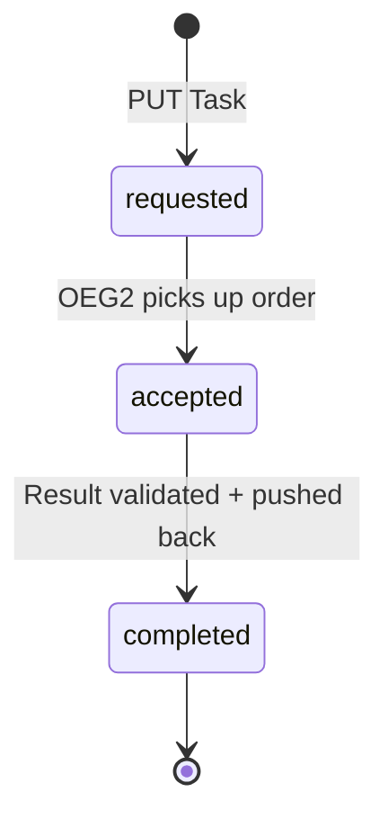

# Phase 1, Step 1b: Validate End-to-End FHIR Flow

*Back to [Integration Plan](../../bahmni-openelis-global2-integration-plan.md)*

**Status:** In Progress — FHIR push + Task pickup validated; order realization + result entry pending
**Goal:** Push a FHIR lab order to `external-fhir-api`, confirm OEG2 picks it up, enter and validate a result, and verify the full Task lifecycle (REQUESTED → ACCEPTED → COMPLETED).

---

## Progress

### Completed (validated 2026-02-23)

| # | Validation | Result |
|---|-----------|--------|
| 1 | FHIR resources pushed to external-fhir-api (PUT with UUIDs) | PASS — all 4 resources created |
| 2 | OEG2 picks up Task, changes status to "accepted" | PASS — within ~20s |
| 3 | Electronic order appears in OEG2 Incoming Orders | PASS — searchable by patient family name "TestPatient" |
| 4 | Lab number generated via UI | PASS — `DEV01260000000000001` |

### Pending (blocked by demo DB setup)

| # | Validation | Blocker |
|---|-----------|---------|
| 5 | Order realized (SamplePatientEntry form submitted) | Demo DB missing: organization (site), National ID requirement needs disabling |
| 6 | Result entered for the lab test | Depends on #5 |
| 7 | Result validated (accepted) | Depends on #6 |
| 8 | DiagnosticReport appears in FHIR store | Depends on #7 |
| 9 | Task reaches "completed" on external-fhir-api | Depends on #8 |

### Demo DB Setup Required

The OEG2 demo database needs two changes before order realization can work. These are added to the demo script (Step 0/6: DB setup):

1. **Disable National ID requirement** — `site_information` has `National ID required = true`, but our FHIR Patient doesn't carry a national ID
2. **Create an organization (site)** — the SamplePatientEntry form requires a "Site Name" from an autocomplete that searches the `organization` table (type = "referring clinic"). The demo DB has zero organizations.

```sql
-- 1. Disable National ID requirement
UPDATE clinlims.site_information SET value = 'false' WHERE name = 'National ID required';

-- 2. Create organization + associate as "referring clinic" (type_id=5)
INSERT INTO clinlims.organization (id, name, is_active, mls_sentinel_lab_flag)
VALUES (nextval('clinlims.organization_seq'), 'Bahmni Clinic', 'Y', 'N');

INSERT INTO clinlims.organization_organization_type (org_id, org_type_id)
VALUES (currval('clinlims.organization_seq'), 5);
```

**Note:** The webapp must be restarted after these DB changes for the `site_information` cache to refresh:
```bash
docker restart openelisglobal-webapp
```

---

## Critical Findings (recorded in [Decision 16](../decisions-log.md))

Three critical requirements discovered during FHIR payload debugging:

### 1. All FHIR resource IDs must be valid UUIDs

OEG2's `FhirApiWorkFlowServiceImpl.java:560` calls `UUID.fromString()` on Practitioner/Patient IDs extracted from Task references. HAPI FHIR's default POST auto-assigns integer IDs (54, 55, etc.), which causes `IllegalArgumentException`.

**Fix:** Use `PUT /fhir/Resource/{uuid}` with pre-generated UUIDs instead of POST.

### 2. Patient given names must not contain digits

OEG2's `firstNameCharset` DB config = `.'a-zàâçéèêëîïôûùüÿñæœ -` (no digits). Names like "PoCStep1b" are rejected with "invalid name format, possibly illegal character".

**Fix:** Use alphabetic-only names (e.g., "Bahmni").

### 3. Task must pre-include OEG2's identifier to avoid version conflict

OEG2 adds an `identifier` to the Task in a separate PUT (creating version 2) before trying to update status from version 1 → HTTP 409 conflict → Task rejected. Pre-including the identifier in our original PUT prevents the intermediate update.

**Fix:** Include this identifier in the Task:
```json
{
  "type": {"coding": [{"system": "http://openelis-global.org/genIdType", "code": "externalId"}]},
  "system": "https://fhir.openelis.org:8443/fhir/",
  "value": "$TASK_ID"
}
```

Community reference: [talk.openelis-global.org/t/fhir-put-service-request/1312](https://talk.openelis-global.org/t/fhir-put-service-request/1312)

---

## Prerequisites

- Step 1a complete — all 6 OEG2 containers running
- `common.properties` configured with FHIR polling (done in Step 1a)
- FHIR store reachable at `https://localhost/fhir/`
- Node.js + Playwright installed (for UI tests)

---

## FHIR Resources Used

| Resource | Key Fields | Purpose |
|----------|-----------|---------|
| Practitioner | name: BahmniMediatorPractitioner, UUID ID | Task owner (wildcard match) |
| Patient | identifier: POC-PAT-001, name: Bahmni TestPatient, birthDate + gender, UUID ID | Lab order subject |
| ServiceRequest | LOINC 736-9 (Lymphocytes), identifier: POC-LAB-ORDER-001, UUID ID | Lab test order |
| Task | status: requested, owner: Practitioner/*, basedOn: ServiceRequest, pre-included OEG2 identifier, UUID ID | Triggers OEG2 pickup |

**Test choice:** LOINC `736-9` (Lymphocytes [#/volume] in Blood by Manual count) — a simple hematology numeric result available in the OEG2 demo database. Test ID = 27, sample type = Whole Blood.

**Resource templates:** [`docs/steps/scripts/fhir-bundle/step1b-resources.json`](scripts/fhir-bundle/step1b-resources.json)

---

## Task Lifecycle (Externally Visible)

When polling `external-fhir-api`, the Task progresses through three visible states:



**Note:** OEG2 also uses internal states (`received`, `in_progress`) on its local FHIR store, but these are NOT visible on `external-fhir-api`. This is expected behavior — the external lifecycle is `requested → accepted → completed`. See [Decision 17](../decisions-log.md).

---

## Running the Validation

### One-command demo (recommended)

The demo script handles everything: DB setup, pre-flight checks, FHIR resource push, Task polling, Playwright UI tests, and FHIR result verification.

```bash
bash /Users/vishalkarmalkar/IdeaProjects/bahmni/OpenElis/docs/steps/scripts/phase1-step1b-demo.sh
```

Script: [`docs/steps/scripts/phase1-step1b-demo.sh`](scripts/phase1-step1b-demo.sh)

### Running suites individually

| Suite | What it covers | How to run |
|---|---|---|
| **Bash verification** | FHIR resource push, Task polling, DiagnosticReport check | See below |
| **Playwright spec** | Order pickup UI, result entry, validation, FHIR verification | See below |

**Bash verification** (push FHIR resources + verify):

```bash
cd /Users/vishalkarmalkar/IdeaProjects/bahmni/openelismigration/OpenELIS-Global-2
bash /Users/vishalkarmalkar/IdeaProjects/bahmni/OpenElis/docs/steps/scripts/phase1-step1b-verify.sh
```

**Bash verification** (verify-only, after resources already pushed):

```bash
cd /Users/vishalkarmalkar/IdeaProjects/bahmni/openelismigration/OpenELIS-Global-2
bash /Users/vishalkarmalkar/IdeaProjects/bahmni/OpenElis/docs/steps/scripts/phase1-step1b-verify.sh verify-only
```

**Playwright UI tests** (requires FHIR resources already pushed):

```bash
cd /Users/vishalkarmalkar/IdeaProjects/bahmni/openelismigration/OpenELIS-Global-2/frontend

# Install Playwright browsers (first time only)
npx playwright install chromium

# Run Step 1b UI tests (pass resource IDs from the state file)
source /Users/vishalkarmalkar/IdeaProjects/bahmni/OpenElis/docs/steps/scripts/.step1b-state.env
TASK_ID=$TASK_ID SR_ID=$SR_ID PATIENT_ID=$PATIENT_ID PRACTITIONER_ID=$PRACTITIONER_ID \
  TEST_USER=admin TEST_PASS="adminADMIN!" \
  npx playwright test bahmni-poc-step1b --reporter=list
```

Spec: [`OpenELIS-Global-2/frontend/playwright/tests/bahmni-poc-step1b.spec.ts`](../../../../openelismigration/OpenELIS-Global-2/frontend/playwright/tests/bahmni-poc-step1b.spec.ts)

---

## Demo Script Flow

The demo script (`phase1-step1b-demo.sh`) runs 7 steps:

| Step | Action | Pass Condition |
|------|--------|---------------|
| 0/6 | DB setup (idempotent) | National ID requirement disabled, organization created |
| 1/6 | Pre-flight checks | All containers running, FHIR store + webapp reachable |
| 2/6 | Push FHIR resources | Practitioner, Patient, ServiceRequest, Task all created with UUIDs |
| 3/6 | Wait for Task pickup | Task status changes from "requested" to "accepted" (≤120s) |
| 4/6 | Playwright UI tests | Order realized, result entered + validated |
| 5/6 | Wait for DiagnosticReport | DiagnosticReport with status "final" in FHIR store (≤180s) |
| 6/6 | Verify Task lifecycle | Task status == "completed" |

---

## UI Flow for Order Realization (Manual Reference)

When automating or manually realizing an order in OEG2:

1. **Incoming Orders** (`/ElectronicOrders`):
   - Search by **patient family name** (e.g., "TestPatient") — NOT by ServiceRequest identifier
   - The order appears with status "Entered", Subject Number "POC-PAT-001"
   - Click **Expand** (chevron) to reveal the order row
   - Click **Generate** to auto-assign a lab number (format: `DEV01YYYYMMDDHHMMSS001`)
   - Click **Enter Order** — opens SamplePatientEntry in a new tab

2. **SamplePatientEntry** (multi-step form):
   - **Patient Info** — auto-detected from electronic order (Complete)
   - **Program Selection** — defaults to "Routine Testing" (click Next)
   - **Add Sample** — select "Whole Blood", check "Lymphocytes (%)" test (click Next)
   - **Add Order** — lab number pre-filled, fill Site Name (type "Bahmni" → select "Bahmni Clinic"), fill Requester First/Last Name, click Submit

3. **Results** → **By Order** (`/AccessionResults`):
   - Enter the accession number (lab number from step 1)
   - Enter result value (e.g., "25.5") in the Lymphocytes (%) field
   - Click Save

4. **Validation** → **By Order** (`/AccessionValidation`):
   - Enter the accession number
   - Check the Accept checkbox
   - Click Save

---

## Playwright Test Issues Found

The initial Playwright spec (`bahmni-poc-step1b.spec.ts`) needs fixes:

| Issue | Problem | Fix Needed |
|-------|---------|-----------|
| Search by identifier | Top search on `/ElectronicOrders` searches by family name, not ServiceRequest identifier | Search by "TestPatient" instead of "POC-LAB-ORDER-001" |
| Overlay intercepts clicks | Carbon Design data-table rows intercept pointer events on Generate/Enter buttons | Use `page.evaluate()` JavaScript clicks |
| SamplePatientEntry form | Multi-step form requires Site Name (autocomplete), sample type, test selection | Add DB setup step; automate form navigation |
| National ID required | Demo DB requires National ID which our FHIR Patient lacks | Disable via DB update (in demo script) |
| No organizations in demo DB | Site Name autocomplete has no suggestions | Create "Bahmni Clinic" organization (in demo script) |
| Timeout too short | Default 30s test timeout insufficient for multi-step form + polling | Increase to 120s per test |

---

## Verification Checks Detail

### Check 1: FHIR resources exist in store

After the demo script pushes resources, verify they exist:

```bash
# Using IDs from the state file
source /Users/vishalkarmalkar/IdeaProjects/bahmni/OpenElis/docs/steps/scripts/.step1b-state.env
curl -sk "https://localhost/fhir/Patient/$PATIENT_ID" | python3 -c "import sys,json; print(json.load(sys.stdin)['resourceType'])"
curl -sk "https://localhost/fhir/ServiceRequest/$SR_ID" | python3 -c "import sys,json; print(json.load(sys.stdin)['resourceType'])"
curl -sk "https://localhost/fhir/Task/$TASK_ID" | python3 -c "import sys,json; print(json.load(sys.stdin)['status'])"
```

**Pass:** All return their resource type; Task.status != "requested"

---

### Check 2: Task picked up (status: accepted)

```bash
curl -sk "https://localhost/fhir/Task/$TASK_ID" | python3 -m json.tool | grep '"status"'
```

**Pass:** `"status": "accepted"` (or later: `"completed"`)
**Fail:** `"status": "requested"` after 120s — check OEG2 logs and `remote.source.identifier` config

---

### Check 3: Electronic order in OEG2

Navigate to **Order → Incoming Orders** in the OEG2 UI (`https://localhost/ElectronicOrders`).
Search by patient family name **"TestPatient"** (not by identifier).

**Pass:** Order appears in the table with status "Entered" or "Realized"

---

### Check 4: Result entry

Navigate to **Results → By Order** (`https://localhost/AccessionResults`).
Enter the accession number assigned to the realized order.

**Pass:** Test (Lymphocytes) appears with an input field; result value can be entered and saved

---

### Check 5: Result validation

Navigate to **Validation → By Order** (`https://localhost/AccessionValidation`).
Enter the accession number.

**Pass:** Result appears with Accept checkbox; validation saves successfully

---

### Check 6: DiagnosticReport in FHIR store

```bash
curl -sk "https://localhost/fhir/DiagnosticReport?based-on=ServiceRequest/$SR_ID" \
  | python3 -c "import sys,json; d=json.load(sys.stdin); print(f'total={d[\"total\"]}, status={d[\"entry\"][0][\"resource\"][\"status\"]}')"
```

**Pass:** `total=1, status=final`

---

### Check 7: Task lifecycle complete

```bash
curl -sk "https://localhost/fhir/Task/$TASK_ID" | python3 -m json.tool | grep '"status"'
```

**Pass:** `"status": "completed"`

---

## Summary: Pass Criteria

Step 1b is **complete** when all of the following are true:

- [x] FHIR resources (Patient, ServiceRequest, Task) pushed to external-fhir-api
- [x] OEG2 picks up the Task (status: requested → accepted)
- [x] Electronic order visible in OEG2 Incoming Orders page
- [ ] Order realized with a lab accession number
- [ ] Result entered and saved for the lab test
- [ ] Result validated (accepted) in OEG2
- [ ] DiagnosticReport with status "final" appears in FHIR store
- [ ] Task status reaches "completed" on external-fhir-api

---

## Task.owner Decision (Open Question 4)

**For this PoC:** Using `Practitioner/*` wildcard. A Practitioner resource is PUT to the FHIR store so the wildcard expansion finds it.

**Production recommendation:** Use `Organization/<uuid>` — avoids expensive Practitioner enumeration on every poll cycle, semantically correct (lab org owns the task), matches OpenHIE conventions. This decision should be recorded in the decisions log after the PoC validates the full flow.

---

## Troubleshooting

### Task stuck in "requested"

1. Check OEG2 is polling: `docker compose logs oe.openelis.org | grep -i "task\|fhir\|remote" | tail -20`
2. Verify config: `docker compose exec oe.openelis.org grep "remote.source" /run/secrets/common.properties`
3. Ensure `remote.source.identifier` matches the Task.owner — `Practitioner/*` should match any Practitioner

### Task status "rejected" (HTTP 409 version conflict)

The Task was rejected because OEG2 tried to update it but the version had already changed. This happens when the Task doesn't pre-include OEG2's identifier. See Critical Finding #3 above. Re-push with the identifier included.

### No DiagnosticReport after validation

1. Check FHIR subscriber config: `docker compose exec oe.openelis.org grep "fhir.subscriber" /run/secrets/common.properties`
2. Check webapp logs for errors pushing to external FHIR: `docker compose logs oe.openelis.org | grep -i "subscriber\|diagnostic\|error" | tail -20`
3. Verify the subscriber URL is the external FHIR store: `https://fhir.openelis.org:8443/fhir/`

### Order not appearing in Incoming Orders

1. Wait for the poll cycle (20s configured, may take up to 2 cycles)
2. Check Task status on FHIR store — if still "requested", OEG2 hasn't picked it up
3. Search by **patient family name** (e.g., "TestPatient") — the top search box does NOT search by ServiceRequest identifier

### SamplePatientEntry form validation errors

1. "National ID Required" — run `UPDATE clinlims.site_information SET value = 'false' WHERE name = 'National ID required';` and restart webapp
2. "No suggestions" for Site Name — create an organization: see DB Setup Required section above

---

## Next Step

Once Step 1b is complete: **Phase 1, Step 1c — Confirm Mediator Service Design**
