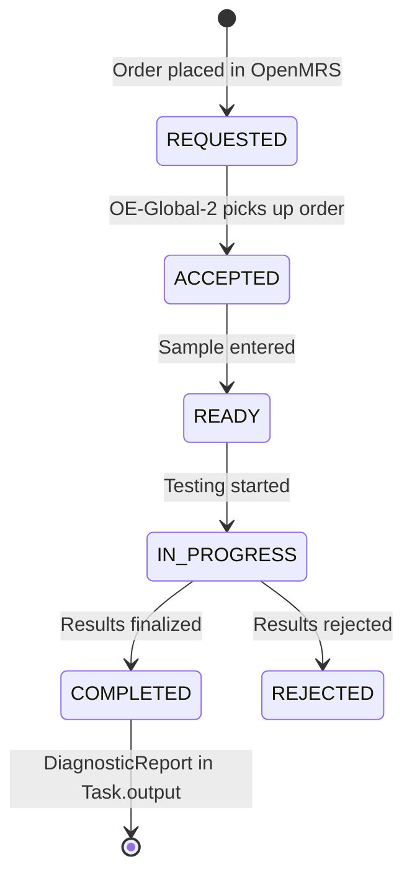
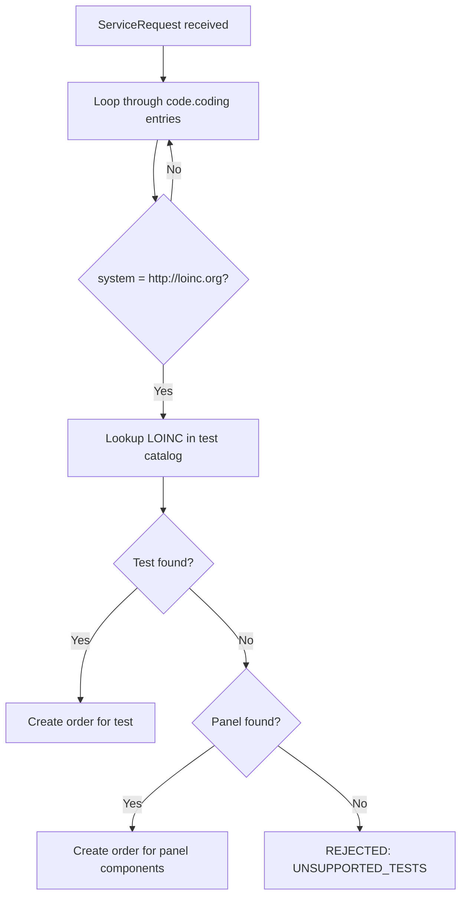

# Technical Reference: OE-Global-2 Integration

*Back to [Integration Plan](../bahmni-openelis-global2-integration-plan.md)*

---

This page covers OE-Global-2 internals that are **common to both architecture options**. For option-specific details, see [Proposed Flow](proposed-flow-detail.md) and [Architecture](architecture-detail.md).

## How the Mediator Service Works

Bahmni will use a **custom mediator service** (standalone microservice) to bridge OpenMRS and OE-Global-2. This follows Bahmni's existing integration pattern (ERP/PACS) — a standalone container that listens to events and orchestrates FHIR communication.

### Mediator Responsibilities

**Outbound (orders):**
1. Detect new lab order events in OpenMRS
2. Fetch order + patient data from OpenMRS (via REST API)
3. Build a FHIR Task + ServiceRequest + Patient bundle
4. Push the bundle to OE-Global-2's FHIR store (`external-fhir-api`)

**Inbound (results):**
1. Poll `external-fhir-api` for Tasks with status COMPLETED
2. Fetch the associated DiagnosticReport + Observations
3. Push results back to OpenMRS (create lab result encounter + observations)

**Patient sync:**
1. Detect new patient creation events in OpenMRS
2. Create corresponding Patient resource in `external-fhir-api`

### Event Detection (design decision pending)

The mediator needs to detect new orders in OpenMRS. Options:
- **AtomFeed polling** — consistent with current OpenELIS integration; proven pattern
- **JMS subscription** — instant detection (this is what `openmrs-module-labonfhir` uses internally via `Event.subscribe(Order.class, ...)`)
- **FHIR subscription** — if OpenMRS supports it

### Reference: How Lab on FHIR Does It (prior art)

The reference implementation uses `openmrs-module-labonfhir`, which runs inside OpenMRS and uses JMS:

```java
Event.subscribe(Order.class, Event.Action.CREATED.toString(), orderListener);
```

Lab on FHIR's approach: Hibernate persists Order → JMS message → `OrderCreationListener` → builds FHIR bundle → pushes to configured FHIR Store URL. For results, it uses a scheduled polling task (`FetchTaskUpdates`).

## Task Status Lifecycle



## LOINC Code Matching

When OE-Global-2 receives a FHIR ServiceRequest, the `TaskInterpreter` does:



**Key points:**
- OE-Global-2 matches tests by **LOINC codes only** — no fallback to custom codes
- Every test ordered from Bahmni **must have a LOINC code**
- The same LOINC code must exist in both OpenMRS and OE-Global-2

**Method selection at execution time:** Per the [community discussion](https://talk.openelis-global.org/t/openelis-global-capability-for-selecting-a-specific-method-for-a-given-order/1691), OE-Global-2 supports selecting the specific method (EIA, PCR, STAIN, CULTURE, etc.) at the time of test execution — not at order time. You don't need separate LOINC codes per method at order time. The recommended pattern is parent/child test configuration.

## Master Data Setup

**Ownership (decided):** OpenMRS is the master for test definitions. OEG2 manages reference ranges (they vary by ethnicity, location, etc. — lab systems handle this better).

| Master Data | Master System | Setup Method | Details |
|---|---|---|---|
| **Tests + panels** | OpenMRS | CSV files on OEG2 startup | Drop CSV in `/var/lib/openelis-global/configuration/backend/tests/`. Format: `testName,testSection,sampleType,loinc,isActive,...` |
| **Sample types** | OpenMRS | CSV files on OEG2 startup | `configuration/sampleTypes/*.csv` |
| **Dictionaries** | OpenMRS | CSV files on OEG2 startup | `configuration/dictionaries/*.csv` |
| **Result ranges** | OEG2 | Admin UI or REST API | No CSV import — must be configured per test via OEG2 UI |
| **Organizations/centers** | OpenMRS | FHIR import from OpenMRS | `org.openelisglobal.facilitylist.fhirstore=http://openmrs:8080/openmrs/ws/fhir2/R4` |
| **Users/providers** | OpenMRS | FHIR import + local creation | Practitioners auto-imported from OpenMRS FHIR |
| **Roles** | OEG2 | CSV files on startup | `configuration/roles/*.csv` |

**Recommended approach for Bahmni:** Create a "Bahmni default" CSV configuration set checked into version control. Mount as a Docker volume.
