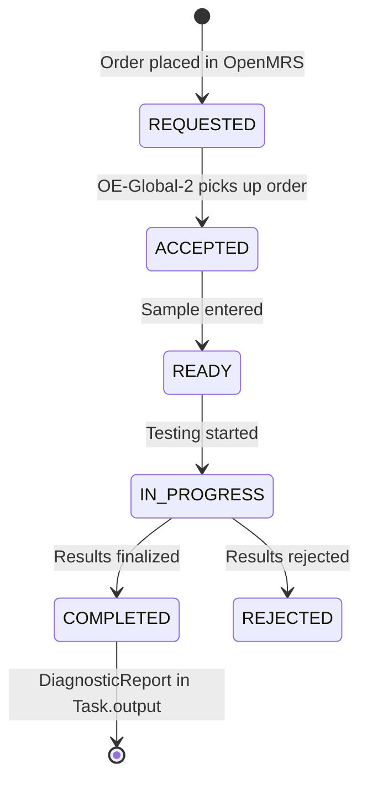
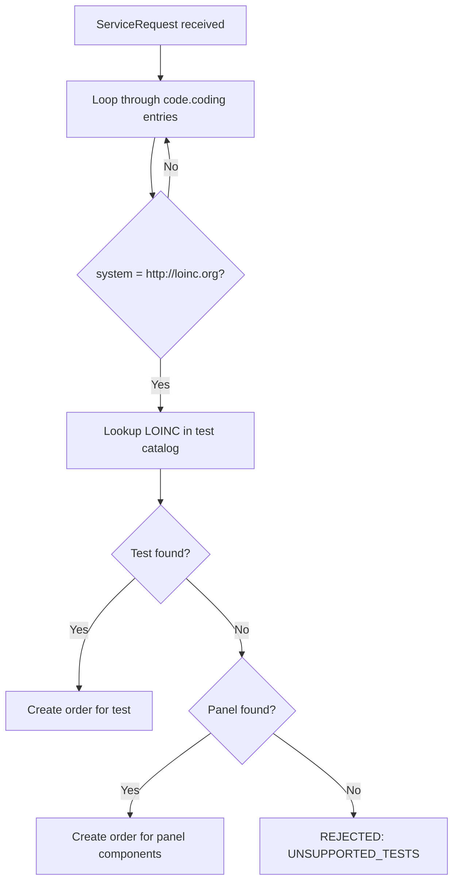

# Technical Reference: OE-Global-2 Integration

*Back to [Integration Plan](../bahmni-openelis-global2-integration-plan.md)*

---

This page covers OE-Global-2 internals that are **common to both architecture options**. For option-specific details, see [Proposed Flow](proposed-flow-detail.md) and [Architecture](architecture-detail.md).

## How Lab on FHIR Detects New Orders

OpenMRS has a built-in JMS event system (`openmrs-module-event`). When Hibernate saves an `Order` entity, a JMS message is published. Lab on FHIR subscribes at startup:

```java
Event.subscribe(Order.class, Event.Action.CREATED.toString(), orderListener);
```

When a clinician saves a lab order:
1. Hibernate persists the `Order`
2. OpenMRS Event module publishes a JMS message
3. Lab on FHIR's `OrderCreationListener` receives it
4. Listener loads the Order by UUID, checks if it's a `TestOrder`
5. Builds a FHIR Task + ServiceRequest + Patient bundle
6. Pushes it to the configured FHIR Store URL (`labonfhir.lisUrl`)

This is **event-driven** (instant), not polling.

For the **return path**, Lab on FHIR uses a **scheduled polling task** (`FetchTaskUpdates`) that periodically checks the FHIR Store for Tasks that changed from REQUESTED to COMPLETED, then imports the DiagnosticReport + Observations.

## Task Status Lifecycle



## LOINC Code Matching

When OE-Global-2 receives a FHIR ServiceRequest, the `TaskInterpreter` does:



**Key points:**
- OE-Global-2 matches tests by **LOINC codes only** — no fallback to custom codes
- Every test ordered from Bahmni **must have a LOINC code**
- The same LOINC code must exist in both OpenMRS and OE-Global-2

**Method selection at execution time:** Per the [community discussion](https://talk.openelis-global.org/t/openelis-global-capability-for-selecting-a-specific-method-for-a-given-order/1691), OE-Global-2 supports selecting the specific method (EIA, PCR, STAIN, CULTURE, etc.) at the time of test execution — not at order time. You don't need separate LOINC codes per method at order time. The recommended pattern is parent/child test configuration.

## Master Data Setup

| Master Data | Recommended Setup Method | Details |
|---|---|---|
| **Tests + panels** | CSV files on startup | Drop CSV in `/var/lib/openelis-global/configuration/backend/tests/`. Format: `testName,testSection,sampleType,loinc,isActive,...` |
| **Sample types** | CSV files on startup | `configuration/sampleTypes/*.csv` |
| **Dictionaries** | CSV files on startup | `configuration/dictionaries/*.csv` |
| **Result ranges** | Admin UI or REST API | No CSV import — must be configured per test via UI |
| **Organizations/centers** | FHIR import from OpenMRS | `org.openelisglobal.facilitylist.fhirstore=http://openmrs:8080/openmrs/ws/fhir2/R4` |
| **Users/providers** | FHIR import + local creation | Practitioners auto-imported from OpenMRS FHIR |
| **Roles** | CSV files on startup | `configuration/roles/*.csv` |

**Recommended approach for Bahmni:** Create a "Bahmni default" CSV configuration set checked into version control. Mount as a Docker volume.
